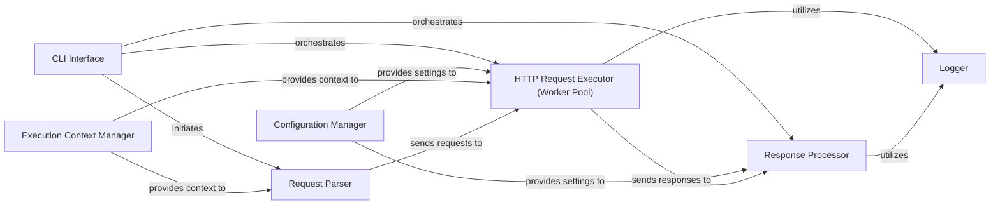

## Details

The `ganda` application is structured around a command-line interface (`CLI Interface`) that orchestrates the entire request processing pipeline. Upon initiation, the `CLI Interface` leverages the `Configuration Manager` to load application settings and then constructs an `Execution Context Manager` that encapsulates these settings along with input/output streams. This context is then provided to the `Request Parser`, which transforms raw input into structured HTTP requests. These requests are subsequently dispatched to the `HTTP Request Executor (Worker Pool)`, a concurrent component responsible for executing the actual HTTP calls, handling retries, and throttling. Once responses are received, they are forwarded to the `Response Processor`, which handles transformations, saving, and output based on the configured settings. Throughout this process, both the `HTTP Request Executor` and `Response Processor` utilize a dedicated `Logger` for operational insights and error reporting. This modular design ensures clear separation of concerns, allowing for independent development and maintenance of each stage in the request-response lifecycle.

Critical Interaction Pathways:
1.  **CLI Interface to Execution Context Manager**: The `CLI Interface` initializes and populates the `Execution Context Manager` with configuration and I/O streams.
2.  **Execution Context Manager to Request Parser, HTTP Request Executor, Response Processor**: The `Execution Context Manager` provides the necessary runtime context (configuration, I/O, logger) to these core processing components.
3.  **Request Parser to HTTP Request Executor (Worker Pool)**: The `Request Parser` feeds structured requests into the `HTTP Request Executor (Worker Pool)`.
4.  **HTTP Request Executor (Worker Pool) to Response Processor**: The `HTTP Request Executor (Worker Pool)` forwards completed HTTP responses to the `Response Processor`.
5.  **Configuration Manager to HTTP Request Executor (Worker Pool) and Response Processor**: The `Configuration Manager` dictates operational parameters for both request execution and response handling.
6.  **HTTP Request Executor (Worker Pool) and Response Processor to Logger**: Both the `HTTP Request Executor (Worker Pool)` and `Response Processor` utilize the `Logger` for reporting status and errors.

### HTTP Request Executor (Worker Pool) [[Expand]](./HTTP_Request_Executor_Worker_Pool_.md)
The core component for dispatching and executing HTTP requests concurrently. It implements a worker pool pattern to manage a configurable number of parallel requests, handling network communication, retries, and throttling.

**Related Classes/Methods**:

- `requests`

### Request Parser
Reads and parses incoming request definitions (e.g., URLs, HTTP methods, headers) from the input stream. It transforms raw input into structured request objects that can be processed by the HTTP Request Executor.

**Related Classes/Methods**:

- `parser`

### Response Processor
Handles the processing of HTTP responses received from the HTTP Request Executor. This includes transforming response bodies (e.g., base64 encoding, SHA256 hashing, discarding), saving responses to files, and preparing results for output.

**Related Classes/Methods**:

- `responses`

### Configuration Manager
Responsible for loading, parsing, and managing application configuration, including command-line flags, default values, and environmental settings. It provides a centralized source for runtime parameters.

**Related Classes/Methods**:

- `config`

### Execution Context Manager
Creates and manages the execution context for the application. This context bundles together the parsed configuration, input/output streams, and other runtime dependencies, making them accessible to various processing stages.

**Related Classes/Methods**:

- `execcontext`

### CLI Interface
Manages all interactions with the command-line interface. This includes parsing arguments, setting up commands, and directing the overall application flow based on user input. It also handles the initial setup of input/output streams.

**Related Classes/Methods**:

- `cli`

### Logger
Provides logging capabilities for the application, allowing for structured output of information, warnings, and errors.

**Related Classes/Methods**:

- `logger`

### [FAQ](https://github.com/CodeBoarding/GeneratedOnBoardings/tree/main?tab=readme-ov-file#faq)