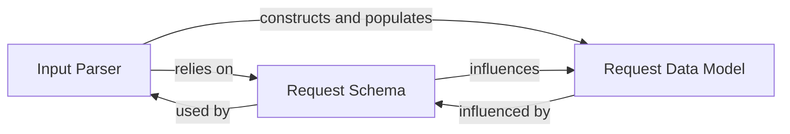

## Details

The `ganda` system's input processing subsystem is composed of three core components: the `Input Parser`, the `Request Data Model`, and the `Request Schema`. The `Input Parser` acts as the entry point, consuming raw input and, based on the `Request Schema`, transforms it into structured `Request Data Model` instances. The `Request Schema` serves as the definitive contract, guiding the `Input Parser`'s validation and shaping the structure of the `Request Data Model`. This clear separation of concerns ensures robust input handling and consistent data representation throughout the system.

### Input Parser
This component is responsible for reading raw input (e.g., from stdin or files), performing lexical and syntactic analysis, and validating the input against the `Request Schema`. It then orchestrates the transformation of this raw data into instances of the `Request Data Model`.

**Related Classes/Methods**:

- `parser`

### Request Data Model
Defines the Go data structures (structs) that represent the standardized, structured request objects. These structures are the canonical in-memory representation of a request within the `ganda` system, ensuring data consistency for downstream processing.

**Related Classes/Methods**:

- `requests`

### Request Schema
Provides a formal, machine-readable definition (e.g., JSON Schema) of the structure, data types, and validation constraints for the request objects. It acts as the contract for valid input, ensuring data integrity.

**Related Classes/Methods**:

- `request.schema.json`

### [FAQ](https://github.com/CodeBoarding/GeneratedOnBoardings/tree/main?tab=readme-ov-file#faq)