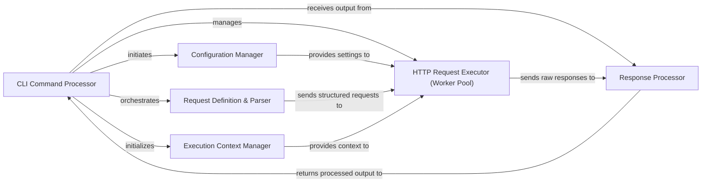

## Details

The project `ganda` is a Go-based command-line utility designed for making parallel HTTP requests. Its architecture is structured around several key components that handle command-line argument parsing, configuration, request generation, concurrent execution, and response processing. The core flow involves the `CLI Command Processor` initiating the application, which then sets up the `Configuration Manager` and `Execution Context Manager`. User input, either URLs or JSON-formatted requests, is processed by the `Request Definition & Parser`. These parsed requests are then dispatched to the `HTTP Request Executor (Worker Pool)` for concurrent execution. Finally, responses from the HTTP requests are handled by the `Response Processor` before being outputted. This modular design allows for clear separation of concerns and efficient parallel processing of HTTP requests.

### CLI Command Processor
The primary user interface, responsible for parsing command-line arguments, validating flags, and orchestrating the application's execution flow. It initiates and coordinates all major operations.

**Related Classes/Methods**:

- <a href="https://github.com/tednaleid/ganda/blob/main/main.go" target="_blank" rel="noopener noreferrer">`main.go`</a>
- <a href="https://github.com/tednaleid/ganda/blob/main/cli/cli.go" target="_blank" rel="noopener noreferrer">`cli/cli.go`</a>
- <a href="https://github.com/tednaleid/ganda/blob/main/cli/worker_flag.go" target="_blank" rel="noopener noreferrer">`cli/worker_flag.go`</a>

### Configuration Manager
Manages application-wide settings, including network parameters, concurrency limits, and input/output configurations, providing a centralized source for operational parameters.

**Related Classes/Methods**:

- <a href="https://github.com/tednaleid/ganda/blob/main/config/config.go" target="_blank" rel="noopener noreferrer">`config/config.go`</a>

### Request Definition & Parser [[Expand]](./Request_Definition_Parser.md)
Transforms raw input (e.g., from stdin or files) into standardized, structured request objects, ensuring data conforms to the expected schema.

**Related Classes/Methods**:

- <a href="https://github.com/tednaleid/ganda/blob/main/parser/parser.go" target="_blank" rel="noopener noreferrer">`parser/parser.go`</a>
- <a href="https://github.com/tednaleid/ganda/blob/main/requests/requests.go" target="_blank" rel="noopener noreferrer">`requests/requests.go`</a>
- <a href="https://github.com/tednaleid/ganda/blob/main/request.schema.json" target="_blank" rel="noopener noreferrer">`request.schema.json`</a>

### Execution Context Manager
Provides and manages the shared operational context for concurrent tasks, including cancellation signals and resource management, ensuring graceful shutdown and coordinated execution.

**Related Classes/Methods**:

- <a href="https://github.com/tednaleid/ganda/blob/main/execcontext/execcontext.go" target="_blank" rel="noopener noreferrer">`execcontext/execcontext.go`</a>

### HTTP Request Executor (Worker Pool) [[Expand]](./HTTP_Request_Executor_Worker_Pool_.md)
The core component for dispatching HTTP requests. It utilizes a worker pool pattern to handle concurrent requests efficiently, managing the lifecycle of individual requests and network communication.

**Related Classes/Methods**:

- <a href="https://github.com/tednaleid/ganda/blob/main/cli/cli.go" target="_blank" rel="noopener noreferrer">`cli/cli.go`</a>

### Response Processor
Receives raw HTTP responses, deserializes them, and performs necessary transformations or aggregations, preparing the data for final output or further processing.

**Related Classes/Methods**:

- <a href="https://github.com/tednaleid/ganda/blob/main/responses/responses.go" target="_blank" rel="noopener noreferrer">`responses/responses.go`</a>

### [FAQ](https://github.com/CodeBoarding/GeneratedOnBoardings/tree/main?tab=readme-ov-file#faq)