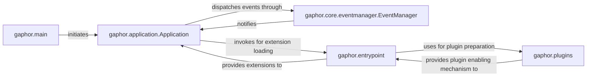

## Details

The Application Core subsystem is central to the Desktop GUI Application, encompassing key modules and functionalities for application lifecycle management, event dispatching, and extension loading.

### gaphor.application.Application
The primary orchestrator and lifecycle manager of the entire application. It represents the core application instance, responsible for initializing services, managing the application state, and coordinating overall application flow.

**Related Classes/Methods**:

- <a href="https://github.com/gaphor/gaphor/blob/main/gaphor/application.py#L48-L185" target="_blank" rel="noopener noreferrer">`gaphor.application.Application`:48-185</a>

### gaphor.main
The bootstrap component responsible for initializing the application environment, setting up the initial configuration, and starting the main application loop. It acts as the initial entry point for the application.

**Related Classes/Methods**:

- <a href="https://github.com/gaphor/gaphor/blob/main/gaphor/main.py" target="_blank" rel="noopener noreferrer">`gaphor.main`</a>

### gaphor.core.eventmanager.EventManager
The central communication bus, crucial for enabling loosely coupled interactions between various application components. It facilitates event-driven communication, allowing components to react to changes without direct dependencies.

**Related Classes/Methods**:

- <a href="https://github.com/gaphor/gaphor/blob/main/gaphor/core/eventmanager.py#L44-L134" target="_blank" rel="noopener noreferrer">`gaphor.core.eventmanager.EventManager`:44-134</a>

### gaphor.entrypoint
Manages the dynamic discovery and loading of application extensions and plugins. This component is vital for the application's extensibility, allowing new functionalities to be integrated seamlessly.

**Related Classes/Methods**:

- <a href="https://github.com/gaphor/gaphor/blob/main/gaphor/entrypoint.py" target="_blank" rel="noopener noreferrer">`gaphor.entrypoint`</a>

### gaphor.plugins
Provides the underlying mechanism for activating and managing discovered plugins. It works in conjunction with `gaphor.entrypoint` to ensure that loaded plugins are properly initialized and integrated into the application.

**Related Classes/Methods**:

- <a href="https://github.com/gaphor/gaphor/blob/main/gaphor/plugins" target="_blank" rel="noopener noreferrer">`gaphor.plugins`</a>

### [FAQ](https://github.com/CodeBoarding/GeneratedOnBoardings/tree/main?tab=readme-ov-file#faq)