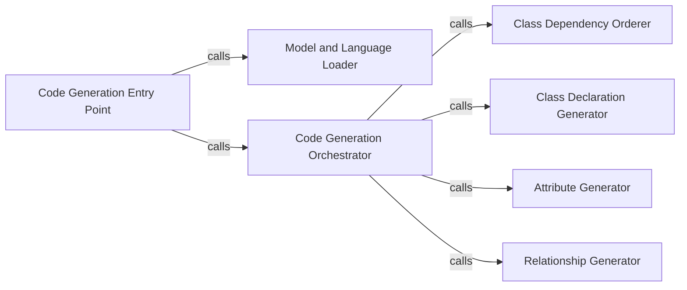

## Details

The Code Generation subsystem is responsible for translating the abstract Gaphor model into executable code or other textual representations. Its primary boundary is defined by the gaphor.codegen.coder module, specifically the coder.py file.

### Code Generation Entry Point
The external entry point for initiating the code generation process. It sets up the environment by loading the model and language configurations before triggering the core generation logic.

**Related Classes/Methods**:

- <a href="https://github.com/gaphor/gaphor/blob/main/gaphor/codegen/coder.py" target="_blank" rel="noopener noreferrer">`gaphor.codegen.coder:main`</a>

### Model and Language Loader
Responsible for loading the Gaphor model data and configuring the code generation process based on the specific target modeling language's requirements and interpretations.

**Related Classes/Methods**:

- <a href="https://github.com/gaphor/gaphor/blob/main/gaphor/codegen/coder.py" target="_blank" rel="noopener noreferrer">`gaphor.codegen.coder:load_model`</a>
- <a href="https://github.com/gaphor/gaphor/blob/main/gaphor/codegen/coder.py" target="_blank" rel="noopener noreferrer">`gaphor.codegen.coder:load_modeling_language`</a>

### Code Generation Orchestrator
The core orchestrator that drives the generation of code for various model elements. It acts as the central control flow, delegating tasks to specialized generator components.

**Related Classes/Methods**:

- <a href="https://github.com/gaphor/gaphor/blob/main/gaphor/codegen/coder.py" target="_blank" rel="noopener noreferrer">`gaphor.codegen.coder:coder`</a>

### Class Dependency Orderer
Ensures that classes are processed in a dependency-aware order, which is crucial for correct code generation, by analyzing inheritance and other structural relationships.

**Related Classes/Methods**:

- <a href="https://github.com/gaphor/gaphor/blob/main/gaphor/codegen/coder.py" target="_blank" rel="noopener noreferrer">`gaphor.codegen.coder:order_classes`</a>

### Class Declaration Generator
Generates the foundational code for a class declaration, including its name and inherited base classes, forming the basic structure of each class in the output.

**Related Classes/Methods**:

- <a href="https://github.com/gaphor/gaphor/blob/main/gaphor/codegen/coder.py" target="_blank" rel="noopener noreferrer">`gaphor.codegen.coder:class_declaration`</a>

### Attribute Generator
Handles the generation of code for attributes (variables) within a class, differentiating between primitive and complex types to ensure correct representation.

**Related Classes/Methods**:

- <a href="https://github.com/gaphor/gaphor/blob/main/gaphor/codegen/coder.py" target="_blank" rel="noopener noreferrer">`gaphor.codegen.coder:variables`</a>

### Relationship Generator
Manages the generation of code representing relationships (associations and subsetting) between classes, handling references or collections as appropriate for the target language.

**Related Classes/Methods**:

- <a href="https://github.com/gaphor/gaphor/blob/main/gaphor/codegen/coder.py" target="_blank" rel="noopener noreferrer">`gaphor.codegen.coder:associations`</a>
- <a href="https://github.com/gaphor/gaphor/blob/main/gaphor/codegen/coder.py" target="_blank" rel="noopener noreferrer">`gaphor.codegen.coder:subsets`</a>

### [FAQ](https://github.com/CodeBoarding/GeneratedOnBoardings/tree/main?tab=readme-ov-file#faq)