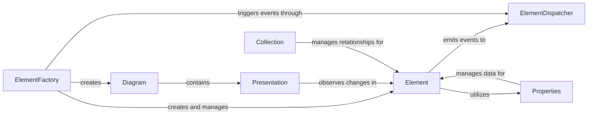

## Details

The Domain Model subsystem is the core of the Gaphor application, embodying the "Model" in the Model-View-Controller (MVC) pattern. It encapsulates the abstract UML/SysML data, relationships, and fundamental business logic, ensuring a clear separation from the graphical representation and user interaction. The subsystem is primarily defined by the `gaphor.core.modeling` package.

### Element
The foundational abstract class for all model entities. It provides a unique identifier, manages properties and associations, handles its lifecycle (initialization, saving, unlinking), and emits events when its state changes.

**Related Classes/Methods**:

- <a href="https://github.com/gaphor/gaphor/blob/main/gaphor/core/modeling/base.py" target="_blank" rel="noopener noreferrer">`gaphor.core.modeling.base.Element`</a>

### ElementFactory
Manages the lifecycle and creation of all model elements. It is responsible for creating new Element instances, maintaining a registry of all active elements, and handling the removal of unlinked elements.

**Related Classes/Methods**:

- <a href="https://github.com/gaphor/gaphor/blob/main/gaphor/core/modeling/elementfactory.py#L52-L247" target="_blank" rel="noopener noreferrer">`gaphor.core.modeling.elementfactory.ElementFactory`:52-247</a>

### ElementDispatcher
The central event system for model changes. It acts as an event bus, subscribing to and dispatching events related to element changes (e.g., property modifications, unlinking) and model loading to various listeners throughout the application, ensuring loose coupling.

**Related Classes/Methods**:

- <a href="https://github.com/gaphor/gaphor/blob/main/gaphor/core/modeling/elementdispatcher.py#L72-L267" target="_blank" rel="noopener noreferrer">`gaphor.core.modeling.elementdispatcher.ElementDispatcher`:72-267</a>

### Properties
Defines and manages attributes and associations of elements. It provides the mechanism for defining and managing properties of Element instances, handling storage, change notification, and managing relationships (e.g., opposite ends of associations).

**Related Classes/Methods**:

- <a href="https://github.com/gaphor/gaphor/blob/main/gaphor/core/modeling/properties.py" target="_blank" rel="noopener noreferrer">`gaphor.core.modeling.properties.Properties`</a>

### Diagram
A model element representing a diagram, acting as a container for Presentation elements. It manages the overall layout and visual properties of a diagram within the model.

**Related Classes/Methods**:

- <a href="https://github.com/gaphor/gaphor/blob/main/gaphor/core/modeling/diagram.py" target="_blank" rel="noopener noreferrer">`gaphor.core.modeling.diagram.Diagram`</a>

### Presentation
The model's representation of a graphical element, linking to an Element. It handles visual properties and reacts to changes in the underlying model element to update its conceptual display within the model.

**Related Classes/Methods**:

- <a href="https://github.com/gaphor/gaphor/blob/main/gaphor/core/modeling/presentation.py#L28-L159" target="_blank" rel="noopener noreferrer">`gaphor.core.modeling.presentation.Presentation`:28-159</a>

### Collection
Manages relationships between model elements. It provides specialized collection types for managing ordered or unordered associations and containment relationships between Element instances.

**Related Classes/Methods**:

- <a href="https://github.com/gaphor/gaphor/blob/main/gaphor/core/modeling/collection.py#L14-L132" target="_blank" rel="noopener noreferrer">`gaphor.core.modeling.collection.Collection`:14-132</a>

### [FAQ](https://github.com/CodeBoarding/GeneratedOnBoardings/tree/main?tab=readme-ov-file#faq)