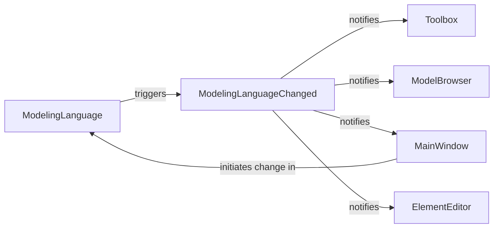

## Details

The `Modeling Language Services` subsystem is centered around managing the active modeling language within the application, ensuring all language-specific definitions and rules are consistently applied across various UI components.

### ModelingLanguage
This is the authoritative service component responsible for managing the application's active modeling language (e.g., UML, SysML). It provides language-specific definitions for toolbox elements, diagram types, and element behaviors, ensuring adherence to the chosen modeling standard. It acts as the "Model" or core logic for language definition.

**Related Classes/Methods**:

- <a href="https://github.com/gaphor/gaphor/blob/main/gaphor/abc.py#L31-L66" target="_blank" rel="noopener noreferrer">`ModelingLanguage`:31-66</a>

### ModelingLanguageChanged
This is an event or message component that serves as a broadcast mechanism. It notifies other parts of the application when the active modeling language has been altered, enabling dependent components to update their state or display accordingly. It's a key part of the event system for decoupling.

**Related Classes/Methods**:

- <a href="https://github.com/gaphor/gaphor/blob/main/gaphor/services/modelinglanguage.py#L10-L12" target="_blank" rel="noopener noreferrer">`ModelingLanguageChanged`:10-12</a>

### MainWindow
Manages the main application window and provides the primary user interface for selecting and initiating changes to the modeling language. It acts as a "Controller" or "Presenter" by interacting with the `ModelingLanguage` service and also as a "View" by reacting to language change notifications.

**Related Classes/Methods**:

- <a href="https://github.com/gaphor/gaphor/blob/main/gaphor/ui/mainwindow.py#L53-L341" target="_blank" rel="noopener noreferrer">`MainWindow`:53-341</a>

### Toolbox
Displays a palette of tools for creating model elements. Its content is dynamic and depends entirely on the currently active modeling language. It acts as a "View" component that must adapt its offerings based on language changes.

**Related Classes/Methods**:

- <a href="https://github.com/gaphor/gaphor/blob/main/gaphor/ui/diagrams.py" target="_blank" rel="noopener noreferrer">`Toolbox`</a>

### ModelBrowser
Provides a tree-like view of the model's elements. The structure and types of elements displayed are inherently tied to the active modeling language, requiring it to update its presentation when the language changes. It functions as a "View" of the model's structure.

**Related Classes/Methods**:

- <a href="https://github.com/gaphor/gaphor/blob/main/gaphor/ui/modelbrowser.py#L29-L272" target="_blank" rel="noopener noreferrer">`ModelBrowser`:29-272</a>

### ElementEditor
Allows users to view and modify properties of selected model elements. The available properties, their types, and validation rules are specific to the active modeling language, necessitating updates upon language changes. It acts as a "View" and "Controller" for element properties.

**Related Classes/Methods**:

- <a href="https://github.com/gaphor/gaphor/blob/main/gaphor/ui/elementeditor.py#L59-L144" target="_blank" rel="noopener noreferrer">`ElementEditor`:59-144</a>

### [FAQ](https://github.com/CodeBoarding/GeneratedOnBoardings/tree/main?tab=readme-ov-file#faq)