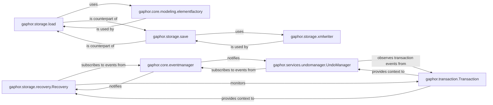

## Details

The Gaphor application's core functionality revolves around robust model management, encompassing loading, saving, recovery, and undo/redo capabilities. The `gaphor.core.eventmanager` acts as a central nervous system, coordinating interactions between components by dispatching events. Model persistence is handled by `gaphor.storage.load` and `gaphor.storage.save`, which rely on `gaphor.core.modeling.elementfactory` for object instantiation and `gaphor.storage.xmlwriter` for XML serialization. Data integrity and user experience are enhanced by `gaphor.storage.recovery.Recovery` and `gaphor.services.undomanager.UndoManager`, both of which observe and react to the atomic changes managed by `gaphor.transaction.Transaction`. This design ensures a consistent and recoverable state for the user's modeling work.

### gaphor.storage.load
Responsible for deserializing Gaphor models from persistent storage (e.g., XML files) into in-memory objects. It reconstructs model elements and their relationships, handling version compatibility.

**Related Classes/Methods**:

- <a href="https://github.com/gaphor/gaphor/blob/main/gaphor/storage/load.py#L188-L201" target="_blank" rel="noopener noreferrer">`gaphor.storage.load.load`:188-201</a>

### gaphor.storage.save
Manages the serialization of the current in-memory Gaphor model into a persistent format (e.g., XML) for storage. It iterates through model elements and their properties to create a complete representation.

**Related Classes/Methods**:

- <a href="https://github.com/gaphor/gaphor/blob/main/gaphor/storage/save.py#L21-L28" target="_blank" rel="noopener noreferrer">`gaphor.storage.save.save`:21-28</a>

### gaphor.storage.recovery.Recovery
Ensures data integrity by logging model changes (events) to facilitate recovery from unexpected application shutdowns. It can replay these events to restore a model to its last consistent state.

**Related Classes/Methods**:

- <a href="https://github.com/gaphor/gaphor/blob/main/gaphor/storage/recovery.py#L80-L177" target="_blank" rel="noopener noreferrer">`gaphor.storage.recovery.Recovery`:80-177</a>

### gaphor.services.undomanager.UndoManager
Provides undo and redo capabilities by tracking and managing a stack of reversible model operations. It groups individual model changes into logical transactions.

**Related Classes/Methods**:

- <a href="https://github.com/gaphor/gaphor/blob/main/gaphor/services/undomanager.py#L121-L493" target="_blank" rel="noopener noreferrer">`gaphor.services.undomanager.UndoManager`:121-493</a>

### gaphor.core.eventmanager
A central event bus that manages and dispatches events throughout the application, notifying subscribed components of model changes and transaction states.

**Related Classes/Methods**:

- <a href="https://github.com/gaphor/gaphor/blob/main/" target="_blank" rel="noopener noreferrer">`gaphor.core.eventmanager`</a>

### gaphor.transaction.Transaction
Manages atomic model changes and the lifecycle of transactions, ensuring data consistency by grouping multiple operations into a single, reversible unit.

**Related Classes/Methods**:

- <a href="https://github.com/gaphor/gaphor/blob/main/gaphor/transaction.py#L16-L131" target="_blank" rel="noopener noreferrer">`gaphor.transaction.Transaction`:16-131</a>

### gaphor.core.modeling.elementfactory
Responsible for instantiating and managing Gaphor model elements, particularly during the loading process and other model creation operations.

**Related Classes/Methods**:

- <a href="https://github.com/gaphor/gaphor/blob/main/" target="_blank" rel="noopener noreferrer">`gaphor.core.modeling.elementfactory`</a>

### gaphor.storage.xmlwriter
Handles the low-level serialization of Gaphor model data into XML format, used by the `save` component to write models to persistent storage.

**Related Classes/Methods**:

- <a href="https://github.com/gaphor/gaphor/blob/main/gaphor/storage/xmlwriter.py#L24-L162" target="_blank" rel="noopener noreferrer">`gaphor.storage.xmlwriter.XMLWriter`:24-162</a>

### [FAQ](https://github.com/CodeBoarding/GeneratedOnBoardings/tree/main?tab=readme-ov-file#faq)