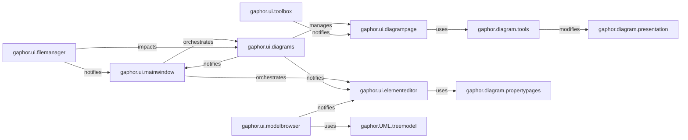

## Details

The User Interface subsystem in gaphor encompasses all graphical user interface elements for user interaction, including diagram editing, property editing, model browsing, and file management dialogs. It combines the "View" and "Controller" aspects for visual interaction, adhering to the Desktop GUI Application pattern.

### gaphor.ui.mainwindow
Acts as the primary application container, orchestrating the visibility and interaction between major UI panels and managing global application actions (e.g., file operations, active diagram switching).

**Related Classes/Methods**:

- <a href="https://github.com/gaphor/gaphor/blob/main/gaphor/ui/mainwindow.py" target="_blank" rel="noopener noreferrer">`gaphor.ui.mainwindow`</a>

### gaphor.ui.diagrams
Manages the lifecycle of multiple `diagrampage` instances, allowing users to switch between different open diagrams (e.g., via tabs).

**Related Classes/Methods**:

- <a href="https://github.com/gaphor/gaphor/blob/main/gaphor/ui/diagrams.py" target="_blank" rel="noopener noreferrer">`gaphor.ui.diagrams`</a>

### gaphor.ui.diagrampage
Represents the primary interactive view for a single diagram, handling user input for drawing, selecting, and manipulating diagram items. It acts as the "View" and "Controller" for a specific diagram.

**Related Classes/Methods**:

- <a href="https://github.com/gaphor/gaphor/blob/main/gaphor/ui/diagrampage.py" target="_blank" rel="noopener noreferrer">`gaphor.ui.diagrampage`</a>

### gaphor.ui.toolbox
Presents a categorized list of tools (e.g., class tool, association tool) that users can select to create new diagram elements.

**Related Classes/Methods**:

- <a href="https://github.com/gaphor/gaphor/blob/main/gaphor/ui/toolbox.py" target="_blank" rel="noopener noreferrer">`gaphor.ui.toolbox`</a>

### gaphor.ui.elementeditor
Displays and allows editing of properties for the currently selected model element or diagram item, providing a detailed "Property View."

**Related Classes/Methods**:

- <a href="https://github.com/gaphor/gaphor/blob/main/gaphor/ui/elementeditor.py" target="_blank" rel="noopener noreferrer">`gaphor.ui.elementeditor`</a>

### gaphor.ui.modelbrowser
Provides a tree-like hierarchical view of all model elements within the project, enabling navigation, selection, and direct manipulation of the underlying model structure.

**Related Classes/Methods**:

- <a href="https://github.com/gaphor/gaphor/blob/main/gaphor/ui/modelbrowser.py" target="_blank" rel="noopener noreferrer">`gaphor.ui.modelbrowser`</a>

### gaphor.ui.filemanager
Manages all file-related operations, including opening, saving, reloading, and merging project files. It acts as the "Controller" for file persistence.

**Related Classes/Methods**:

- <a href="https://github.com/gaphor/gaphor/blob/main/gaphor/ui/filemanager.py" target="_blank" rel="noopener noreferrer">`gaphor.ui.filemanager`</a>

### gaphor.diagram.tools
Provides foundational logic for user interactions on the diagram, such as selecting items, moving them, and creating new elements based on the active tool.

**Related Classes/Methods**:

- <a href="https://github.com/gaphor/gaphor/blob/main/gaphor/diagram/tools" target="_blank" rel="noopener noreferrer">`gaphor.diagram.tools`</a>

### gaphor.diagram.propertypages
Provides property page definitions for diagram elements.

**Related Classes/Methods**:

- <a href="https://github.com/gaphor/gaphor/blob/main/gaphor/diagram/propertypages.py" target="_blank" rel="noopener noreferrer">`gaphor.diagram.propertypages`</a>

### gaphor.UML.treemodel
Provides the tree model for UML elements.

**Related Classes/Methods**:

- <a href="https://github.com/gaphor/gaphor/blob/main/gaphor/UML/treemodel.py" target="_blank" rel="noopener noreferrer">`gaphor.UML.treemodel`</a>

### gaphor.diagram.presentation
Represents the visual presentation of diagram items.

**Related Classes/Methods**:

- <a href="https://github.com/gaphor/gaphor/blob/main/gaphor/diagram/presentation.py" target="_blank" rel="noopener noreferrer">`gaphor.diagram.presentation`</a>

### [FAQ](https://github.com/CodeBoarding/GeneratedOnBoardings/tree/main?tab=readme-ov-file#faq)