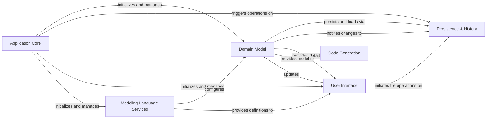

## Details

The Gaphor project exhibits a clear Model-View-Controller (MVC) like architecture, with a strong emphasis on a central `Domain Model` that encapsulates the core UML/SysML data. The `Application Core` acts as the orchestrator, managing the lifecycle of various services and components. `Persistence & History` is a critical component for data integrity and user experience, handling model storage and change tracking. The `User Interface` serves as the primary interaction point, visualizing and allowing manipulation of the `Domain Model`. Specialized services like `Modeling Language Services` and `Code Generation` extend the core functionality, providing language-specific configurations and model-to-code transformations, respectively. The design promotes modularity, allowing for clear separation of concerns and facilitating future extensions, particularly in supporting new modeling languages or export formats.

### Application Core [[Expand]](./Application_Core.md)
Manages the overall application lifecycle, service orchestration, event dispatching, and plugin management. It acts as the central hub for application-wide concerns, ensuring services are properly initialized and coordinated.

**Related Classes/Methods**:

- <a href="https://github.com/gaphor/gaphor/blob/main/gaphor/main.py" target="_blank" rel="noopener noreferrer">`gaphor.main`</a>
- <a href="https://github.com/gaphor/gaphor/blob/main/gaphor/application.py" target="_blank" rel="noopener noreferrer">`gaphor.application`</a>
- <a href="https://github.com/gaphor/gaphor/blob/main/gaphor/entrypoint.py" target="_blank" rel="noopener noreferrer">`gaphor.entrypoint`</a>
- <a href="https://github.com/gaphor/gaphor/blob/main/gaphor/core/eventmanager.py" target="_blank" rel="noopener noreferrer">`gaphor.core.eventmanager`</a>
- <a href="https://github.com/gaphor/gaphor/blob/main/gaphor/plugins" target="_blank" rel="noopener noreferrer">`gaphor.plugins`</a>

### Domain Model [[Expand]](./Domain_Model.md)
The foundational component responsible for managing the abstract UML/SysML data model. It is the "Model" in the MVC pattern, encapsulating the core data, relationships, and business logic of the modeling domain.

**Related Classes/Methods**:

- <a href="https://github.com/gaphor/gaphor/blob/main/gaphor/core/modeling/elementfactory.py" target="_blank" rel="noopener noreferrer">`gaphor.core.modeling.elementfactory`</a>
- <a href="https://github.com/gaphor/gaphor/blob/main/gaphor/core/modeling/elementdispatcher.py" target="_blank" rel="noopener noreferrer">`gaphor.core.modeling.elementdispatcher`</a>
- <a href="https://github.com/gaphor/gaphor/blob/main/gaphor/core/modeling/base.py" target="_blank" rel="noopener noreferrer">`gaphor.core.modeling.base`</a>

### Persistence & History [[Expand]](./Persistence_History.md)
Handles the loading, saving, and recovery of models from storage, along with managing the history of model changes to support undo and redo operations. This component ensures data integrity and user flexibility.

**Related Classes/Methods**:

- `gaphor.storage.load`
- `gaphor.storage.save`
- `gaphor.storage.recovery`
- `gaphor.services.undomanager`

### User Interface [[Expand]](./User_Interface.md)
Encompasses all graphical user interface elements for user interaction, including diagram editing, property editing, model browsing, and file management dialogs. It combines the "View" and "Controller" aspects for visual interaction.

**Related Classes/Methods**:

- <a href="https://github.com/gaphor/gaphor/blob/main/gaphor/ui/diagrams.py" target="_blank" rel="noopener noreferrer">`gaphor.ui.diagrams`</a>
- <a href="https://github.com/gaphor/gaphor/blob/main/gaphor/ui/diagrampage.py" target="_blank" rel="noopener noreferrer">`gaphor.ui.diagrampage`</a>
- <a href="https://github.com/gaphor/gaphor/blob/main/gaphor/diagram/tools" target="_blank" rel="noopener noreferrer">`gaphor.diagram.tools`</a>
- <a href="https://github.com/gaphor/gaphor/blob/main/gaphor/diagram/painter.py" target="_blank" rel="noopener noreferrer">`gaphor.diagram.painter`</a>
- <a href="https://github.com/gaphor/gaphor/blob/main/gaphor/diagram/shapes.py" target="_blank" rel="noopener noreferrer">`gaphor.diagram.shapes`</a>
- <a href="https://github.com/gaphor/gaphor/blob/main/gaphor/diagram/presentation.py" target="_blank" rel="noopener noreferrer">`gaphor.diagram.presentation`</a>
- <a href="https://github.com/gaphor/gaphor/blob/main/gaphor/core/styling/compiler.py" target="_blank" rel="noopener noreferrer">`gaphor.core.styling.compiler`</a>
- <a href="https://github.com/gaphor/gaphor/blob/main/gaphor/core/modeling/stylesheet.py" target="_blank" rel="noopener noreferrer">`gaphor.core.modeling.stylesheet`</a>
- <a href="https://github.com/gaphor/gaphor/blob/main/gaphor/diagram/styleeditor.py" target="_blank" rel="noopener noreferrer">`gaphor.diagram.styleeditor`</a>
- <a href="https://github.com/gaphor/gaphor/blob/main/gaphor/ui/toolbox.py" target="_blank" rel="noopener noreferrer">`gaphor.ui.toolbox`</a>
- <a href="https://github.com/gaphor/gaphor/blob/main/gaphor/diagram/tools/placement.py" target="_blank" rel="noopener noreferrer">`gaphor.diagram.tools.placement`</a>
- <a href="https://github.com/gaphor/gaphor/blob/main/gaphor/ui/elementeditor.py" target="_blank" rel="noopener noreferrer">`gaphor.ui.elementeditor`</a>
- <a href="https://github.com/gaphor/gaphor/blob/main/gaphor/diagram/propertypages.py" target="_blank" rel="noopener noreferrer">`gaphor.diagram.propertypages`</a>
- <a href="https://github.com/gaphor/gaphor/blob/main/gaphor/UML/propertypages.py" target="_blank" rel="noopener noreferrer">`gaphor.UML.propertypages`</a>
- <a href="https://github.com/gaphor/gaphor/blob/main/gaphor/ui/modelbrowser.py" target="_blank" rel="noopener noreferrer">`gaphor.ui.modelbrowser`</a>
- <a href="https://github.com/gaphor/gaphor/blob/main/gaphor/UML/treemodel.py" target="_blank" rel="noopener noreferrer">`gaphor.UML.treemodel`</a>
- <a href="https://github.com/gaphor/gaphor/blob/main/gaphor/ui/filemanager.py" target="_blank" rel="noopener noreferrer">`gaphor.ui.filemanager`</a>

### Modeling Language Services [[Expand]](./Modeling_Language_Services.md)
Manages the active modeling language (e.g., UML, SysML), providing language-specific definitions for toolbox elements, diagram types, and element behaviors. It ensures the application adheres to the rules and constructs of the chosen modeling standard.

**Related Classes/Methods**:

- <a href="https://github.com/gaphor/gaphor/blob/main/gaphor/services/modelinglanguage.py" target="_blank" rel="noopener noreferrer">`gaphor.services.modelinglanguage`</a>

### Code Generation [[Expand]](./Code_Generation.md)
Translates the abstract model into executable code or other textual representations (e.g., XML, documentation). This component provides the capability to derive artifacts from the visual model.

**Related Classes/Methods**:

- <a href="https://github.com/gaphor/gaphor/blob/main/gaphor/codegen/coder.py" target="_blank" rel="noopener noreferrer">`gaphor.codegen.coder`</a>

### [FAQ](https://github.com/CodeBoarding/GeneratedOnBoardings/tree/main?tab=readme-ov-file#faq)