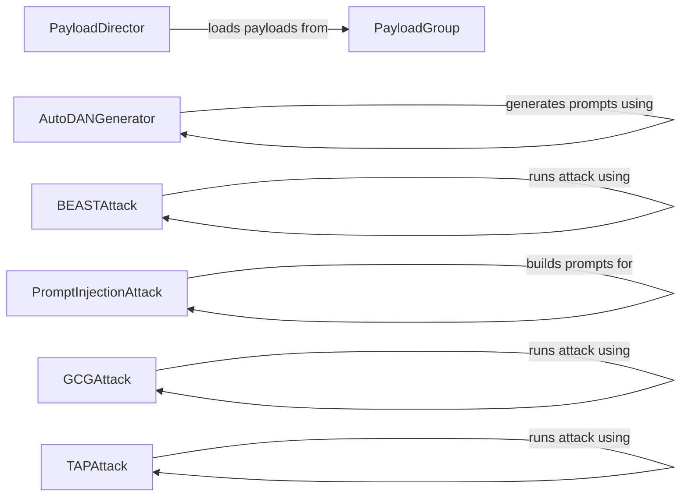

## Component Details

The Data & Resource Management component in garak is responsible for providing access to data files, managing external resources, and ensuring the availability of necessary data for other components during the testing process. It encompasses functionalities for loading payloads, generating adversarial prompts, and scoring mechanisms. The central flow involves loading data from various sources, processing it, and providing it to other components for attack generation and evaluation.

### PayloadDirector
The PayloadDirector manages the lifecycle of payloads, loading them from various sources, refreshing them, and providing access to them for other components. It interacts with PayloadGroup to load payloads from specific sources and provides a central point for accessing and managing payloads.
- **Related Classes/Methods**: `garak.payloads.Director:_refresh_payloads`, `garak.payloads.Director:_load_payload`, `garak.payloads.Director:load`, `garak.payloads.Director:__init__`

### PayloadGroup
PayloadGroup represents a collection of payloads loaded from a specific source. It handles the loading and organization of these payloads. It is used by the PayloadDirector to manage payloads from different sources, providing a structured way to access payloads from specific origins.
- **Related Classes/Methods**: `garak.payloads.PayloadGroup:_load`, `garak.payloads.PayloadGroup:__init__`

### AutoDANGenerator
The AutoDANGenerator is responsible for generating adversarial prompts using the AutoDAN technique. It uses genetic algorithms to evolve prompts that are effective at eliciting undesirable behavior from LLMs. It interacts with model_utils for scoring and genetic for applying genetic operations, providing a mechanism for automated adversarial prompt generation.
- **Related Classes/Methods**: `garak.resources.autodan.autodan:autodan_generate`, `garak.resources.autodan.genetic:autodan_ga`, `garak.resources.autodan.genetic:autodan_hga`

### BEASTAttack
The BEASTAttack component implements the BEAST attack, which involves iteratively evaluating candidate prompts, scoring them, and sampling tokens to find adversarial prompts. It interacts with generator to generate prompts and with scoring to score the generated prompts, providing an iterative approach to adversarial prompt generation.
- **Related Classes/Methods**: `garak.resources.beast.beast_attack:run_beast`, `garak.resources.beast.beast_attack:_attack`

### PromptInjectionAttack
The PromptInjectionAttack component builds and scores prompts for prompt injection attacks. It compiles prompts and creates product lists to generate a variety of injection attempts. It interacts with scoring to evaluate the effectiveness of the generated prompts, providing a systematic way to generate and evaluate prompt injection attacks.
- **Related Classes/Methods**: `garak.resources.promptinject.scoring:score_attacks`, `garak.resources.promptinject.prompting:build_prompts`

### GCGAttack
The GCGAttack component runs the Generative Combinatorial Generation attack to generate adversarial prompts. It performs optimization steps to refine prompts that are effective at eliciting undesirable behavior. It interacts with attack_manager and gcg_attack modules to perform the attack, providing an optimization-based approach to adversarial prompt generation.
- **Related Classes/Methods**: `garak.resources.gcg.generate_gcg:run_gcg`, `garak.resources.gcg.gcg_attack.GCGMultiPromptAttack:step`

### TAPAttack
The TAPAttack component runs the Targeted Adversarial Perturbations attack. It generates perturbations to existing prompts to make them more effective at eliciting targeted behavior. It interacts with generator_utils to generate prompts, providing a perturbation-based approach to adversarial prompt generation.
- **Related Classes/Methods**: `garak.resources.tap.tap_main:run_tap`
