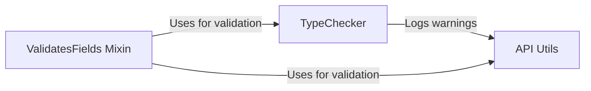

## Component Details

The Data Validation and Type Checking subsystem ensures data integrity when interacting with the Facebook API. It validates data types and formats for both incoming and outgoing data, preventing errors and maintaining consistency. The core components work together to enforce data type constraints, convert data when necessary, and log warnings for potential issues.

### ValidatesFields Mixin
The `ValidatesFields` mixin provides a mechanism to validate fields within a class. Specifically, the `__setitem__` method is responsible for handling the assignment of values to fields and triggering validation if necessary. It checks if the assigned value conforms to the expected type and format, raising warnings if validation fails.
- **Related Classes/Methods**: `facebook_business.mixins.ValidatesFields:__setitem__`

### TypeChecker
The `TypeChecker` class is the core component responsible for performing type checking and data conversion. It provides methods to determine if a value is of a specific type, convert strings to primitive types, and validate complex data structures like lists and maps. It uses a set of predefined rules and type mappings to ensure data conforms to the expected schema.
- **Related Classes/Methods**: `facebook_business.typechecker.TypeChecker:convert_string_to_prim_type`, `facebook_business.typechecker.TypeChecker:is_valid_pair`, `facebook_business.typechecker.TypeChecker:is_type`, `facebook_business.typechecker.TypeChecker:is_list_param`, `facebook_business.typechecker.TypeChecker:is_map_param`, `facebook_business.typechecker.TypeChecker:is_file_param`, `facebook_business.typechecker.TypeChecker:get_typed_value`

### API Utils
The `api_utils` module provides utility functions for interacting with the Facebook API, including a `warning` function for logging warnings related to data validation or other API-related issues. These warnings are raised when data fails to validate against the expected types or formats.
- **Related Classes/Methods**: `facebook_business.utils.api_utils:warning`
