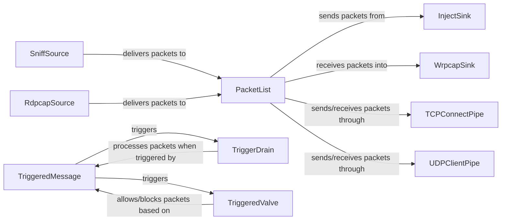

## Component Details

The DataProcessing component in Scapy provides a flexible framework for capturing, manipulating, and exporting network packets. It centers around the PacketList, which acts as a container for packets and offers various methods for filtering, summarizing, and displaying packet data. Data sources like SniffSource (for live capture) and RdpcapSource (for reading from pcap files) feed packets into the PacketList. Conversely, data sinks like InjectSink (for sending packets) and WrpcapSink (for writing to pcap files) receive packets from the PacketList. Additional components like TCPConnectPipe and UDPClientPipe facilitate communication over TCP and UDP respectively. Triggered components (TriggeredMessage, TriggerDrain, TriggeredValve, TriggeredQueueingValve, TriggeredSwitch) enable conditional packet processing based on specific triggers.

### PacketList
Represents a list of packets and provides methods for manipulating and analyzing them, including filtering, summarizing, and displaying packet information. It acts as a central hub for packet management.
- **Related Classes/Methods**: `scapy.plist._PacketList`

### SniffSource
Captures packets from a network interface using `scapy.sniff()`. It continuously provides captured packets to the PacketList.
- **Related Classes/Methods**: `scapy.scapypipes.SniffSource`

### RdpcapSource
Reads packets from a pcap file, iterating through the packets and delivering them to the PacketList.
- **Related Classes/Methods**: `scapy.scapypipes.RdpcapSource`

### InjectSink
Injects packets into the network using `scapy.send()` or `scapy.sendp()`. It receives packets from the PacketList.
- **Related Classes/Methods**: `scapy.scapypipes.InjectSink`

### WrpcapSink
Writes packets to a pcap file, appending packets received from the PacketList to the specified file.
- **Related Classes/Methods**: `scapy.scapypipes.WrpcapSink`

### TCPConnectPipe
Establishes a TCP connection and sends/receives packets over it, acting as both a source and a sink. It forwards packets between the connection and the PacketList.
- **Related Classes/Methods**: `scapy.scapypipes.TCPConnectPipe`

### UDPClientPipe
Sends and receives packets over UDP, connecting to a UDP server and forwarding packets between the connection and the PacketList.
- **Related Classes/Methods**: `scapy.scapypipes.UDPClientPipe`

### TriggeredMessage
A message that triggers an action when a specific condition is met, used for conditional packet processing in conjunction with TriggerDrain, TriggeredValve, TriggeredQueueingValve, and TriggeredSwitch.
- **Related Classes/Methods**: `scapy.scapypipes.TriggeredMessage`

### TriggerDrain
A sink that only processes packets when triggered by a TriggeredMessage, allowing for selective packet processing based on specific conditions.
- **Related Classes/Methods**: `scapy.scapypipes.TriggerDrain`

### TriggeredValve
A valve that either allows or blocks packets based on a trigger from a TriggeredMessage, used for conditional packet filtering.
- **Related Classes/Methods**: `scapy.scapypipes.TriggeredValve`
