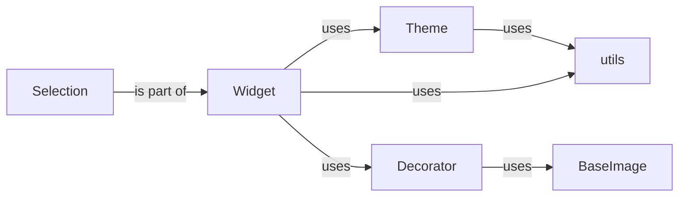

## Component Details

The Drawing and Decoration subsystem in pygame-menu provides the ability to enhance the visual appearance of menus by adding graphical elements such as shapes, images, and text. It relies on the BaseImage component for image handling, the Decorator component for managing decorations, and the Theme component for defining the overall visual style. Widgets utilize these components to render their appearance, and the utils module provides utility functions for color manipulation and surface creation. The Selection component is responsible for highlighting selected widgets.

### BaseImage
Handles image loading, manipulation (scaling, cropping, rotation), and drawing. It provides a consistent interface for image-related operations within the menu system.
- **Related Classes/Methods**: `pygame_menu.baseimage.BaseImage`

### Decorator
Provides functionalities to add graphical decorations (shapes, text, images) to UI elements. It manages a cache of decorations for efficient rendering.
- **Related Classes/Methods**: `pygame_menu._decorator.Decorator`, `pygame_menu._decorator._DecoratorCopyException`

### Theme
Defines the visual style of the menu, including colors, fonts, and background images. It provides methods for validating and applying theme settings.
- **Related Classes/Methods**: `pygame_menu.themes.Theme`

### Widget
The base class for all UI elements in the menu. It handles rendering, event handling (mouse over, selection), and value management. It also manages the widget's position, size, and appearance.
- **Related Classes/Methods**: `pygame_menu.widgets.core.widget.Widget`

### Selection
Handles the visual representation of a selected widget, including its color and background color.
- **Related Classes/Methods**: `pygame_menu.widgets.core.selection.Selection`

### utils
Provides utility functions for color formatting, gradient filling, and surface creation.
- **Related Classes/Methods**: `pygame_menu.utils`
