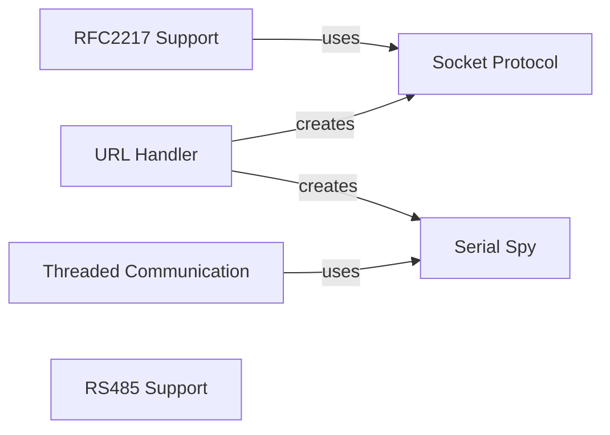

## Component Details

The Extended Communication Protocols component enhances the pyserial library by providing support for various communication protocols and features beyond basic serial communication. It includes RFC2217 for network serial ports, URL handling for flexible port specification, threaded communication for asynchronous operations, and RS485 for industrial applications. These extensions expand the library's capabilities, enabling remote access, concurrent communication, and compatibility with diverse hardware interfaces.

### RFC2217 Support
This component provides support for accessing serial ports over a network using the RFC2217 protocol. It includes classes for managing the Telnet connection, handling option negotiation, and transferring data between the local machine and the remote serial port server.
- **Related Classes/Methods**: `serial/rfc2217.py`

### URL Handler
The URL Handler component allows specifying serial ports using URLs, providing a flexible and extensible way to configure serial connections. It supports various URL schemes, including socket, cp2110, loop, and spy, each with its own implementation for creating and managing the serial port instance.
- **Related Classes/Methods**: `serial/urlhandler/__init__.py`, `serial/serial.py`

### Threaded Communication
The Threaded Communication component enables asynchronous serial communication by using threads to read data from the serial port and process it in the background. It includes classes for packetizing data and managing the reader thread, allowing for non-blocking serial operations.
- **Related Classes/Methods**: `serial/threaded.py`

### RS485 Support
This component provides support for RS485 serial communication, handling the specific requirements of this protocol, such as controlling the transceiver enable signal. It allows applications to communicate with devices using the RS485 standard, commonly used in industrial environments.
- **Related Classes/Methods**: `serial/rs485.py`

### Socket Protocol
The Socket Protocol component implements serial communication over a network socket. It allows connecting to a remote serial port by establishing a socket connection and exchanging data over the network.
- **Related Classes/Methods**: `serial/urlhandler/protocol_socket.py`

### Serial Spy
The Serial Spy component wraps another serial port and logs the data transmitted and received. It's used for debugging and monitoring serial communication by intercepting and recording data flow.
- **Related Classes/Methods**: `serial/urlhandler/protocol_spy.py`
