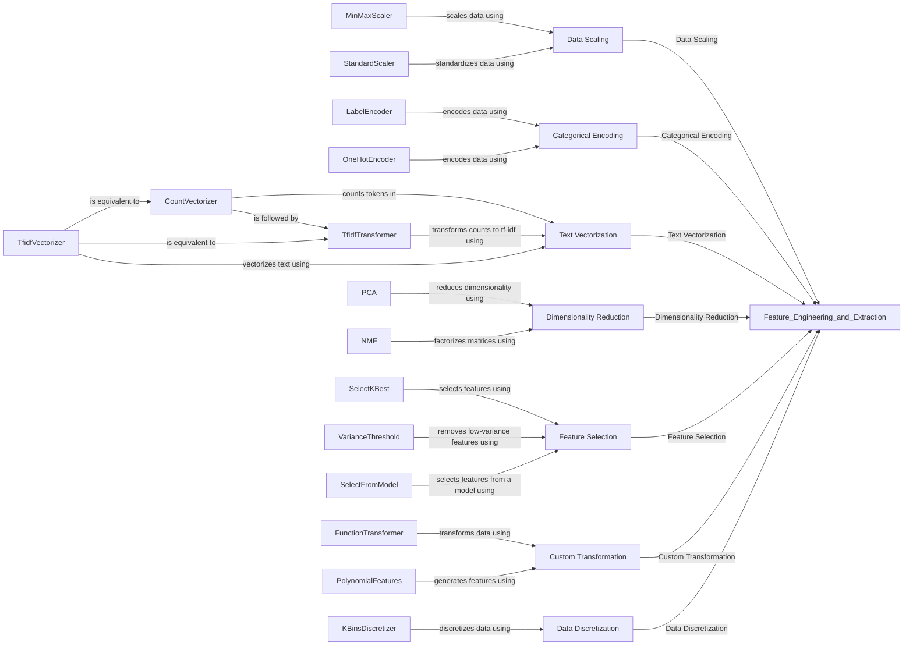

## Component Details

The Feature Engineering and Extraction component transforms raw data into a suitable feature representation for machine learning models. It encompasses scaling numerical features, encoding categorical features, handling text data, and applying dimensionality reduction techniques. The main flow involves selecting appropriate transformation techniques based on the data type and model requirements, applying these transformations, and potentially reducing the dimensionality of the resulting features to improve model performance and reduce computational cost. The purpose is to create informative and relevant features that enhance the accuracy and efficiency of machine learning models.

### Data Scaling
This component focuses on scaling numerical features to a specific range or distribution. MinMaxScaler scales features to a range between 0 and 1, while StandardScaler standardizes features by removing the mean and scaling to unit variance. These techniques ensure that features with different scales do not disproportionately influence the model.
- **Related Classes/Methods**: `sklearn.preprocessing._data.MinMaxScaler`, `sklearn.preprocessing._data.StandardScaler`

### Categorical Encoding
This component handles the encoding of categorical features into numerical representations. LabelEncoder converts categorical labels into numerical values between 0 and n_classes-1. OneHotEncoder transforms categorical features into a one-hot numeric array, creating binary columns for each category.
- **Related Classes/Methods**: `sklearn.preprocessing._label.LabelEncoder`, `sklearn.preprocessing._encoders.OneHotEncoder`

### Text Vectorization
This component converts text documents into numerical feature vectors. CountVectorizer counts the occurrences of each word in the documents, while TfidfTransformer transforms these counts into TF-IDF (Term Frequency-Inverse Document Frequency) values, which reflect the importance of each word in the document relative to the entire corpus. TfidfVectorizer combines both steps.
- **Related Classes/Methods**: `sklearn.feature_extraction.text.CountVectorizer`, `sklearn.feature_extraction.text.TfidfTransformer`, `sklearn.feature_extraction.text.TfidfVectorizer`

### Dimensionality Reduction
This component reduces the number of features while preserving important information. PCA (Principal Component Analysis) performs linear dimensionality reduction by projecting the data onto a set of orthogonal components. NMF (Non-Negative Matrix Factorization) decomposes the data into two non-negative matrices, which can be useful for topic extraction or dimensionality reduction on non-negative data.
- **Related Classes/Methods**: `sklearn.decomposition._pca.PCA`, `sklearn.decomposition._nmf.NMF`

### Feature Selection
This component selects a subset of the most relevant features. SelectKBest selects features based on univariate statistical tests. VarianceThreshold removes features with low variance. SelectFromModel selects features based on the importance weights assigned by a model.
- **Related Classes/Methods**: `sklearn.feature_selection._univariate_selection.SelectKBest`, `sklearn.feature_selection._variance_threshold.VarianceThreshold`, `sklearn.feature_selection._from_model.SelectFromModel`

### Custom Transformation
This component allows users to apply custom transformations to the data using an arbitrary callable. FunctionTransformer constructs a transformer from a user-defined function, enabling flexible data manipulation. PolynomialFeatures generates polynomial and interaction features from the input features, expanding the feature space.
- **Related Classes/Methods**: `sklearn.preprocessing._function_transformer.FunctionTransformer`, `sklearn.preprocessing._polynomial.PolynomialFeatures`

### Data Discretization
This component discretizes continuous features into intervals. KBinsDiscretizer bins continuous data into k intervals, transforming continuous features into discrete ones.
- **Related Classes/Methods**: `sklearn.preprocessing._discretization.KBinsDiscretizer`
