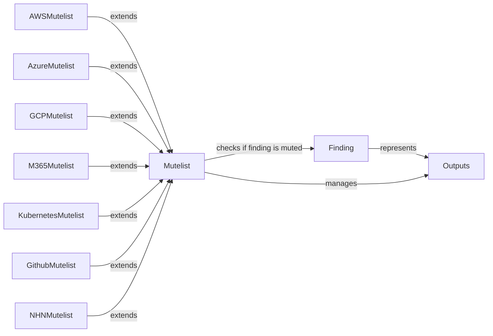

## Component Details

The Finding and Mute Management component is responsible for generating, formatting, and filtering security findings. It leverages the `Finding` class to represent individual findings with details like resource ID, status, severity, and remediation steps. The `Mutelist` class and its platform-specific subclasses (`AWSMutelist`, `AzureMutelist`, `GCPMutelist`, `M365Mutelist`, `KubernetesMutelist`, `GithubMutelist`, `NHNMutelist`) are used to manage and apply muting rules, suppressing findings based on user-defined criteria. The `Outputs` module then uses these components to generate reports in various formats (HTML, CSV, compliance-specific formats), ensuring that muted findings are excluded.

### Finding
Represents a single security finding, encapsulating its details such as resource ID, status, severity, and remediation steps. It provides methods for formatting the finding for output in various formats.
- **Related Classes/Methods**: `prowler.lib.outputs.finding.Finding`

### Mutelist
Manages the mutelist, which contains a list of findings that should be excluded from the report. It provides methods for checking if a finding is muted based on various criteria.
- **Related Classes/Methods**: `prowler.lib.mutelist.mutelist.Mutelist`

### AWSMutelist
Extends the Mutelist class to provide AWS-specific muting logic. It checks if a finding is muted based on AWS-specific criteria.
- **Related Classes/Methods**: `prowler.providers.aws.lib.mutelist.mutelist.AWSMutelist`

### AzureMutelist
Extends the Mutelist class to provide Azure-specific muting logic. It checks if a finding is muted based on Azure-specific criteria.
- **Related Classes/Methods**: `prowler.providers.azure.lib.mutelist.mutelist.AzureMutelist`

### GCPMutelist
Extends the Mutelist class to provide GCP-specific muting logic. It checks if a finding is muted based on GCP-specific criteria.
- **Related Classes/Methods**: `prowler.providers.gcp.lib.mutelist.mutelist.GCPMutelist`

### M365Mutelist
Extends the Mutelist class to provide M365-specific muting logic. It checks if a finding is muted based on M365-specific criteria.
- **Related Classes/Methods**: `prowler.providers.m365.lib.mutelist.mutelist.M365Mutelist`

### KubernetesMutelist
Extends the Mutelist class to provide Kubernetes-specific muting logic. It checks if a finding is muted based on Kubernetes-specific criteria.
- **Related Classes/Methods**: `prowler.providers.kubernetes.lib.mutelist.mutelist.KubernetesMutelist`

### GithubMutelist
Extends the Mutelist class to provide Github-specific muting logic. It checks if a finding is muted based on Github-specific criteria.
- **Related Classes/Methods**: `prowler.providers.github.lib.mutelist.mutelist.GithubMutelist`

### NHNMutelist
Extends the Mutelist class to provide NHN-specific muting logic. It checks if a finding is muted based on NHN-specific criteria.
- **Related Classes/Methods**: `prowler.providers.nhn.lib.mutelist.mutelist.NHNMutelist`

### Outputs
The Outputs module is responsible for generating reports in various formats, including HTML, CSV, and compliance-specific formats. It utilizes the Finding class to format individual findings and the Mutelist class to filter out muted findings.
- **Related Classes/Methods**: `prowler.lib.outputs.outputs`
