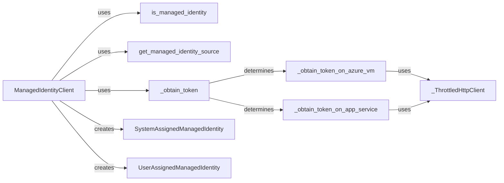

## Component Details

The Managed Identity Provider component enables applications running in Azure environments to authenticate using managed identities, eliminating the need for explicit credentials. The main flow involves determining if the application is running in a managed identity enabled environment, identifying the source of the managed identity (e.g., Azure VM, App Service), and then acquiring a token from the appropriate endpoint. The ManagedIdentityClient orchestrates this process, creating instances of SystemAssignedManagedIdentity or UserAssignedManagedIdentity as needed. Throttling is implemented to prevent overwhelming the managed identity endpoint.

### ManagedIdentityClient
This class orchestrates the token acquisition process using Managed Identity. It determines the appropriate managed identity endpoint and interacts with it to retrieve the token. It also creates instances of SystemAssignedManagedIdentity and UserAssignedManagedIdentity.
- **Related Classes/Methods**: `microsoft-authentication-library-for-python.msal.managed_identity.ManagedIdentityClient`

### is_managed_identity
This function determines if the application is running in a Managed Identity enabled environment by checking for specific environment variables or other indicators.
- **Related Classes/Methods**: `microsoft-authentication-library-for-python.msal.managed_identity:is_managed_identity`

### get_managed_identity_source
This function identifies the source of the managed identity (e.g., Azure VM, App Service, Azure Arc, Azure Machine Learning) by inspecting the environment and available endpoints.
- **Related Classes/Methods**: `microsoft-authentication-library-for-python.msal.managed_identity:get_managed_identity_source`

### _obtain_token
This function acts as a dispatcher, calling the correct token acquisition method based on the managed identity source determined by `get_managed_identity_source`. It selects the appropriate `_obtain_token_on_*` function.
- **Related Classes/Methods**: `microsoft-authentication-library-for-python.msal.managed_identity:_obtain_token`

### _obtain_token_on_azure_vm
This function obtains a token when the application is running on an Azure Virtual Machine. It interacts with the Azure Instance Metadata Service (IMDS) endpoint to retrieve the token, using `_ThrottledHttpClient` for making the HTTP request.
- **Related Classes/Methods**: `microsoft-authentication-library-for-python.msal.managed_identity:_obtain_token_on_azure_vm`

### _obtain_token_on_app_service
This function obtains a token when the application is running on an Azure App Service. It interacts with the App Service managed identity endpoint to retrieve the token, using `_ThrottledHttpClient` for making the HTTP request.
- **Related Classes/Methods**: `microsoft-authentication-library-for-python.msal.managed_identity:_obtain_token_on_app_service`

### _ThrottledHttpClient
Handles HTTP requests with throttling to avoid overwhelming the managed identity endpoint. It implements retry logic with exponential backoff to handle transient errors and rate limiting.
- **Related Classes/Methods**: `microsoft-authentication-library-for-python.msal.managed_identity._ThrottledHttpClient`

### SystemAssignedManagedIdentity
Represents a system-assigned managed identity. It encapsulates the logic for acquiring tokens using the system-assigned identity.
- **Related Classes/Methods**: `microsoft-authentication-library-for-python.msal.managed_identity.SystemAssignedManagedIdentity`

### UserAssignedManagedIdentity
Represents a user-assigned managed identity. It encapsulates the logic for acquiring tokens using a specific user-assigned identity, identified by its client ID.
- **Related Classes/Methods**: `microsoft-authentication-library-for-python.msal.managed_identity.UserAssignedManagedIdentity`
