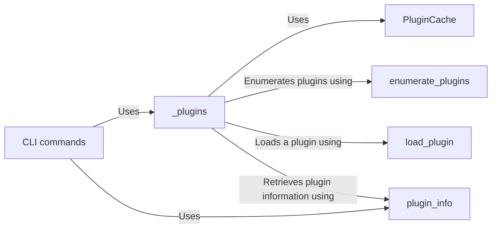

## Component Details

The Plugin Management subsystem is responsible for dynamically discovering, loading, and managing plugins within the garak framework. It utilizes a plugin cache to efficiently store and retrieve plugin information, ensuring that plugins are loaded only once. The subsystem provides functionalities to enumerate available plugins, load specific plugins, and retrieve detailed information about plugins. This allows the system to extend its functionality dynamically by incorporating various probes, generators, detectors, and buffs.

### PluginCache
The PluginCache class is a singleton that manages the loading and caching of plugins. It ensures that plugins are loaded only once and provides methods to retrieve plugin information efficiently. It uses the `_enumerate_plugin_klasses` method to find all available plugins and stores them in a cache for quick access.
- **Related Classes/Methods**: `garak.garak._plugins.PluginCache`

### _plugins
The `_plugins` module provides utility functions for interacting with plugins, such as enumerating available plugins, loading specific plugins, and retrieving plugin information. It serves as a central point for accessing plugin-related functionalities.
- **Related Classes/Methods**: `garak.garak._plugins`

### enumerate_plugins
The `enumerate_plugins` function discovers and lists all available plugins within the garak project. It searches through predefined plugin paths and identifies classes that inherit from the base plugin classes.
- **Related Classes/Methods**: `garak.garak._plugins:enumerate_plugins`

### load_plugin
The `load_plugin` function dynamically loads a specific plugin based on its name or identifier. It retrieves the plugin class from the PluginCache and instantiates it.
- **Related Classes/Methods**: `garak.garak._plugins:load_plugin`

### plugin_info
The `plugin_info` function retrieves detailed information about a specific plugin, such as its description, author, and version. It accesses the plugin's metadata and returns it in a structured format.
- **Related Classes/Methods**: `garak.garak._plugins:plugin_info`

### CLI commands
The CLI commands provide an interface for users to interact with the plugin system. These commands allow users to list plugins of different types (probes, detectors, etc.) and view detailed information about specific plugins. They use the `_plugins` module to access plugin information and display it to the user.
- **Related Classes/Methods**: `garak.garak.command:print_plugins`, `garak.garak.command:print_probes`, `garak.garak.command:print_detectors`, `garak.garak.command:print_generators`, `garak.garak.command:print_buffs`, `garak.garak.command:plugin_info`
