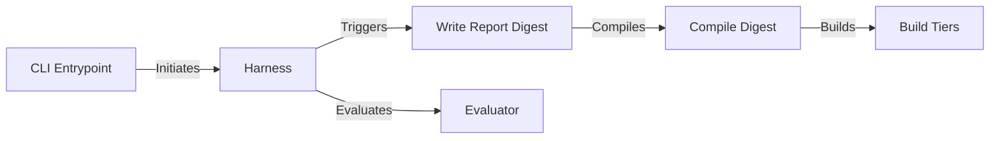

## Component Details

The Reporting & Analysis subsystem in Garak is responsible for generating comprehensive reports that summarize the findings of LLM vulnerability assessments. It aggregates results from various evaluators and attacks, compiles them into a digest, and categorizes findings for qualitative review. This process provides insights into the LLM's weaknesses and vulnerabilities, aiding in the development of more robust and secure models. The subsystem is initiated from the command line, executed within a harness, and culminates in the creation of detailed reports.

### CLI Entrypoint
The CLI entrypoint (`garak.cli.main`) is the starting point for Garak. It parses command-line arguments, configures the environment, and initiates the harness execution. It also triggers the report generation process after the harness run is complete.
- **Related Classes/Methods**: `garak.cli.main`

### Harness
The `Harness` class (`garak.harnesses.base.Harness`) manages the execution of attacks and evaluations. It orchestrates the process of loading plugins, running probes, and evaluating the model's responses. The `_end_run_hook` method is called at the end of a harness run to trigger the writing of the report digest.
- **Related Classes/Methods**: `garak.harnesses.base.Harness:_end_run_hook`

### Write Report Digest
The `write_report_digest` function (`garak.command.write_report_digest`) orchestrates the compilation of results from the evaluation and formats them into a readable report. It calls the `compile_digest` function to aggregate and summarize the findings.
- **Related Classes/Methods**: `garak.command:write_report_digest`

### Compile Digest
The `compile_digest` function (`garak.analyze.report_digest.compile_digest`) compiles the digest from the evaluation results. This involves aggregating and summarizing the findings from different evaluators and attacks. It also calls the `build_tiers` function to categorize findings for qualitative review.
- **Related Classes/Methods**: `garak.analyze.report_digest:compile_digest`

### Build Tiers
The `build_tiers` function (`garak.analyze.qual_review.build_tiers`) builds tiers for qualitative review, categorizing the findings based on severity or other criteria to facilitate manual inspection. This allows for a more focused and efficient review of the most critical vulnerabilities.
- **Related Classes/Methods**: `garak.analyze.qual_review:build_tiers`

### Evaluator
The `Evaluator` class (`garak.evaluators.base.Evaluator`) defines the interface for evaluating the model's output. It includes methods for evaluating the model's output and printing results in different formats. Evaluators are responsible for determining whether a given response is acceptable or not.
- **Related Classes/Methods**: `garak.evaluators.base.Evaluator:evaluate`, `garak.evaluators.base.Evaluator:print_results_wide`, `garak.evaluators.base.Evaluator:print_results_narrow`
