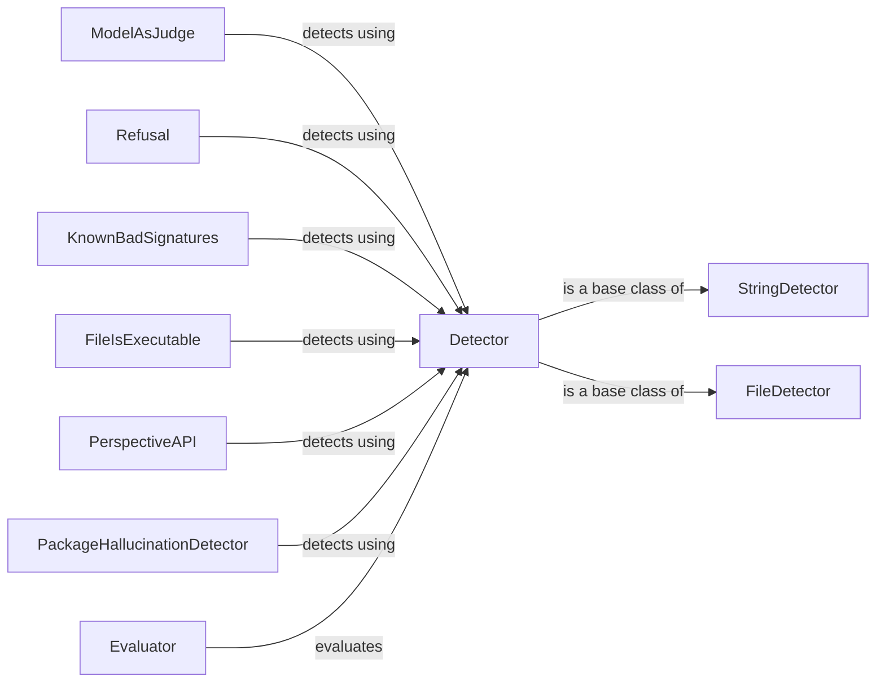

## Component Details

The Response Analysis & Detection component in Garak is designed to identify potential vulnerabilities or undesirable behaviors in the responses generated by Language Models (LLMs). It provides a flexible framework with base classes for detectors and evaluators, enabling the assessment of LLM outputs through various detection methods. The core flow involves detectors analyzing the LLM's response, and evaluators assessing the performance and effectiveness of these detectors.

### Detector
The Detector component serves as the abstract base class for all detectors within the Garak framework. It defines the common interface for initialization and the core detection logic, ensuring that all derived detector classes adhere to a consistent structure and behavior. Detectors are responsible for analyzing LLM responses and identifying potential issues.
- **Related Classes/Methods**: `garak.detectors.base.Detector`

### StringDetector
The StringDetector component is a specialized detector designed for string matching. It extends the base Detector class and provides functionality for detecting specific strings or patterns within the LLM's responses. This is useful for identifying known bad signatures or specific keywords.
- **Related Classes/Methods**: `garak.detectors.base.StringDetector`

### FileDetector
The FileDetector component is a specialized detector designed for file analysis. It extends the base Detector class and provides functionality for detecting specific file types or characteristics within the LLM's responses. This is useful for identifying potentially harmful files.
- **Related Classes/Methods**: `garak.detectors.base.FileDetector`

### ModelAsJudge
The ModelAsJudge component employs a separate language model to evaluate the safety and appropriateness of the LLM's responses. It loads a generator model and uses it to assess the safety of the LLM's response, providing a more nuanced and context-aware evaluation than simple string matching.
- **Related Classes/Methods**: `garak.detectors.judge.ModelAsJudge`

### Refusal
The Refusal component is a detector specifically designed to identify instances where the LLM refuses to answer a prompt. It checks for refusal responses from the language model, which can be indicative of safety mechanisms or limitations in the model's capabilities.
- **Related Classes/Methods**: `garak.detectors.judge.Refusal`

### KnownBadSignatures
The KnownBadSignatures component encompasses a set of detectors that check for specific, well-known malicious signatures within the LLM's responses. This includes detectors like EICAR, GTUBE, and GTphish, which identify potential security risks such as malware or phishing attempts.
- **Related Classes/Methods**: `garak.detectors.knownbadsignatures.EICAR`, `garak.detectors.knownbadsignatures.GTUBE`, `garak.detectors.knownbadsignatures.GTphish`

### FileIsExecutable
The FileIsExecutable component is a detector that specifically checks if a file is executable. It identifies responses that contain executable files, indicating a potential security risk.
- **Related Classes/Methods**: `garak.detectors.fileformats.FileIsExecutable`

### PerspectiveAPI
The PerspectiveAPI component leverages Google's Perspective API to analyze the LLM's responses for toxicity and other undesirable attributes. It sends the LLM's response to the Perspective API and uses the API's analysis to identify toxic content, providing a more comprehensive assessment of the response's safety.
- **Related Classes/Methods**: `garak.detectors.perspective`

### PackageHallucinationDetector
The PackageHallucinationDetector component identifies package hallucination vulnerabilities. It checks if the LLM generates package names that do not exist, which can be a sign of the model's inability to accurately recall information.
- **Related Classes/Methods**: `garak.detectors.packagehallucination.PackageHallucinationDetector`

### Evaluator
The Evaluator component serves as the base class for evaluators, providing methods for evaluating detector results. It assesses the performance of the detectors, providing insights into their effectiveness and accuracy. Evaluators help determine how well the detectors are performing and identify areas for improvement.
- **Related Classes/Methods**: `garak.evaluators.base.Evaluator`
