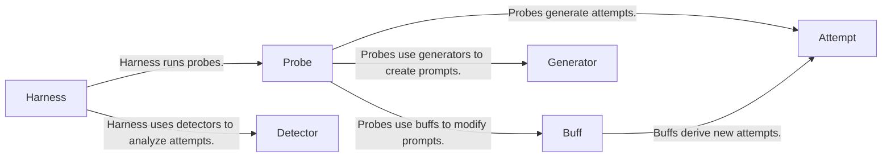

## Component Details

The test execution and orchestration component manages the entire lifecycle of a test run in Garak. It starts with the Harness, which sets up the environment and loads necessary components like probes, buffs, and detectors. The Harness then orchestrates the execution of probes, which generate prompts and interact with the language model. Buffs modify these prompts to explore different variations. Each interaction, or attempt, is recorded and analyzed by detectors to identify vulnerabilities. The component ensures that all probes are executed, results are collected, and the testing process is properly managed from start to finish.

### Harness
The Harness class is responsible for setting up the testing environment, loading necessary components like buffs and detectors, and orchestrating the execution of probes. It manages the overall testing process and provides hooks for pre- and post-run actions.
- **Related Classes/Methods**: `garak.harnesses.base.Harness`

### Probe
The Probe class defines the individual tests to be performed on the language model. It generates prompts, executes them against the model, and analyzes the outputs for vulnerabilities. Probes can utilize language providers and reverse language providers to generate diverse prompts.
- **Related Classes/Methods**: `garak.probes.base.Probe`

### Buff
The Buff class modifies the prompts generated by probes to explore different variations and edge cases. It transforms the prompts to uncover potential vulnerabilities that might not be exposed by the original prompts.
- **Related Classes/Methods**: `garak.buffs.base.Buff`

### Attempt
The Attempt class represents a single interaction with the language model, including the prompt and the model's output. It stores the history of prompts and outputs for analysis.
- **Related Classes/Methods**: `garak.attempt.Attempt`

### Detector
Detectors analyze the output of the language model in each attempt to identify potential vulnerabilities or harmful behaviors. They work in conjunction with probes and buffs to assess the model's responses.
- **Related Classes/Methods**: `garak.detectors.base.Detector`

### Generator
Generators are responsible for creating the initial prompts that are fed into the language model. They work in tandem with probes and buffs to create a diverse range of inputs.
- **Related Classes/Methods**: `garak.generators.base.Generator`
