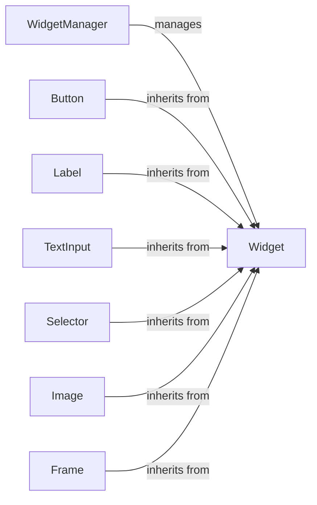

## Component Details

The Widget System in Pygame Menu provides a flexible and extensible way to create interactive menus. The core of the system revolves around the WidgetManager, which handles the addition, removal, and updating of widgets. The Widget class serves as the base for all interactive elements, providing common functionality for drawing, event handling, and positioning. Specific widget types, such as buttons, labels, and text inputs, inherit from the Base Widget and provide specialized functionality for user interaction. This architecture allows for easy creation of custom widgets and integration into the menu system.

### WidgetManager
The WidgetManager class is responsible for managing a collection of widgets. It provides methods for adding, filtering, and retrieving widgets, as well as handling generic widget creation. It maintains the state of all widgets within a menu.
- **Related Classes/Methods**: `pygame_menu._widgetmanager.WidgetManager`

### Widget
The base class for all widgets. It provides common functionality such as drawing, event handling, and positioning. It defines the basic interface that all widgets must implement.
- **Related Classes/Methods**: `pygame_menu.widgets.core.widget.Widget`, `pygame_menu.widgets.core.widget._WidgetNoValue`, `pygame_menu.widgets.core.widget._WidgetCopyException`

### Button
The Button widget triggers an action when clicked. It inherits from the Widget class and adds functionality for handling click events and executing associated callbacks.
- **Related Classes/Methods**: `pygame_menu.widgets.widget.button.Button`

### Label
The Label widget displays text on the menu. It supports underlining and dynamic title generation. It inherits from the Widget class and provides methods for rendering text on the screen.
- **Related Classes/Methods**: `pygame_menu.widgets.widget.label.Label`

### TextInput
The TextInput widget allows the user to input text. It inherits from the Widget class and provides methods for handling keyboard input and displaying the entered text.
- **Related Classes/Methods**: `pygame_menu.widgets.widget.textinput.TextInput`

### Selector
The Selector widget allows the user to select from a list of options using left and right arrows. It inherits from the Widget class and provides methods for displaying the options and handling user selection.
- **Related Classes/Methods**: `pygame_menu.widgets.widget.selector.Selector`

### Image
The Image widget displays an image on the menu. It supports scaling, resizing, rotation, and flipping of the image. It inherits from the Widget class and provides methods for loading and rendering images.
- **Related Classes/Methods**: `pygame_menu.widgets.widget.image.Image`

### Frame
The Frame widget provides a container for grouping other widgets together. It inherits from the Widget class and provides methods for managing the layout of its child widgets.
- **Related Classes/Methods**: `pygame_menu.widgets.widget.frame.Frame`
