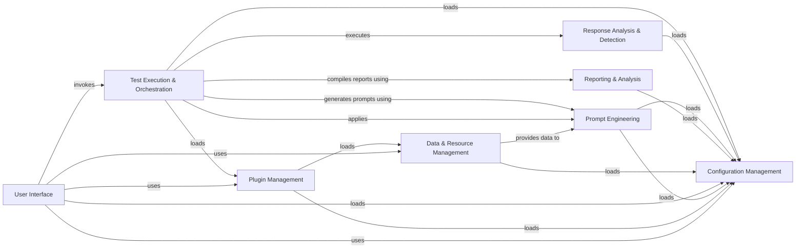

## Component Details

Garak is a security testing tool designed to probe large language models (LLMs) for vulnerabilities. It operates by generating prompts, sending them to the LLM, analyzing the responses, and reporting on potential issues. The core flow involves configuring the test, loading plugins (probes, generators, detectors, buffs), generating prompts using specified generators and payloads, applying buffs to modify the prompts, executing the probes against the LLM, analyzing the responses using detectors and evaluators, and finally generating a report summarizing the findings. The tool also provides an interactive mode for exploring configurations and running tests manually.

### Configuration Management
This component is responsible for loading, validating, and providing access to configuration settings from YAML files and environment variables. It ensures that all other components have consistent and reliable access to the settings they need to operate correctly, centralizing the management of application-wide parameters.
- **Related Classes/Methods**: `garak._config`

### Plugin Management
The Plugin Management component handles the discovery, loading, and management of various plugins, including probes, generators, detectors, and buffs. It utilizes a cache to store plugin information for efficient access and provides methods for enumerating and loading plugins, enabling the system to dynamically extend its functionality.
- **Related Classes/Methods**: `garak._plugins`, `garak.configurable`

### Prompt Engineering
This component focuses on the generation and manipulation of prompts that are sent to the LLM. It includes base classes for generators and implementations for interacting with various LLM APIs. It also incorporates the application of buffs, which are transformations applied to prompts before they are sent to the LLM, allowing for targeted testing scenarios.
- **Related Classes/Methods**: `garak.generators.base`, `garak.generators`, `garak.buffs.base`, `garak.buffs`

### Response Analysis & Detection
The Response Analysis & Detection component is responsible for analyzing the LLM's responses to identify potential vulnerabilities or undesirable behaviors. It includes base classes and implementations for various detection methods and evaluators, providing a flexible framework for assessing the LLM's output.
- **Related Classes/Methods**: `garak.detectors.base`, `garak.detectors`, `garak.evaluators.base`

### Test Execution & Orchestration
This component orchestrates the overall execution flow of a test. It manages the loading of buffs, starts and ends runs, and coordinates the interaction between generators, probes, and detectors. It also handles the execution of individual attempts, managing the lifecycle of each test case.
- **Related Classes/Methods**: `garak.harnesses.base`, `garak.attempt`

### Data & Resource Management
This component provides access to data files, such as payloads and word lists, and manages external resources, including attack prompts and scoring mechanisms. It ensures that the necessary data and resources are available to other components during the testing process.
- **Related Classes/Methods**: `garak.data`, `garak.resources`, `garak.payloads`

### Reporting & Analysis
The Reporting & Analysis component compiles and generates reports summarizing the results of a Garak run. It includes functionality for creating report digests and analyzing the results, providing insights into the LLM's vulnerabilities and weaknesses.
- **Related Classes/Methods**: `garak.analyze.report_digest`, `garak.report`

### User Interface
This component provides both a command-line interface (CLI) and an interactive mode for users to interact with Garak. The CLI parses command-line arguments and invokes the appropriate Garak functionality, while the interactive mode allows users to explore configurations and run tests manually.
- **Related Classes/Methods**: `garak.cli`, `garak.interactive`, `garak.command`