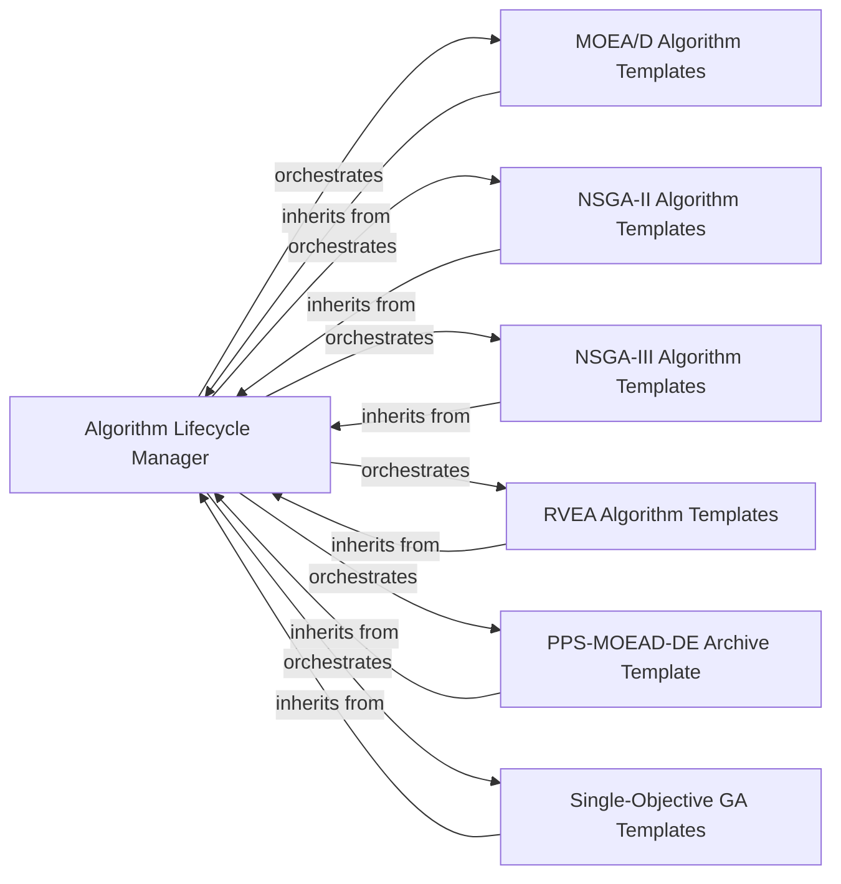

## Details

This subsystem encompasses the core framework for defining and executing evolutionary algorithms. Its boundaries are defined by the abstract `Algorithm` class (acting as the `Algorithm Lifecycle Manager`) and its concrete implementations, which are specialized algorithm templates for various evolutionary paradigms (e.g., MOEA/D, NSGA-II, Single-Objective GA). It focuses on the main loop of an evolutionary process, including initialization, iteration, and termination.

### Algorithm Lifecycle Manager
Provides the foundational framework and abstract template for all evolutionary algorithms. It defines the overall lifecycle, including initialization, termination conditions, statistical reporting, and visualization hooks. It acts as the core orchestrator for the high-level evolutionary process.

**Related Classes/Methods**:

- <a href="https://github.com/geatpy-dev/geatpy/blob/master/geatpy/Algorithm.py" target="_blank" rel="noopener noreferrer">`geatpy/Algorithm.py`</a>

### MOEA/D Algorithm Templates
Implements concrete evolutionary loops and specific strategies (selection, reproduction, environmental selection) tailored for MOEA/D (Multi-Objective Evolutionary Algorithm based on Decomposition) variants. These templates extend the `Algorithm Lifecycle Manager` to provide specialized behavior for decomposition-based multi-objective optimization.

**Related Classes/Methods**:

- <a href="https://github.com/geatpy-dev/geatpy/blob/master/geatpy/algorithms/moeas/moead/moea_MOEAD_archive_templet.py" target="_blank" rel="noopener noreferrer">`geatpy/algorithms/moeas/moead/moea_MOEAD_archive_templet.py`</a>
- <a href="https://github.com/geatpy-dev/geatpy/blob/master/geatpy/algorithms/moeas/moead/moea_MOEAD_templet.py" target="_blank" rel="noopener noreferrer">`geatpy/algorithms/moeas/moead/moea_MOEAD_templet.py`</a>
- <a href="https://github.com/geatpy-dev/geatpy/blob/master/geatpy/algorithms/moeas/moead/moea_MOEAD_DE_templet.py" target="_blank" rel="noopener noreferrer">`geatpy/algorithms/moeas/moead/moea_MOEAD_DE_templet.py`</a>

### NSGA-II Algorithm Templates
Implements concrete evolutionary loops and specific strategies (selection, reproduction, environmental selection) tailored for NSGA-II (Non-dominated Sorting Genetic Algorithm II) variants. These templates extend the `Algorithm Lifecycle Manager` to provide specialized behavior for Pareto-dominance-based multi-objective optimization.

**Related Classes/Methods**:

- <a href="https://github.com/geatpy-dev/geatpy/blob/master/geatpy/algorithms/moeas/nsga2/moea_NSGA2_archive_templet.py" target="_blank" rel="noopener noreferrer">`geatpy/algorithms/moeas/nsga2/moea_NSGA2_archive_templet.py`</a>
- <a href="https://github.com/geatpy-dev/geatpy/blob/master/geatpy/algorithms/moeas/nsga2/moea_NSGA2_templet.py" target="_blank" rel="noopener noreferrer">`geatpy/algorithms/moeas/nsga2/moea_NSGA2_templet.py`</a>
- <a href="https://github.com/geatpy-dev/geatpy/blob/master/geatpy/algorithms/moeas/nsga2/moea_NSGA2_DE_templet.py" target="_blank" rel="noopener noreferrer">`geatpy/algorithms/moeas/nsga2/moea_NSGA2_DE_templet.py`</a>
- <a href="https://github.com/geatpy-dev/geatpy/blob/master/geatpy/algorithms/moeas/nsga2/moea_psy_NSGA2_archive_templet.py" target="_blank" rel="noopener noreferrer">`geatpy/algorithms/moeas/nsga2/moea_psy_NSGA2_archive_templet.py`</a>
- <a href="https://github.com/geatpy-dev/geatpy/blob/master/geatpy/algorithms/moeas/nsga2/moea_psy_NSGA2_templet.py" target="_blank" rel="noopener noreferrer">`geatpy/algorithms/moeas/nsga2/moea_psy_NSGA2_templet.py`</a>

### NSGA-III Algorithm Templates
Implements concrete evolutionary loops and specific strategies (selection, reproduction, environmental selection) tailored for NSGA-III (Non-dominated Sorting Genetic Algorithm III) variants. These templates extend the `Algorithm Lifecycle Manager` to provide specialized behavior for reference-point-based multi-objective optimization.

**Related Classes/Methods**:

- <a href="https://github.com/geatpy-dev/geatpy/blob/master/geatpy/algorithms/moeas/nsga3/moea_NSGA3_DE_templet.py" target="_blank" rel="noopener noreferrer">`geatpy/algorithms/moeas/nsga3/moea_NSGA3_DE_templet.py`</a>
- <a href="https://github.com/geatpy-dev/geatpy/blob/master/geatpy/algorithms/moeas/nsga3/moea_NSGA3_templet.py" target="_blank" rel="noopener noreferrer">`geatpy/algorithms/moeas/nsga3/moea_NSGA3_templet.py`</a>
- <a href="https://github.com/geatpy-dev/geatpy/blob/master/geatpy/algorithms/moeas/nsga3/moea_psy_NSGA3_templet.py" target="_blank" rel="noopener noreferrer">`geatpy/algorithms/moeas/nsga3/moea_psy_NSGA3_templet.py`</a>

### RVEA Algorithm Templates
Implements concrete evolutionary loops and specific strategies (selection, reproduction, environmental selection) tailored for RVEA (Reference Vector Guided Evolutionary Algorithm) variants. These templates extend the `Algorithm Lifecycle Manager` to provide specialized behavior for reference vector-based multi-objective optimization.

**Related Classes/Methods**:

- <a href="https://github.com/geatpy-dev/geatpy/blob/master/geatpy/algorithms/moeas/rvea/moea_psy_RVEA_templet.py" target="_blank" rel="noopener noreferrer">`geatpy/algorithms/moeas/rvea/moea_psy_RVEA_templet.py`</a>
- <a href="https://github.com/geatpy-dev/geatpy/blob/master/geatpy/algorithms/moeas/rvea/moea_psy_RVEA_RES_templet.py" target="_blank" rel="noopener noreferrer">`geatpy/algorithms/moeas/rvea/moea_psy_RVEA_RES_templet.py`</a>
- <a href="https://github.com/geatpy-dev/geatpy/blob/master/geatpy/algorithms/moeas/rvea/moea_RVEA_templet.py" target="_blank" rel="noopener noreferrer">`geatpy/algorithms/moeas/rvea/moea_RVEA_templet.py`</a>
- <a href="https://github.com/geatpy-dev/geatpy/blob/master/geatpy/algorithms/moeas/rvea/moea_RVEA_RES_templet.py" target="_blank" rel="noopener noreferrer">`geatpy/algorithms/moeas/rvea/moea_RVEA_RES_templet.py`</a>

### PPS-MOEAD-DE Archive Template
Implements a specific evolutionary loop and strategies for the PPS-MOEAD-DE algorithm, which is a variant of MOEA/D with a push-pull search strategy and differential evolution. It extends the `Algorithm Lifecycle Manager` to provide this specialized behavior, including unique reinsertion and offspring creation mechanisms.

**Related Classes/Methods**:

- <a href="https://github.com/geatpy-dev/geatpy/blob/master/geatpy/algorithms/moeas/pps/moea_PPS_MOEAD_DE_archive_templet.py" target="_blank" rel="noopener noreferrer">`geatpy/algorithms/moeas/pps/moea_PPS_MOEAD_DE_archive_templet.py`</a>

### Single-Objective GA Templates
Implements concrete evolutionary loops and specific strategies (selection, reproduction, environmental selection) tailored for various single-objective Genetic Algorithms (GAs). These templates extend the `Algorithm Lifecycle Manager` to provide specialized behavior for single-objective optimization.

**Related Classes/Methods**:

- <a href="https://github.com/geatpy-dev/geatpy/blob/master/geatpy/algorithms/soeas/GA/soea_GGAP_SGA_templet.py" target="_blank" rel="noopener noreferrer">`geatpy/algorithms/soeas/GA/soea_GGAP_SGA_templet.py`</a>
- <a href="https://github.com/geatpy-dev/geatpy/blob/master/geatpy/algorithms/soeas/GA/soea_psy_GGAP_SGA_templet.py" target="_blank" rel="noopener noreferrer">`geatpy/algorithms/soeas/GA/soea_psy_GGAP_SGA_templet.py`</a>
- <a href="https://github.com/geatpy-dev/geatpy/blob/master/geatpy/algorithms/soeas/GA/soea_multi_SEGA_templet.py" target="_blank" rel="noopener noreferrer">`geatpy/algorithms/soeas/GA/soea_multi_SEGA_templet.py`</a>

### [FAQ](https://github.com/CodeBoarding/GeneratedOnBoardings/tree/main?tab=readme-ov-file#faq)