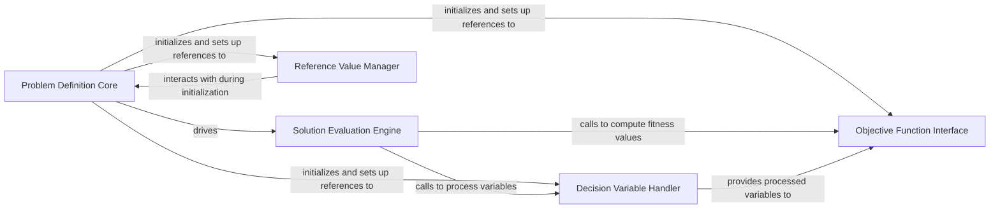

## Details

The `Problem Definition & Evaluation` subsystem in `geatpy` is centered around the `geatpy.Problem` class, which serves as the core abstraction for defining and evaluating optimization problems. This design aligns well with the Library/Toolkit pattern, emphasizing extensibility and clear separation of concerns for problem specification.

### Problem Definition Core
The foundational component that provides a unified interface for users to define an optimization problem. It encapsulates all necessary metadata and initial configuration, serving as the central hub for problem specification.

**Related Classes/Methods**:

- <a href="https://github.com/geatpy-dev/geatpy/blob/master/geatpy/Problem.py" target="_blank" rel="noopener noreferrer">`geatpy.Problem`</a>

### Solution Evaluation Engine
Orchestrates the core evaluation process for candidate solutions. It coordinates the application of variable transformations and the objective function to compute fitness values, handling the overall flow of solution assessment.

**Related Classes/Methods**:

- <a href="https://github.com/geatpy-dev/geatpy/blob/master/geatpy/Problem.py#L180-L207" target="_blank" rel="noopener noreferrer">`geatpy.Problem.evaluation`:180-207</a>

### Objective Function Interface
Defines the abstract method (`aimFunc`) that users must implement to specify the objective(s) of their optimization problem. This component is responsible for calculating the fitness of a given set of decision variables based on the problem's goals.

**Related Classes/Methods**:

- <a href="https://github.com/geatpy-dev/geatpy/blob/master/geatpy/Problem.py#L102-L122" target="_blank" rel="noopener noreferrer">`geatpy.Problem.aimFunc`:102-122</a>

### Decision Variable Handler
Manages the processing, transformation, and validation of decision variables. This includes applying any necessary pre-processing steps or handling constraints before variables are passed to the objective function for evaluation.

**Related Classes/Methods**:

- <a href="https://github.com/geatpy-dev/geatpy/blob/master/geatpy/Problem.py#L124-L149" target="_blank" rel="noopener noreferrer">`geatpy.Problem.evalVars`:124-149</a>

### Reference Value Manager
Provides mechanisms for retrieving and computing reference objective values. These values are often used for normalization, performance comparison, or specific algorithmic requirements within the optimization framework.

**Related Classes/Methods**:

- <a href="https://github.com/geatpy-dev/geatpy/blob/master/geatpy/Problem.py#L217-L263" target="_blank" rel="noopener noreferrer">`geatpy.Problem.getReferObjV`:217-263</a>
- <a href="https://github.com/geatpy-dev/geatpy/blob/master/geatpy/Problem.py#L209-L215" target="_blank" rel="noopener noreferrer">`geatpy.Problem.calReferObjV`:209-215</a>

### [FAQ](https://github.com/CodeBoarding/GeneratedOnBoardings/tree/main?tab=readme-ov-file#faq)