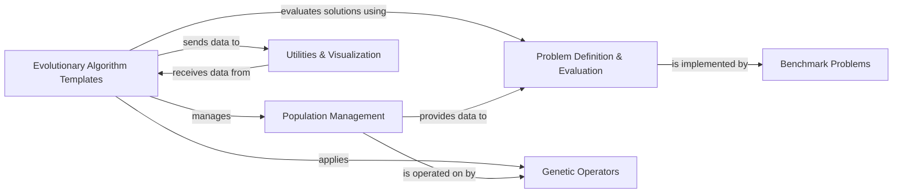

## Details

The `geatpy` framework provides a robust architecture for evolutionary computation. At its core, `Evolutionary Algorithm Templates` orchestrate the entire optimization process, interacting directly with `Population Management` to handle the collection of candidate solutions. These algorithms leverage `Problem Definition & Evaluation` to assess the fitness of individuals, which can be instantiated using pre-defined `Benchmark Problems`. New solutions are generated by applying `Genetic Operators` to the population. Throughout the process, `Utilities & Visualization` components receive data from the algorithms to facilitate analysis, recording, and graphical representation of the evolutionary progress and results. This modular design ensures clear separation of concerns, making the framework extensible and easy to understand for both documentation and visual diagram generation.

### Evolutionary Algorithm Templates [[Expand]](./Evolutionary_Algorithm_Templates.md)
Core orchestrators of the evolutionary process, implementing the main loop (selection, reproduction, environmental selection).

**Related Classes/Methods**:

- <a href="https://github.com/geatpy-dev/geatpy/blob/master/geatpy/Algorithm.py" target="_blank" rel="noopener noreferrer">`geatpy.Algorithm`</a>

### Population Management
Manages the collection of individuals (solutions), providing data structures and basic manipulation.

**Related Classes/Methods**:

- <a href="https://github.com/geatpy-dev/geatpy/blob/master/geatpy/Population.py" target="_blank" rel="noopener noreferrer">`geatpy.Population`</a>
- <a href="https://github.com/geatpy-dev/geatpy/blob/master/geatpy/PsyPopulation.py" target="_blank" rel="noopener noreferrer">`geatpy.PsyPopulation`</a>

### Problem Definition & Evaluation [[Expand]](./Problem_Definition_Evaluation.md)
Defines the optimization problem, including objective functions, variable evaluation, and constraints.

**Related Classes/Methods**:

- <a href="https://github.com/geatpy-dev/geatpy/blob/master/geatpy/Problem.py" target="_blank" rel="noopener noreferrer">`geatpy.Problem`</a>

### Genetic Operators
Provides a collection of standard genetic operators (e.g., crossover, mutation, selection) for generating new solutions.

**Related Classes/Methods**:

- <a href="https://github.com/geatpy-dev/geatpy/blob/master/geatpy/operators/recombination" target="_blank" rel="noopener noreferrer">`geatpy.operators.recombination`</a>
- <a href="https://github.com/geatpy-dev/geatpy/blob/master/geatpy/operators/mutation" target="_blank" rel="noopener noreferrer">`geatpy.operators.mutation`</a>
- <a href="https://github.com/geatpy-dev/geatpy/blob/master/geatpy/operators" target="_blank" rel="noopener noreferrer">`geatpy.operators.selection`</a>
- <a href="https://github.com/geatpy-dev/geatpy/blob/master/geatpy/operators/migration" target="_blank" rel="noopener noreferrer">`geatpy.operators.migration`</a>

### Benchmark Problems
A suite of pre-defined, well-known test problems for evaluating algorithm performance.

**Related Classes/Methods**:

- <a href="https://github.com/geatpy-dev/geatpy/blob/master/geatpy/benchmarks/mops" target="_blank" rel="noopener noreferrer">`geatpy.benchmarks.mops.WFG`</a>
- <a href="https://github.com/geatpy-dev/geatpy/blob/master/geatpy/benchmarks/mops" target="_blank" rel="noopener noreferrer">`geatpy.benchmarks.mops.ZDT`</a>
- <a href="https://github.com/geatpy-dev/geatpy/blob/master/geatpy/benchmarks/mops" target="_blank" rel="noopener noreferrer">`geatpy.benchmarks.mops.DTLZ`</a>

### Utilities & Visualization
Provides various utility functions for data manipulation, statistical analysis, and visualization of results.

**Related Classes/Methods**:

- <a href="https://github.com/geatpy-dev/geatpy/blob/master" target="_blank" rel="noopener noreferrer">`geatpy.utils.ndsr`</a>
- <a href="https://github.com/geatpy-dev/geatpy/blob/master" target="_blank" rel="noopener noreferrer">`geatpy.utils.soea_record`</a>
- <a href="https://github.com/geatpy-dev/geatpy/blob/master" target="_blank" rel="noopener noreferrer">`geatpy.utils.moea_record`</a>

### [FAQ](https://github.com/CodeBoarding/GeneratedOnBoardings/tree/main?tab=readme-ov-file#faq)