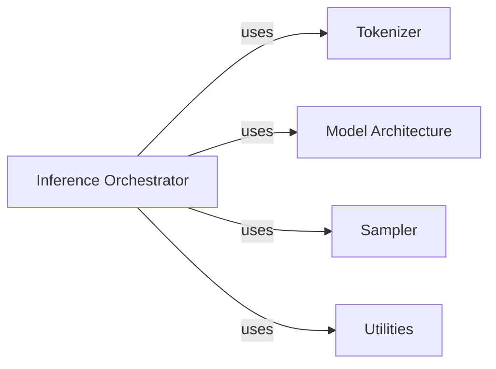

## Details

Abstract Components Overview of the gemma_pytorch library

### Inference Orchestrator [[Expand]](./Inference_Orchestrator.md)
The Inference Orchestrator is a central component responsible for directing the entire model inference process. This includes loading pre-trained model weights, managing the flow of input data, executing the model's forward pass to generate raw outputs, and implementing various text generation strategies (e.g., sampling, beam search) to produce the final desired output. It acts as the primary coordinator for all inference-related operations within the gemma_pytorch library.

**Related Classes/Methods**:

- `gemma_pytorch.inference.generate`
- `gemma_pytorch.inference.GemmaForCausalLM.forward`
- `gemma_pytorch.inference.load_model`
- `gemma_pytorch.utils.load_weights`

### Tokenizer
The Tokenizer component is responsible for converting raw text input into a sequence of numerical tokens that the model can process. This typically involves breaking down text into sub-word units, mapping these units to unique integer IDs, and handling special tokens (e.g., for start-of-sequence, end-of-sequence, padding). It plays a crucial role in preparing input data for the model and converting model outputs back into human-readable text.

**Related Classes/Methods**: _None_

### Model Architecture
The Model Architecture component defines the neural network structure of the Gemma model. This includes the layers, their connections, and the overall computational graph. It encompasses the implementation of attention mechanisms, feed-forward networks, and embedding layers that constitute the core of the transformer-based model. This component is responsible for performing the actual computations during both training and inference.

**Related Classes/Methods**: _None_

### Sampler
The Sampler component is responsible for generating text outputs from the model's raw predictions (logits). It implements various decoding strategies, such as greedy decoding, top-k sampling, nucleus sampling (top-p), or beam search, to select the next token in a sequence based on the model's probability distribution. This component directly influences the quality, diversity, and coherence of the generated text.

**Related Classes/Methods**: _None_

### Utilities
The Utilities component encompasses a collection of helper functions and modules that support various operations within the `gemma_pytorch` library. This may include functions for loading and saving model weights, data preprocessing, configuration management, and other general-purpose functionalities that are not directly part of the core model architecture or inference process but are essential for the system's operation.

**Related Classes/Methods**: _None_

### [FAQ](https://github.com/CodeBoarding/GeneratedOnBoardings/tree/main?tab=readme-ov-file#faq)