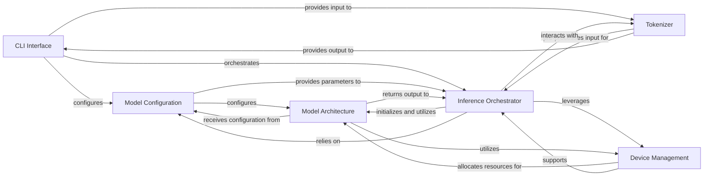

## Details

The `gemma_pytorch` architecture is designed as a modular Machine Learning Model Library, primarily focused on efficient inference.

### CLI Interface
Provides the command-line entry point for users to interact with the `gemma_pytorch` library, enabling them to initiate inference, specify model parameters, and manage input/output.

**Related Classes/Methods**:

- `gemma_pytorch.run_inference.main` (1:1)
- `gemma_pytorch.run_inference.parse_args` (1:1)

### Model Configuration
Manages and provides all configurable parameters and hyperparameters necessary to define and initialize the Gemma model, such as hidden dimensions, number of layers, and vocabulary size.

**Related Classes/Methods**:

- `gemma_pytorch.config.GemmaConfig` (1:1)
- `gemma_pytorch.config.GemmaConfig.from_pretrained` (1:1)

### Tokenizer
Handles the bidirectional conversion between raw text and numerical tokens, leveraging SentencePiece for efficient subword tokenization.

**Related Classes/Methods**:

- `gemma_pytorch.tokenizer.Tokenizer` (1:1)
- `gemma_pytorch.tokenizer.SentencePieceProcessor` (1:1)
- `gemma_pytorch.tokenizer.encode` (1:1)
- `gemma_pytorch.tokenizer.decode` (1:1)

### Inference Orchestrator [[Expand]](./Inference_Orchestrator.md)
Directs the entire model inference process, including loading pre-trained weights, managing data flow, executing the model's forward pass, and implementing text generation strategies.

**Related Classes/Methods**:

- `gemma_pytorch.inference.generate` (1:1)
- `gemma_pytorch.inference.GemmaForCausalLM.forward` (1:1)
- `gemma_pytorch.inference.load_model` (1:1)
- `gemma_pytorch.utils.load_weights` (1:1)

### Model Architecture
Encapsulates the core neural network structure of the Gemma model, defining its layers, attention mechanisms, forward pass logic, and essential mathematical operations like rotary embeddings.

**Related Classes/Methods**:

- `gemma_pytorch.model.GemmaModel` (1:1)
- `gemma_pytorch.model.GemmaForCausalLM` (1:1)
- `gemma_pytorch.model.GemmaDecoderBlock` (1:1)
- `gemma_pytorch.model.Attention` (1:1)
- `gemma_pytorch.model.MLP` (1:1)
- `gemma_pytorch.utils.precompute_freqs_cis` (1:1)
- `gemma_pytorch.utils.apply_rotary_emb` (1:1)

### Device Management
Provides utilities for efficiently placing model tensors and operations on the appropriate computing devices (CPU, GPU, TPU/XLA) to optimize performance.

**Related Classes/Methods**:

- `gemma_pytorch.utils.get_device` (1:1)
- `gemma_pytorch.utils.to_device` (1:1)
- `torch.device` (1:1)
- `torch.xla.core.xla_model` (1:1)

### [FAQ](https://github.com/CodeBoarding/GeneratedOnBoardings/tree/main?tab=readme-ov-file#faq)