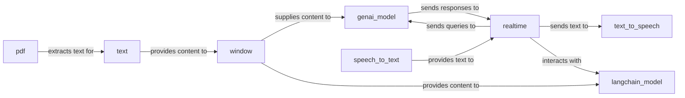

## Details

The AI & Specialized Processors subsystem is a critical part of the project, focusing on specialized data transformations and interactions, particularly with Generative AI models and various content types. It embodies the project's pipeline-driven, modular, and asynchronous architectural patterns. The internal relationships within the subsystem are characterized by a pipeline-driven flow: realtime acts as the central orchestrator, directing input from speech_to_text to AI models (genai_model, langchain_model) and routing AI outputs to text_to_speech. Raw content (e.g., from pdf) is transformed by text and then managed by window for continuous processing or contextual feeding to AI models. speech_to_text, text_to_speech, pdf, and text serve as specialized processors, each handling a specific type of data transformation before or after interaction with the core AI models. The presence of both genai_model and langchain_model demonstrates a modular approach to integrating different AI backends, allowing realtime and window to interact with either based on configuration or specific use cases.

### genai_model
Core interface for interacting with external Generative AI APIs, handling content generation and response parsing. It serves as the primary gateway for AI-driven content creation.

**Related Classes/Methods**:

- <a href="https://github.com/google-gemini/genai-processors/blob/main/genai_processors/core/genai_model.py" target="_blank" rel="noopener noreferrer">`genai_processors.core.genai_model`</a>

### langchain_model
Provides an alternative integration point for Langchain-based models, adapting content for their specific requirements. This component ensures flexibility in integrating different AI frameworks.

**Related Classes/Methods**:

- <a href="https://github.com/google-gemini/genai-processors/blob/main/genai_processors/contrib/langchain_model.py" target="_blank" rel="noopener noreferrer">`genai_processors.contrib.langchain_model`</a>

### speech_to_text
Transcribes spoken audio into textual content, acting as a crucial input processor for conversational AI.

**Related Classes/Methods**:

- <a href="https://github.com/google-gemini/genai-processors/blob/main/genai_processors/core/speech_to_text.py" target="_blank" rel="noopener noreferrer">`genai_processors.core.speech_to_text`</a>

### text_to_speech
Synthesizes textual content into audio speech, enabling spoken output from the system.

**Related Classes/Methods**:

- <a href="https://github.com/google-gemini/genai-processors/blob/main/genai_processors/core/text_to_speech.py" target="_blank" rel="noopener noreferrer">`genai_processors.core.text_to_speech`</a>

### realtime
Orchestrates complex, real-time conversational flows, managing user input, model interactions, and responses. This is a key orchestration component, embodying the pipeline's control flow.

**Related Classes/Methods**:

- <a href="https://github.com/google-gemini/genai-processors/blob/main/genai_processors/core/realtime.py" target="_blank" rel="noopener noreferrer">`genai_processors.core.realtime`</a>

### pdf
Processes PDF documents to extract structured or unstructured information, serving as a specialized content ingestion processor.

**Related Classes/Methods**:

- <a href="https://github.com/google-gemini/genai-processors/blob/main/genai_processors/core/pdf.py" target="_blank" rel="noopener noreferrer">`genai_processors.core.pdf`</a>

### text [[Expand]](./text.md)
Performs general text transformations, extractions, and manipulations, acting as a versatile content processor within the pipeline.

**Related Classes/Methods**:

- <a href="https://github.com/google-gemini/genai-processors/blob/main/genai_processors/core/text.py" target="_blank" rel="noopener noreferrer">`genai_processors.core.text`</a>

### window
Manages content streams by creating and processing sliding windows of data, essential for continuous processing and context management in pipelines.

**Related Classes/Methods**:

- <a href="https://github.com/google-gemini/genai-processors/blob/main/genai_processors/core/window.py" target="_blank" rel="noopener noreferrer">`genai_processors.core.window`</a>

### [FAQ](https://github.com/CodeBoarding/GeneratedOnBoardings/tree/main?tab=readme-ov-file#faq)