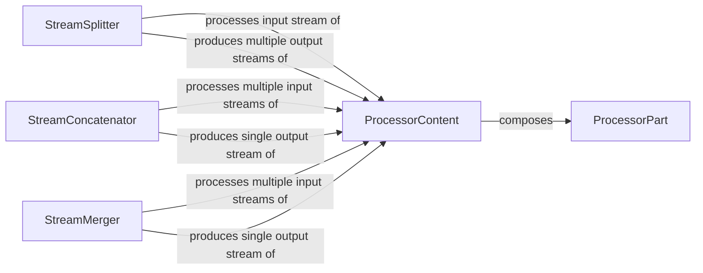

## Details

The `genai_processors` subsystem is designed around the flexible manipulation of diverse content types within processing pipelines. At its core, `ProcessorPart` represents the atomic units of data, which are then aggregated and managed by `ProcessorContent`. This `ProcessorContent` serves as the primary data object that flows through the system's processing streams. Specialized stream utilities, including `StreamSplitter`, `StreamConcatenator`, and `StreamMerger`, enable dynamic control over these content streams, allowing for operations such as branching, sequential merging, and interleaved combination of content. This architecture facilitates the construction of complex data processing pipelines essential for generative AI applications.

### ProcessorPart
Represents the most granular, atomic unit of content within the system (e.g., a text string, image bytes, a function call object). It is the fundamental building block that `ProcessorContent` aggregates.

**Related Classes/Methods**: _None_

### ProcessorContent
Acts as a flexible container for one or more `ProcessorPart` instances, along with associated metadata. It provides comprehensive methods for constructing, accessing, transforming (e.g., to text, bytes, images, function calls), and serializing this aggregated content. It manages the internal structure of content, such as grouping by mimetype or concatenating parts.

**Related Classes/Methods**: _None_

### StreamSplitter
A utility that facilitates the division of an input stream of `ProcessorContent` into multiple distinct output streams. This is crucial for enabling parallel processing branches or conditional routing within a pipeline.

**Related Classes/Methods**: _None_

### StreamConcatenator
A utility that enables the sequential combination of content from multiple input streams of `ProcessorContent` into a single, unified output stream. This is essential for merging linear processing paths.

**Related Classes/Methods**: _None_

### StreamMerger
A utility that provides functionality to combine content from several input streams of `ProcessorContent` into a single output stream, potentially interleaving elements based on their arrival order or other defined merging logic. This is useful for asynchronous processing where results from different branches need to be collected.

**Related Classes/Methods**: _None_

### [FAQ](https://github.com/CodeBoarding/GeneratedOnBoardings/tree/main?tab=readme-ov-file#faq)