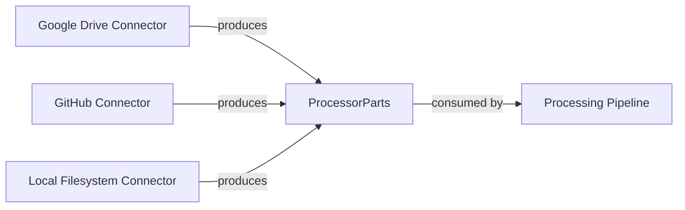

## Details

The genai_processors subsystem is designed to ingest data from various external sources and standardize it into an internal ProcessorParts representation. The Google Drive Connector, GitHub Connector, and Local Filesystem Connector serve as distinct, independent ingress points. Each connector is responsible for fetching data from its specific source (Google Drive, GitHub, or local filesystem, respectively) and transforming it into the ProcessorParts format. This design allows for modularity and extensibility, enabling the system to easily integrate new data sources without affecting existing ones. The ProcessorParts then act as a unified interface for subsequent processing stages within the genai_processors pipeline.

### Google Drive Connector
Fetches data from Google Drive and transforms it into ProcessorParts.

**Related Classes/Methods**: _None_

### GitHub Connector
Fetches data from GitHub and transforms it into ProcessorParts.

**Related Classes/Methods**: _None_

### Local Filesystem Connector
Fetches data from local filesystem and transforms it into ProcessorParts.

**Related Classes/Methods**: _None_

### ProcessorParts
Standardized internal data representation.

**Related Classes/Methods**: _None_

### Processing Pipeline
Consumes ProcessorParts for further handling or analysis.

**Related Classes/Methods**: _None_

### [FAQ](https://github.com/CodeBoarding/GeneratedOnBoardings/tree/main?tab=readme-ov-file#faq)