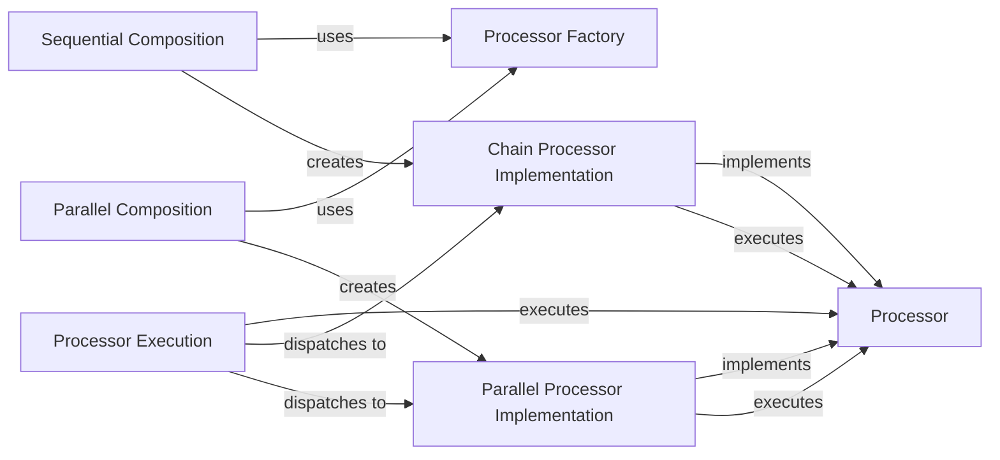

## Details

The Pipeline Orchestration subsystem is the core control unit responsible for defining, composing, and executing data processing pipelines within genai-processors. It manages the flow of ProcessorContent through both sequential and parallel operations, embodying the project's pipeline-driven and asynchronous architectural patterns.

### Processor
The foundational abstract interface (genai_processors.processor.Processor) for all data processing operations. It defines the contract for how data is transformed and serves as the base for all pipeline components.

**Related Classes/Methods**:

- <a href="https://github.com/google-gemini/genai-processors/blob/main/genai_processors/processor.py" target="_blank" rel="noopener noreferrer">`genai_processors.processor.Processor`</a>

### Processor Execution
This component encompasses the public entry point (Processor.__call__) and the core processing logic (Processor.call) for executing a Processor instance. It handles initial setup, context management, input normalization, and dispatches to specific chaining or parallel execution methods.

**Related Classes/Methods**:

- <a href="https://github.com/google-gemini/genai-processors/blob/main/genai_processors/processor.py" target="_blank" rel="noopener noreferrer">`genai_processors.processor.Processor:__call__`</a>
- <a href="https://github.com/google-gemini/genai-processors/blob/main/genai_processors/processor.py" target="_blank" rel="noopener noreferrer">`genai_processors.processor.Processor:call`</a>

### Processor Factory
A utility factory method (genai_processors.processor.to_processor) that converts various callable types (e.g., functions, objects) into a standardized Processor instance. This enables flexible and consistent pipeline construction from diverse sources.

**Related Classes/Methods**:

- <a href="https://github.com/google-gemini/genai-processors/blob/main/genai_processors/processor.py#L680-L683" target="_blank" rel="noopener noreferrer">`genai_processors.processor.to_processor`:680-683</a>

### Sequential Composition
These methods (genai_processors.processor.Processor:chain and genai_processors.processor.Processor:__add__) are responsible for defining and orchestrating sequential execution. They create a linear pipeline where the output of one processor becomes the input for the next.

**Related Classes/Methods**:

- <a href="https://github.com/google-gemini/genai-processors/blob/main/genai_processors/processor.py" target="_blank" rel="noopener noreferrer">`genai_processors.processor.Processor:chain`</a>
- <a href="https://github.com/google-gemini/genai-processors/blob/main/genai_processors/processor.py" target="_blank" rel="noopener noreferrer">`genai_processors.processor.Processor:__add__`</a>

### Parallel Composition
These methods (genai_processors.processor.Processor:parallel and genai_processors.processor.Processor:__floordiv__) define and orchestrate concurrent execution. They allow multiple processors to receive and process the same input simultaneously.

**Related Classes/Methods**:

- <a href="https://github.com/google-gemini/genai-processors/blob/main/genai_processors/processor.py" target="_blank" rel="noopener noreferrer">`genai_processors.processor.Processor:parallel`</a>
- <a href="https://github.com/google-gemini/genai-processors/blob/main/genai_processors/processor.py" target="_blank" rel="noopener noreferrer">`genai_processors.processor.Processor:__floordiv__`</a>

### Chain Processor Implementation
An internal class (genai_processors.processor._ChainProcessor) that implements the concrete logic for sequential processor composition. It is instantiated by Processor.chain and manages the step-by-step execution of chained processors.

**Related Classes/Methods**:

- <a href="https://github.com/google-gemini/genai-processors/blob/main/genai_processors/processor.py#L706-L759" target="_blank" rel="noopener noreferrer">`genai_processors.processor._ChainProcessor`:706-759</a>

### Parallel Processor Implementation
An internal class (genai_processors.processor._ParallelProcessor) that implements the concrete logic for parallel processor composition. It is instantiated by Processor.parallel and manages the concurrent execution of multiple processors.

**Related Classes/Methods**:

- <a href="https://github.com/google-gemini/genai-processors/blob/main/genai_processors/processor.py#L907-L947" target="_blank" rel="noopener noreferrer">`genai_processors.processor._ParallelProcessor`:907-947</a>

### [FAQ](https://github.com/CodeBoarding/GeneratedOnBoardings/tree/main?tab=readme-ov-file#faq)