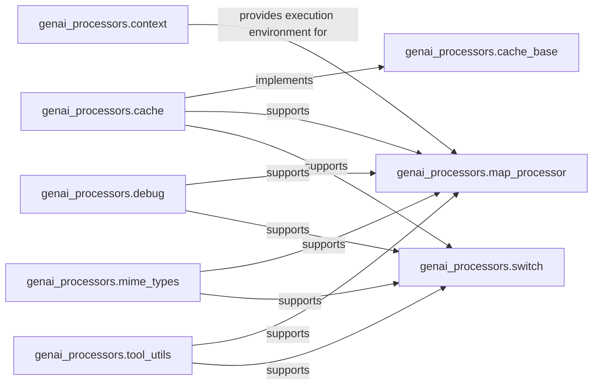

## Details

These components collectively provide the foundational utilities, execution environment management, and basic orchestration mechanisms necessary for building robust and efficient data processing pipelines, especially within an asynchronous AI/ML context.

### genai_processors.context
Manages the asynchronous execution environment for processors, including task creation, cancellation, and exception handling for concurrent operations. It ensures a robust and controlled environment for pipeline execution.

**Related Classes/Methods**:

- <a href="https://github.com/google-gemini/genai-processors/blob/main/genai_processors/context.py" target="_blank" rel="noopener noreferrer">`genai_processors.context`</a>

### genai_processors.cache
Offers efficient in-memory caching mechanisms to store and retrieve processed data, thereby reducing redundant computations and improving pipeline performance.

**Related Classes/Methods**:

- <a href="https://github.com/google-gemini/genai-processors/blob/main/genai_processors/cache.py" target="_blank" rel="noopener noreferrer">`genai_processors.cache`</a>

### genai_processors.cache_base
Defines the base interface/abstract class for caching, promoting extensibility and adherence to a common caching contract.

**Related Classes/Methods**:

- <a href="https://github.com/google-gemini/genai-processors/blob/main/genai_processors/cache_base.py" target="_blank" rel="noopener noreferrer">`genai_processors.cache_base`</a>

### genai_processors.debug
Supplies debugging utilities such as logging, printing debug strings, and monitoring processing times. It is crucial for development, testing, and troubleshooting.

**Related Classes/Methods**:

- <a href="https://github.com/google-gemini/genai-processors/blob/main/genai_processors/debug.py" target="_blank" rel="noopener noreferrer">`genai_processors.debug`</a>

### genai_processors.mime_types
Defines and manages standard MIME types, enabling the system to correctly identify and handle diverse data formats within the processing pipeline.

**Related Classes/Methods**:

- <a href="https://github.com/google-gemini/genai-processors/blob/main/genai_processors/mime_types.py" target="_blank" rel="noopener noreferrer">`genai_processors.mime_types`</a>

### genai_processors.tool_utils
Provides helper functions specifically for integrating external tools, focusing on converting objects into tool schemas. This is vital for interacting with external AI models or services.

**Related Classes/Methods**:

- <a href="https://github.com/google-gemini/genai-processors/blob/main/genai_processors/tool_utils.py" target="_blank" rel="noopener noreferrer">`genai_processors.tool_utils`</a>

### genai_processors.map_processor
An orchestration mechanism for processing data in pipelines, likely enabling parallel or sequential application of a function across data elements.

**Related Classes/Methods**:

- <a href="https://github.com/google-gemini/genai-processors/blob/main/genai_processors/map_processor.py" target="_blank" rel="noopener noreferrer">`genai_processors.map_processor`</a>

### genai_processors.switch
A conditional routing mechanism for data in pipelines, allowing for dynamic path selection based on data characteristics or processing outcomes.

**Related Classes/Methods**:

- <a href="https://github.com/google-gemini/genai-processors/blob/main/genai_processors/switch.py" target="_blank" rel="noopener noreferrer">`genai_processors.switch`</a>

### [FAQ](https://github.com/CodeBoarding/GeneratedOnBoardings/tree/main?tab=readme-ov-file#faq)