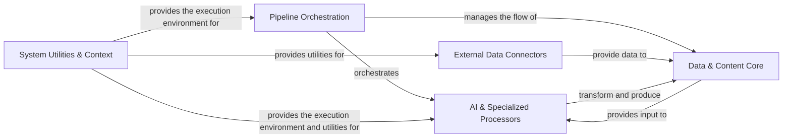

## Details

The `genai-processors` library is built upon a robust, asynchronous pipeline architecture, designed to streamline AI/ML data processing. At its core, the Pipeline Orchestration component serves as the central control, defining and executing complex data workflows. All data within the system, from raw input to processed output, is standardized and managed by the Data & Content Core, which also handles stream manipulation. The heavy lifting of data transformation and interaction with external services is performed by the AI & Specialized Processors, a versatile collection encompassing integrations with Generative AI models, speech and audio processing, and various content manipulation utilities. Data enters these pipelines through External Data Connectors, which abstract interactions with diverse external sources. The entire system's efficient and reliable operation is underpinned by the System Utilities & Context, providing asynchronous execution capabilities and essential common utilities. This modular and pipeline-centric design enables the flexible construction and scalable execution of sophisticated data processing solutions.

### Pipeline Orchestration [[Expand]](./Pipeline_Orchestration.md)
The central control unit for defining, composing, and executing data processing pipelines. It manages the flow of `ProcessorContent` through chained or parallel operations.

**Related Classes/Methods**:

- <a href="https://github.com/google-gemini/genai-processors/blob/main/genai_processors/processor.py" target="_blank" rel="noopener noreferrer">`genai_processors.processor`</a>

### Data & Content Core [[Expand]](./Data_Content_Core.md)
Defines the fundamental data structures (`ProcessorPart`, `ProcessorContent`) and provides utilities for manipulating data streams, enabling operations like splitting, concatenating, and merging content.

**Related Classes/Methods**:

- <a href="https://github.com/google-gemini/genai-processors/blob/main/genai_processors/content_api.py" target="_blank" rel="noopener noreferrer">`genai_processors.content_api`</a>
- <a href="https://github.com/google-gemini/genai-processors/blob/main/genai_processors/streams.py" target="_blank" rel="noopener noreferrer">`genai_processors.streams`</a>

### AI & Specialized Processors [[Expand]](./AI_Specialized_Processors.md)
A collection of modules responsible for performing specific data transformations and interactions, including interfacing with external Generative AI models, speech-to-text/text-to-speech, real-time conversational interactions, and general content transformations (e.g., PDF, text, windowing).

**Related Classes/Methods**:

- <a href="https://github.com/google-gemini/genai-processors/blob/main/genai_processors/core/genai_model.py" target="_blank" rel="noopener noreferrer">`genai_processors.core.genai_model`</a>
- <a href="https://github.com/google-gemini/genai-processors/blob/main/genai_processors/contrib/" target="_blank" rel="noopener noreferrer">`genai_processors.contrib`</a>
- <a href="https://github.com/google-gemini/genai-processors/blob/main/genai_processors/core/speech_to_text.py" target="_blank" rel="noopener noreferrer">`genai_processors.core.speech_to_text`</a>
- <a href="https://github.com/google-gemini/genai-processors/blob/main/genai_processors/core/text_to_speech.py" target="_blank" rel="noopener noreferrer">`genai_processors.core.text_to_speech`</a>
- <a href="https://github.com/google-gemini/genai-processors/blob/main/genai_processors/core/audio_io.py" target="_blank" rel="noopener noreferrer">`genai_processors.core.audio_io`</a>
- <a href="https://github.com/google-gemini/genai-processors/blob/main/genai_processors/core/realtime.py" target="_blank" rel="noopener noreferrer">`genai_processors.core.realtime`</a>
- <a href="https://github.com/google-gemini/genai-processors/blob/main/genai_processors/core/pdf.py" target="_blank" rel="noopener noreferrer">`genai_processors.core.pdf`</a>
- <a href="https://github.com/google-gemini/genai-processors/blob/main/genai_processors/core/text.py" target="_blank" rel="noopener noreferrer">`genai_processors.core.text`</a>
- <a href="https://github.com/google-gemini/genai-processors/blob/main/genai_processors/core/window.py" target="_blank" rel="noopener noreferrer">`genai_processors.core.window`</a>
- <a href="https://github.com/google-gemini/genai-processors/blob/main/genai_processors/core/event_detection.py" target="_blank" rel="noopener noreferrer">`genai_processors.core.event_detection`</a>
- <a href="https://github.com/google-gemini/genai-processors/blob/main/genai_processors/core/jinja_template.py" target="_blank" rel="noopener noreferrer">`genai_processors.core.jinja_template`</a>

### External Data Connectors [[Expand]](./External_Data_Connectors.md)
Modules responsible for retrieving data from external sources such as Google Drive, GitHub, or local file systems, acting as data ingress points for the processing pipelines.

**Related Classes/Methods**:

- <a href="https://github.com/google-gemini/genai-processors/blob/main/genai_processors/core/drive.py" target="_blank" rel="noopener noreferrer">`genai_processors.core.drive`</a>
- <a href="https://github.com/google-gemini/genai-processors/blob/main/genai_processors/core/github.py" target="_blank" rel="noopener noreferrer">`genai_processors.core.github`</a>
- <a href="https://github.com/google-gemini/genai-processors/blob/main/genai_processors/core/filesystem.py" target="_blank" rel="noopener noreferrer">`genai_processors.core.filesystem`</a>

### System Utilities & Context [[Expand]](./System_Utilities_Context.md)
Manages the asynchronous execution environment for processors, including task creation, cancellation, and exception handling, and provides common utilities like caching and debugging tools.

**Related Classes/Methods**:

- <a href="https://github.com/google-gemini/genai-processors/blob/main/genai_processors/context.py" target="_blank" rel="noopener noreferrer">`genai_processors.context`</a>
- <a href="https://github.com/google-gemini/genai-processors/blob/main/genai_processors/cache.py" target="_blank" rel="noopener noreferrer">`genai_processors.cache`</a>
- <a href="https://github.com/google-gemini/genai-processors/blob/main/genai_processors/cache_base.py" target="_blank" rel="noopener noreferrer">`genai_processors.cache_base`</a>
- <a href="https://github.com/google-gemini/genai-processors/blob/main/genai_processors/debug.py" target="_blank" rel="noopener noreferrer">`genai_processors.debug`</a>
- <a href="https://github.com/google-gemini/genai-processors/blob/main/genai_processors/mime_types.py" target="_blank" rel="noopener noreferrer">`genai_processors.mime_types`</a>
- <a href="https://github.com/google-gemini/genai-processors/blob/main/genai_processors/tool_utils.py" target="_blank" rel="noopener noreferrer">`genai_processors.tool_utils`</a>
- <a href="https://github.com/google-gemini/genai-processors/blob/main/genai_processors/map_processor.py" target="_blank" rel="noopener noreferrer">`genai_processors.map_processor`</a>
- <a href="https://github.com/google-gemini/genai-processors/blob/main/genai_processors/switch.py" target="_blank" rel="noopener noreferrer">`genai_processors.switch`</a>

### [FAQ](https://github.com/CodeBoarding/GeneratedOnBoardings/tree/main?tab=readme-ov-file#faq)