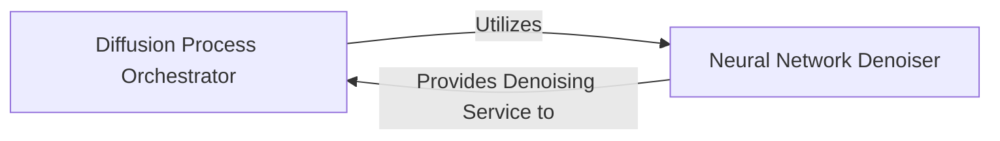

## Details

Core Diffusion Model Subsystem Overview for the Deep Learning Research Framework/Application context, focusing on protein structure generation. It includes the Diffusion Process Orchestrator and the Neural Network Denoiser, detailing their responsibilities and interactions within the generative process.

### Diffusion Process Orchestrator
This component is responsible for managing the entire diffusion process, which includes both the forward (noising) and reverse (denoising) steps. It defines the mathematical framework for how noise is progressively added to or removed from protein structures. It orchestrates the sequence of operations, manages the noise schedules (e.g., how much noise is added at each step), and coordinates the interaction with the `Neural Network Denoiser` to perform the actual denoising. It acts as the high-level control flow for the generative process.

**Related Classes/Methods**:

- <a href="https://github.com/aqlaboratory/genie/blob/main/genie/diffusion/genie.py#L9-L109" target="_blank" rel="noopener noreferrer">`genie.diffusion.genie.Genie` (9:109)</a>
- <a href="https://github.com/aqlaboratory/genie/blob/main/genie/diffusion/diffusion.py#L9-L99" target="_blank" rel="noopener noreferrer">`genie.diffusion.diffusion.Diffusion` (9:99)</a>

### Neural Network Denoiser
This is the central deep learning component that implements the neural network architecture. Its primary responsibility is to learn and predict the noise added to protein structures at each step of the reverse diffusion process. By accurately predicting this noise, it enables the `Diffusion Process Orchestrator` to iteratively refine a noisy input into a coherent protein structure. It is composed of specialized sub-networks designed to process different types of protein features (e.g., single residue features, pairwise residue features, and structural transformations), making it highly specialized for molecular data.

**Related Classes/Methods**:

- <a href="https://github.com/aqlaboratory/genie/blob/main/genie/model/model.py#L9-L70" target="_blank" rel="noopener noreferrer">`genie.model.model.Denoiser` (9:70)</a>
- <a href="https://github.com/aqlaboratory/genie/blob/main/genie/model/single_feature_net.py#L6-L41" target="_blank" rel="noopener noreferrer">`genie.model.single_feature_net.SingleFeatureNet` (6:41)</a>
- <a href="https://github.com/aqlaboratory/genie/blob/main/genie/model/pair_feature_net.py#L6-L72" target="_blank" rel="noopener noreferrer">`genie.model.pair_feature_net.PairFeatureNet` (6:72)</a>
- <a href="https://github.com/aqlaboratory/genie/blob/main/genie/model/pair_transform_net.py#L74-L107" target="_blank" rel="noopener noreferrer">`genie.model.pair_transform_net.PairTransformNet` (74:107)</a>
- <a href="https://github.com/aqlaboratory/genie/blob/main/genie/model/structure_net.py#L55-L87" target="_blank" rel="noopener noreferrer">`genie.model.structure_net.StructureNet` (55:87)</a>

### [FAQ](https://github.com/CodeBoarding/GeneratedOnBoardings/tree/main?tab=readme-ov-file#faq)