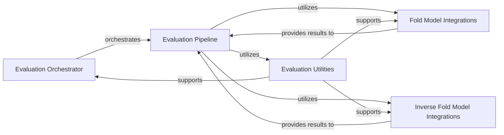

## Details

An overview of the Evaluation Framework components and their relationships.

### Evaluation Orchestrator
This component serves as the central control unit for the entire evaluation process. It is responsible for initiating evaluations, managing the overall flow, and coordinating the execution of different evaluation stages. It acts as the primary entry point for running assessments of generated protein structures.

**Related Classes/Methods**:

- <a href="https://github.com/aqlaboratory/genie/blob/main/evaluations/pipeline/evaluate.py#L1-L1000" target="_blank" rel="noopener noreferrer">`evaluations.pipeline.evaluate` (1:1000)</a>

### Evaluation Pipeline
This component defines the structured sequence of steps involved in evaluating protein structures. It encapsulates the logic for chaining together various sub-processes, such as running folding models, inverse folding models, and calculating metrics. It ensures a systematic and organized approach to evaluation.

**Related Classes/Methods**:

- <a href="https://github.com/aqlaboratory/genie/blob/main/evaluations/pipeline/pipeline.py#L1-L1000" target="_blank" rel="noopener noreferrer">`evaluations.pipeline.pipeline` (1:1000)</a>

### Fold Model Integrations
This component provides the necessary interfaces and wrappers to integrate and interact with external protein folding models, such as ESMFold. It handles the execution of these models on input protein structures and retrieves the folded structures or related predictions for further analysis within the evaluation pipeline.

**Related Classes/Methods**:

- <a href="https://github.com/aqlaboratory/genie/blob/main/evaluations/pipeline/fold_models/esmfold.py#L1-L1000" target="_blank" rel="noopener noreferrer">`evaluations.pipeline.fold_models.esmfold` (1:1000)</a>
- <a href="https://github.com/aqlaboratory/genie/blob/main/evaluations/pipeline/fold_models/model.py#L1-L1000" target="_blank" rel="noopener noreferrer">`evaluations.pipeline.fold_models.model` (1:1000)</a>

### Inverse Fold Model Integrations
Similar to the fold model integrations, this component is responsible for integrating and interacting with external inverse protein folding models, such as ProteinMPNN. It provides the means to run these models to assess the designability or sequence compatibility of generated protein structures, a critical aspect of protein design evaluation.

**Related Classes/Methods**:

- <a href="https://github.com/aqlaboratory/genie/blob/main/evaluations/pipeline/inverse_fold_models/proteinmpnn.py#L1-L1000" target="_blank" rel="noopener noreferrer">`evaluations.pipeline.inverse_fold_models.proteinmpnn` (1:1000)</a>
- <a href="https://github.com/aqlaboratory/genie/blob/main/evaluations/pipeline/inverse_fold_models/model.py#L1-L1000" target="_blank" rel="noopener noreferrer">`evaluations.pipeline.inverse_fold_models.model` (1:1000)</a>

### Evaluation Utilities
This component comprises a collection of reusable helper functions and utility modules specifically designed to support the evaluation framework. This may include functions for data manipulation, metric calculations, result aggregation, reporting, and other common tasks that are shared across different evaluation stages.

**Related Classes/Methods**:

- <a href="https://github.com/aqlaboratory/genie/blob/main/evaluations/pipeline/utils.py#L1-L1000" target="_blank" rel="noopener noreferrer">`evaluations.pipeline.utils` (1:1000)</a>

### [FAQ](https://github.com/CodeBoarding/GeneratedOnBoardings/tree/main?tab=readme-ov-file#faq)