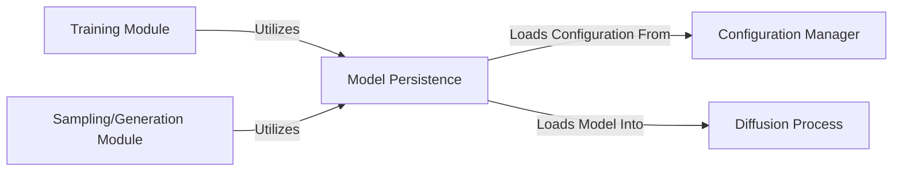

## Details

The Model Persistence component is crucial for a Deep Learning Research Framework, managing the lifecycle of trained models for experimentation, reproducibility, resuming training, inference, deployment, and version control.

### Model Persistence [[Expand]](./Model_Persistence.md)
Manages the serialization and deserialization of model checkpoints and associated configurations. It provides utilities to save trained models and load pre-trained models for various tasks like inference, evaluation, or resuming training. It also handles versioning and epoch tracking of saved models.

**Related Classes/Methods**:

- <a href="https://github.com/aqlaboratory/genie/blob/main/genie/utils/model_io.py#L1-L2" target="_blank" rel="noopener noreferrer">`genie.utils.model_io` (1:2)</a>
- <a href="https://github.com/aqlaboratory/genie/blob/main/genie/utils/model_io.py#L9-L14" target="_blank" rel="noopener noreferrer">`genie.utils.model_io:get_versions` (9:14)</a>
- <a href="https://github.com/aqlaboratory/genie/blob/main/genie/utils/model_io.py#L16-L21" target="_blank" rel="noopener noreferrer">`genie.utils.model_io:get_epochs` (16:21)</a>

### Configuration Manager
Handles the structured loading and saving of model configurations (hyperparameters, model architecture details).

**Related Classes/Methods**: _None_

### Diffusion Process
The core of the model, responsible for tasks like sampling or training after a model is loaded.

**Related Classes/Methods**:

- <a href="https://github.com/aqlaboratory/genie/blob/main/genie/diffusion/diffusion.py#L9-L99" target="_blank" rel="noopener noreferrer">`genie.diffusion.diffusion.Diffusion` (9:99)</a>
- <a href="https://github.com/aqlaboratory/genie/blob/main/genie/diffusion/genie.py#L9-L109" target="_blank" rel="noopener noreferrer">`genie.diffusion.genie.Genie` (9:109)</a>

### Training Module
Periodically saves model checkpoints during training and relies on Model Persistence for saving operations.

**Related Classes/Methods**: _None_

### Sampling/Generation Module
Loads pre-trained models for generating new protein structures or performing inference.

**Related Classes/Methods**: _None_

### [FAQ](https://github.com/CodeBoarding/GeneratedOnBoardings/tree/main?tab=readme-ov-file#faq)