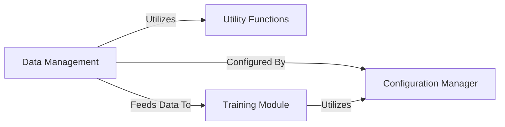

## Details

One paragraph explaining the functionality which is represented by this graph. What the main flow is and what is its purpose.

### Configuration Manager
This component is responsible for the centralized loading, parsing, and management of all application settings, hyperparameters, and experiment configurations. It provides a unified and consistent interface for accessing configuration parameters across the entire system, ensuring reproducibility, flexibility, ease of experimentation. It is crucial for defining model architectures, training schedules, data paths, and other critical operational parameters.

**Related Classes/Methods**:

- <a href="https://github.com/aqlaboratory/genie/blob/main/genie/config.py#L1-L1" target="_blank" rel="noopener noreferrer">`genie.config` (1:1)</a>

### Data Management [[Expand]](./Data_Management.md)
This component handles the entire data pipeline, encompassing the loading, preprocessing, and organization of structural biology datasets (e.g., SCOPe). It defines how raw data is transformed into a format suitable for model consumption, handles data augmentation, batching, and provides efficient data loading mechanisms for both training and evaluation phases. It ensures that the model receives clean, consistent, and correctly formatted input.

**Related Classes/Methods**:

- <a href="https://github.com/aqlaboratory/genie/blob/main/genie/data/data_module.py#L1-L1" target="_blank" rel="noopener noreferrer">`genie.data.data_module` (1:1)</a>
- <a href="https://github.com/aqlaboratory/genie/blob/main/genie/data/dataset.py#L1-L1" target="_blank" rel="noopener noreferrer">`genie.data.dataset` (1:1)</a>
- <a href="https://github.com/aqlaboratory/genie/blob/main/genie/utils/data_io.py#L1-L1" target="_blank" rel="noopener noreferrer">`genie.utils.data_io` (1:1)</a>

### Utility Functions
General utility functions, specifically for data input/output operations and other data manipulation tasks.

**Related Classes/Methods**:

- <a href="https://github.com/aqlaboratory/genie/blob/main/genie/utils/data_io.py#L1-L1" target="_blank" rel="noopener noreferrer">`genie.utils.data_io` (1:1)</a>

### Training Module
This module orchestrates the training process of the model, including setting up the training environment, initializing the model and data modules, and managing the training loop. It integrates with logging and checkpointing mechanisms to monitor and save the training progress.

**Related Classes/Methods**:

- <a href="https://github.com/aqlaboratory/genie/blob/main/genie/train.py#L11-L55" target="_blank" rel="noopener noreferrer">`genie.train.main` (11:55)</a>

### [FAQ](https://github.com/CodeBoarding/GeneratedOnBoardings/tree/main?tab=readme-ov-file#faq)