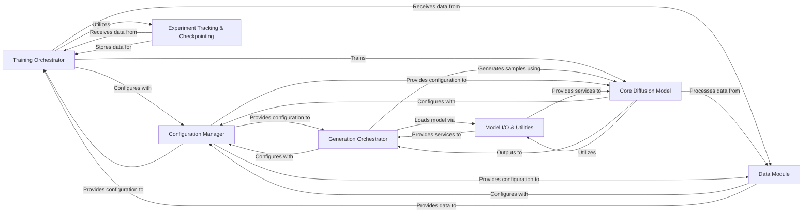

## Details

The `Training & Generation Engine` is a pivotal subsystem within the project, embodying the core deep learning functionalities of model training and novel protein structure synthesis. It adheres to the project's architectural biases by emphasizing modularity, configurability, and a clear separation of concerns, leveraging a pipeline architecture for its operational flow.

### Training Orchestrator
This component is the central coordinator for the model training lifecycle. It initializes the training environment, sets up logging and checkpointing, instantiates the data module and the core diffusion model, and orchestrates the training loop using PyTorch Lightning's `Trainer`. Its primary responsibility is to ensure the model learns effectively from the data and that the training process is monitored and reproducible.

**Related Classes/Methods**:

- <a href="https://github.com/aqlaboratory/genie/blob/main/genie/train.py" target="_blank" rel="noopener noreferrer">`genie.train`</a>

### Generation Orchestrator
This component manages the inference phase, where new protein structures are generated. It is responsible for loading a pre-trained diffusion model, configuring the sampling process (e.g., noise scale, output paths), and executing the reverse diffusion (sampling) loop to synthesize novel structures. It handles the output and persistence of the generated results.

**Related Classes/Methods**:

- <a href="https://github.com/aqlaboratory/genie/blob/main/genie/sample.py" target="_blank" rel="noopener noreferrer">`genie.sample`</a>

### Core Diffusion Model [[Expand]](./Core_Diffusion_Model.md)
This is the heart of the deep learning system, implementing the Equivariant Diffusion Model. It encapsulates the neural network architecture responsible for predicting noise or denoised states during the diffusion process. It defines both the forward (diffusion) and reverse (sampling) steps, making it the central learnable and generative entity.

**Related Classes/Methods**:

- <a href="https://github.com/aqlaboratory/genie/blob/main/genie/diffusion/genie.py" target="_blank" rel="noopener noreferrer">`genie.diffusion.genie`</a>

### Data Module
This component is responsible for efficient data loading, preprocessing, and batching for the training process. Specifically, `SCOPeDataModule` handles the SCOPe dataset, providing a standardized interface for the `Training Orchestrator` to access training and validation data.

**Related Classes/Methods**:

- <a href="https://github.com/aqlaboratory/genie/blob/main/genie/data/data_module.py" target="_blank" rel="noopener noreferrer">`genie.data.data_module`</a>
- <a href="https://github.com/aqlaboratory/genie/blob/main/genie/data/dataset.py" target="_blank" rel="noopener noreferrer">`genie.data.dataset`</a>

### Configuration Manager
This component handles the loading, parsing, and management of configuration parameters from external files. It provides a centralized and structured way to access hyperparameters, I/O paths, and other settings, ensuring configurability and reproducibility for both training and sampling runs.

**Related Classes/Methods**:

- <a href="https://github.com/aqlaboratory/genie/blob/main/genie/config.py" target="_blank" rel="noopener noreferrer">`genie.config`</a>

### Model I/O & Utilities
This component provides essential utility functions for saving and loading model checkpoints, particularly the `load_model` function used during the generation phase. It also encompasses other general-purpose utilities (e.g., geometric transformations, tensor operations) that support the core logic of the training and generation processes.

**Related Classes/Methods**:

- <a href="https://github.com/aqlaboratory/genie/blob/main/genie/utils/model_io.py" target="_blank" rel="noopener noreferrer">`genie.utils.model_io`</a>
- <a href="https://github.com/aqlaboratory/genie/blob/main/genie/utils/affine_utils.py" target="_blank" rel="noopener noreferrer">`genie.utils.affine_utils`</a>
- <a href="https://github.com/aqlaboratory/genie/blob/main/genie/utils/data_io.py" target="_blank" rel="noopener noreferrer">`genie.utils.data_io`</a>
- <a href="https://github.com/aqlaboratory/genie/blob/main/genie/utils/encoding.py" target="_blank" rel="noopener noreferrer">`genie.utils.encoding`</a>
- <a href="https://github.com/aqlaboratory/genie/blob/main/genie/utils/geo_utils.py" target="_blank" rel="noopener noreferrer">`genie.utils.geo_utils`</a>
- <a href="https://github.com/aqlaboratory/genie/blob/main/genie/utils/loss.py" target="_blank" rel="noopener noreferrer">`genie.utils.loss`</a>
- <a href="https://github.com/aqlaboratory/genie/blob/main/genie/utils/tensor_utils.py" target="_blank" rel="noopener noreferrer">`genie.utils.tensor_utils`</a>

### Experiment Tracking & Checkpointing
This component integrates with external experiment tracking tools (TensorBoard, Weights & Biases) for logging metrics, visualizing training progress, and automatically saving model checkpoints at specified intervals. It ensures that training runs are monitored, debuggable, and that model states can be recovered or reused.

**Related Classes/Methods**:

- <a href="https://github.com/aqlaboratory/genie/blob/main/genie/train.py" target="_blank" rel="noopener noreferrer">`genie.train`</a>

### [FAQ](https://github.com/CodeBoarding/GeneratedOnBoardings/tree/main?tab=readme-ov-file#faq)