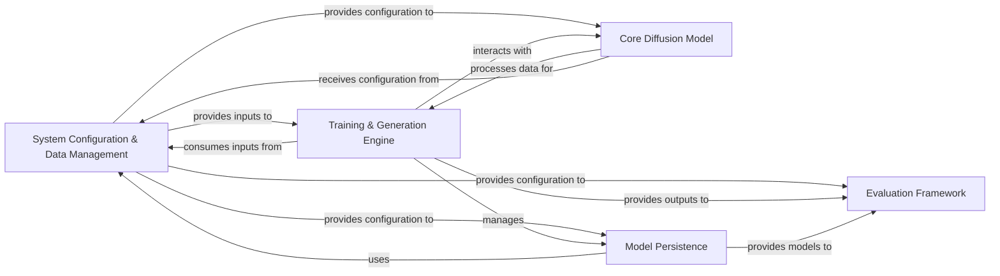

## Details

The `genie` project, a Deep Learning Research Framework for Computational Structural Biology, exhibits a modular and data-centric architecture. The analysis of its Control Flow Graph (CFG) and source code reveals five core components that manage the entire lifecycle from configuration and data handling to model training, generation, and evaluation.

### System Configuration & Data Management [[Expand]](./System_Configuration_Data_Management.md)
This foundational component centralizes application settings, hyperparameters, and manages the loading, preprocessing, and organization of structural biology datasets (e.g., SCOPe). It provides the necessary inputs and configurations for all other parts of the system.

**Related Classes/Methods**:

- <a href="https://github.com/aqlaboratory/genie/blob/main/genie/config.py#L1-L1" target="_blank" rel="noopener noreferrer">`genie/config.py` (1:1)</a>
- <a href="https://github.com/aqlaboratory/genie/blob/main/genie/data/data_module.py#L1-L1" target="_blank" rel="noopener noreferrer">`genie/data/data_module.py` (1:1)</a>
- <a href="https://github.com/aqlaboratory/genie/blob/main/genie/data/dataset.py#L1-L1" target="_blank" rel="noopener noreferrer">`genie/data/dataset.py` (1:1)</a>
- <a href="https://github.com/aqlaboratory/genie/blob/main/genie/utils/data_io.py#L1-L1" target="_blank" rel="noopener noreferrer">`genie/utils/data_io.py` (1:1)</a>

### Core Diffusion Model [[Expand]](./Core_Diffusion_Model.md)
This is the central deep learning component. It encapsulates the mathematical and algorithmic foundation of the equivariant diffusion model, including the forward (noising) and reverse (denoising) processes, noise schedules, and the neural network denoiser. It is responsible for the core protein structure generation logic.

**Related Classes/Methods**:

- <a href="https://github.com/aqlaboratory/genie/blob/main/genie/diffusion/diffusion.py#L1-L1" target="_blank" rel="noopener noreferrer">`genie/diffusion/diffusion.py` (1:1)</a>
- <a href="https://github.com/aqlaboratory/genie/blob/main/genie/diffusion/genie.py#L1-L1" target="_blank" rel="noopener noreferrer">`genie/diffusion/genie.py` (1:1)</a>
- <a href="https://github.com/aqlaboratory/genie/blob/main/genie/diffusion/schedule.py#L1-L1" target="_blank" rel="noopener noreferrer">`genie/diffusion/schedule.py` (1:1)</a>
- <a href="https://github.com/aqlaboratory/genie/blob/main/genie/model/model.py#L1-L1" target="_blank" rel="noopener noreferrer">`genie/model/model.py` (1:1)</a>
- <a href="https://github.com/aqlaboratory/genie/blob/main/genie/model/single_feature_net.py#L1-L1" target="_blank" rel="noopener noreferrer">`genie/model/single_feature_net.py` (1:1)</a>
- <a href="https://github.com/aqlaboratory/genie/blob/main/genie/model/pair_feature_net.py#L1-L1" target="_blank" rel="noopener noreferrer">`genie/model/pair_feature_net.py` (1:1)</a>
- <a href="https://github.com/aqlaboratory/genie/blob/main/genie/model/pair_transform_net.py#L1-L1" target="_blank" rel="noopener noreferrer">`genie/model/pair_transform_net.py` (1:1)</a>
- <a href="https://github.com/aqlaboratory/genie/blob/main/genie/model/structure_net.py#L1-L1" target="_blank" rel="noopener noreferrer">`genie/model/structure_net.py` (1:1)</a>
- <a href="https://github.com/aqlaboratory/genie/blob/main/genie/model/template.py#L1-L1" target="_blank" rel="noopener noreferrer">`genie/model/template.py` (1:1)</a>
- `genie/model/modules/` (1:1)

### Training & Generation Engine [[Expand]](./Training_Generation_Engine.md)
This component orchestrates the entire lifecycle of model training and the generation of new protein structures. It initializes the model, manages the training loop, and executes the reverse diffusion (sampling) process to create novel structures.

**Related Classes/Methods**:

- <a href="https://github.com/aqlaboratory/genie/blob/main/genie/train.py#L1-L1" target="_blank" rel="noopener noreferrer">`genie/train.py` (1:1)</a>
- <a href="https://github.com/aqlaboratory/genie/blob/main/genie/sample.py#L1-L1" target="_blank" rel="noopener noreferrer">`genie/sample.py` (1:1)</a>

### Model Persistence [[Expand]](./Model_Persistence.md)
This component manages the serialization and deserialization of model checkpoints and associated configurations. It enables the saving of trained models during training and the loading of pre-trained models for generation or evaluation.

**Related Classes/Methods**:

- <a href="https://github.com/aqlaboratory/genie/blob/main/genie/utils/model_io.py#L1-L1" target="_blank" rel="noopener noreferrer">`genie/utils/model_io.py` (1:1)</a>

### Evaluation Framework [[Expand]](./Evaluation_Framework.md)
A dedicated pipeline for assessing the quality and properties of generated protein structures. It integrates external tools (e.g., ESMFold, ProteinMPNN) for comprehensive assessment, metric calculation, and reporting.

**Related Classes/Methods**:

- <a href="https://github.com/aqlaboratory/genie/blob/main/evaluations/pipeline/evaluate.py#L1-L1" target="_blank" rel="noopener noreferrer">`evaluations/pipeline/evaluate.py` (1:1)</a>
- `evaluations/pipeline/fold_models/` (1:1)
- `evaluations/pipeline/inverse_fold_models/` (1:1)

### [FAQ](https://github.com/CodeBoarding/GeneratedOnBoardings/tree/main?tab=readme-ov-file#faq)