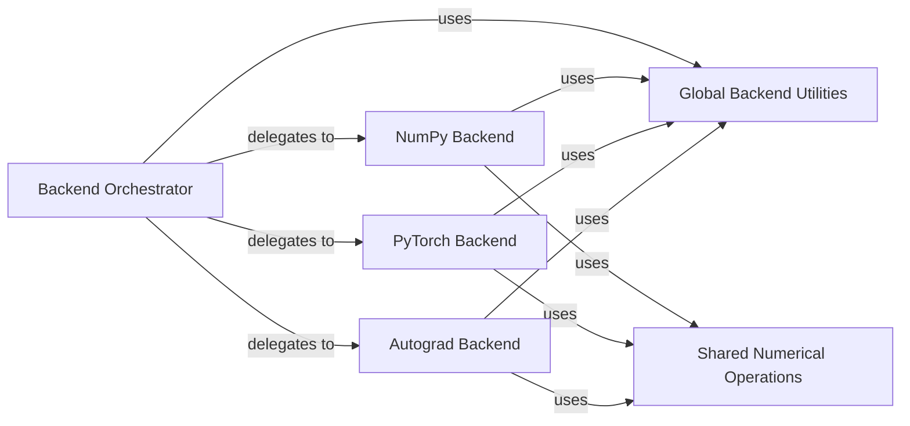

## Details

The `Backend Abstraction Layer` subsystem in `geomstats` is designed to provide a unified API for numerical operations, abstracting away the underlying numerical backend (NumPy, Autograd, PyTorch). This design aligns with the "Backend Abstraction (Strategy/Adapter Pattern)" identified in the project context.

### Backend Orchestrator
This is the central entry point for the backend abstraction. It manages the dynamic loading and switching of the active numerical backend and dispatches calls to the currently selected backend's implementation. It exposes the unified API for numerical operations to the rest of the `geomstats` library.

**Related Classes/Methods**:

- <a href="https://github.com/geomstats/geomstats/blob/main/geomstats/_backend/__init__.py#L1-L9999" target="_blank" rel="noopener noreferrer">`geomstats._backend`:1-9999</a>

### Global Backend Utilities
This component provides foundational services for all backend implementations. It manages global data type consistency, default dtype settings, type validation, and handles configuration settings related to the backend (e.g., default backend to use).

**Related Classes/Methods**:

- <a href="https://github.com/geomstats/geomstats/blob/main/geomstats/_backend/_dtype_utils.py#L1-L9999" target="_blank" rel="noopener noreferrer">`geomstats._backend._dtype_utils`:1-9999</a>
- <a href="https://github.com/geomstats/geomstats/blob/main/geomstats/_backend/_backend_config.py#L1-L9999" target="_blank" rel="noopener noreferrer">`geomstats._backend._backend_config`:1-9999</a>
- <a href="https://github.com/geomstats/geomstats/blob/main/geomstats/_backend/_common.py#L1-L9999" target="_blank" rel="noopener noreferrer">`geomstats._backend._common`:1-9999</a>

### Shared Numerical Operations
Implements common numerical operations (e.g., linear algebra, random number generation, general utilities) that are shared and consistent across all backend implementations. This component reduces code duplication and ensures a baseline of functionality available regardless of the active backend.

**Related Classes/Methods**:

- <a href="https://github.com/geomstats/geomstats/blob/main/geomstats/_backend/_shared_numpy/__init__.py#L1-L9999" target="_blank" rel="noopener noreferrer">`geomstats._backend._shared_numpy`:1-9999</a>
- <a href="https://github.com/geomstats/geomstats/blob/main/geomstats/_backend/_shared_numpy/_common.py#L1-L9999" target="_blank" rel="noopener noreferrer">`geomstats._backend._shared_numpy._common`:1-9999</a>
- <a href="https://github.com/geomstats/geomstats/blob/main/geomstats/_backend/_shared_numpy/_dispatch.py#L1-L9999" target="_blank" rel="noopener noreferrer">`geomstats._backend._shared_numpy._dispatch`:1-9999</a>
- <a href="https://github.com/geomstats/geomstats/blob/main/geomstats/_backend/_shared_numpy/linalg.py#L1-L9999" target="_blank" rel="noopener noreferrer">`geomstats._backend._shared_numpy.linalg`:1-9999</a>
- <a href="https://github.com/geomstats/geomstats/blob/main/geomstats/_backend/_shared_numpy/random.py#L1-L9999" target="_blank" rel="noopener noreferrer">`geomstats._backend._shared_numpy.random`:1-9999</a>

### NumPy Backend
This component provides the NumPy-specific implementation of the unified API. It wraps native NumPy functions, including numerical operations, automatic differentiation capabilities, and data type management tailored for NumPy, to conform to the `geomstats` API.

**Related Classes/Methods**:

- <a href="https://github.com/geomstats/geomstats/blob/main/geomstats/_backend/numpy/__init__.py#L1-L9999" target="_blank" rel="noopener noreferrer">`geomstats._backend.numpy`:1-9999</a>
- <a href="https://github.com/geomstats/geomstats/blob/main/geomstats/_backend/numpy/_common.py#L1-L9999" target="_blank" rel="noopener noreferrer">`geomstats._backend.numpy._common`:1-9999</a>
- <a href="https://github.com/geomstats/geomstats/blob/main/geomstats/_backend/numpy/linalg.py#L1-L9999" target="_blank" rel="noopener noreferrer">`geomstats._backend.numpy.linalg`:1-9999</a>
- <a href="https://github.com/geomstats/geomstats/blob/main/geomstats/_backend/numpy/random.py#L1-L9999" target="_blank" rel="noopener noreferrer">`geomstats._backend.numpy.random`:1-9999</a>
- <a href="https://github.com/geomstats/geomstats/blob/main/geomstats/_backend/numpy/autodiff.py#L1-L9999" target="_blank" rel="noopener noreferrer">`geomstats._backend.numpy.autodiff`:1-9999</a>
- <a href="https://github.com/geomstats/geomstats/blob/main/geomstats/_backend/numpy/_dtype.py#L1-L9999" target="_blank" rel="noopener noreferrer">`geomstats._backend.numpy._dtype`:1-9999</a>

### PyTorch Backend
This component provides the PyTorch-specific implementation of the unified API. It wraps native PyTorch functions, including numerical operations, automatic differentiation capabilities, and data type management tailored for PyTorch, to conform to the `geomstats` API.

**Related Classes/Methods**:

- <a href="https://github.com/geomstats/geomstats/blob/main/geomstats/_backend/pytorch/__init__.py#L1-L9999" target="_blank" rel="noopener noreferrer">`geomstats._backend.pytorch`:1-9999</a>
- <a href="https://github.com/geomstats/geomstats/blob/main/geomstats/_backend/pytorch/_common.py#L1-L9999" target="_blank" rel="noopener noreferrer">`geomstats._backend.pytorch._common`:1-9999</a>
- <a href="https://github.com/geomstats/geomstats/blob/main/geomstats/_backend/pytorch/linalg.py#L1-L9999" target="_blank" rel="noopener noreferrer">`geomstats._backend.pytorch.linalg`:1-9999</a>
- <a href="https://github.com/geomstats/geomstats/blob/main/geomstats/_backend/pytorch/random.py#L1-L9999" target="_blank" rel="noopener noreferrer">`geomstats._backend.pytorch.random`:1-9999</a>
- <a href="https://github.com/geomstats/geomstats/blob/main/geomstats/_backend/pytorch/autodiff.py#L1-L9999" target="_blank" rel="noopener noreferrer">`geomstats._backend.pytorch.autodiff`:1-9999</a>
- <a href="https://github.com/geomstats/geomstats/blob/main/geomstats/_backend/pytorch/_dtype.py#L1-L9999" target="_blank" rel="noopener noreferrer">`geomstats._backend.pytorch._dtype`:1-9999</a>

### Autograd Backend
This component provides the Autograd-specific implementation of the unified API. It wraps native Autograd functions, including numerical operations, automatic differentiation capabilities, and data type management tailored for Autograd, to conform to the `geomstats` API.

**Related Classes/Methods**:

- <a href="https://github.com/geomstats/geomstats/blob/main/geomstats/_backend/autograd/__init__.py#L1-L9999" target="_blank" rel="noopener noreferrer">`geomstats._backend.autograd`:1-9999</a>
- <a href="https://github.com/geomstats/geomstats/blob/main/geomstats/_backend/autograd/_common.py#L1-L9999" target="_blank" rel="noopener noreferrer">`geomstats._backend.autograd._common`:1-9999</a>
- <a href="https://github.com/geomstats/geomstats/blob/main/geomstats/_backend/autograd/linalg.py#L1-L9999" target="_blank" rel="noopener noreferrer">`geomstats._backend.autograd.linalg`:1-9999</a>
- <a href="https://github.com/geomstats/geomstats/blob/main/geomstats/_backend/autograd/random.py#L1-L9999" target="_blank" rel="noopener noreferrer">`geomstats._backend.autograd.random`:1-9999</a>
- <a href="https://github.com/geomstats/geomstats/blob/main/geomstats/_backend/autograd/autodiff.py#L1-L9999" target="_blank" rel="noopener noreferrer">`geomstats._backend.autograd.autodiff`:1-9999</a>
- <a href="https://github.com/geomstats/geomstats/blob/main/geomstats/_backend/autograd/_dtype.py#L1-L9999" target="_blank" rel="noopener noreferrer">`geomstats._backend.autograd._dtype`:1-9999</a>

### [FAQ](https://github.com/CodeBoarding/GeneratedOnBoardings/tree/main?tab=readme-ov-file#faq)