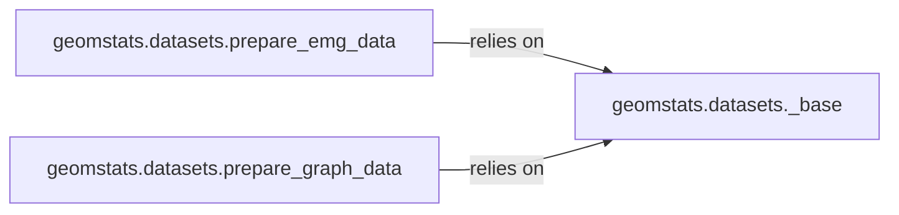

## Details

The `Data Management` subsystem is encapsulated within the `geomstats.datasets` package. These three components are chosen as central to the `Data Management` subsystem because they collectively cover the essential aspects of data handling in a Scientific Computing/Machine Learning Toolkit: `_base` provides the fundamental, abstract layer for data access and storage, crucial for modularity and backend flexibility. `prepare_emg_data` and `prepare_graph_data` represent specialized data preparation modules for distinct data types (EMG and graph data, respectively). Their inclusion highlights the toolkit's ability to process diverse and complex datasets, which is a hallmark of a robust scientific computing library. They demonstrate the "Library/Toolkit Pattern" by offering reusable, domain-specific utilities.

### geomstats.datasets._base
This component serves as the foundational layer for data acquisition and local storage management. It embodies the "Backend Abstraction (Strategy/Adapter Pattern)" by providing a generic interface for fetching data, abstracting away the specifics of data sources (e.g., remote vs. local). It ensures consistent data access and storage mechanisms across the library.

**Related Classes/Methods**:

- <a href="https://github.com/geomstats/geomstats/blob/main/geomstats/datasets/_base.py#L17-L23" target="_blank" rel="noopener noreferrer">`_get_data_home`:17-23</a>

### geomstats.datasets.prepare_emg_data
This specialized component focuses on the transformation and preparation of Electromyography (EMG) data. It exemplifies the "Library/Toolkit Pattern" by offering specific utilities tailored for a particular data type, making it a reusable module for EMG-related tasks, including formatting labels and creating data batches.

**Related Classes/Methods**:

- <a href="https://github.com/geomstats/geomstats/blob/main/geomstats/datasets/prepare_emg_data.py#L77-L79" target="_blank" rel="noopener noreferrer">`_format_labels`:77-79</a>
- <a href="https://github.com/geomstats/geomstats/blob/main/geomstats/datasets/prepare_emg_data.py#L81-L94" target="_blank" rel="noopener noreferrer">`_create_batches`:81-94</a>
- <a href="https://github.com/geomstats/geomstats/blob/main/geomstats/datasets/prepare_emg_data.py#L96-L114" target="_blank" rel="noopener noreferrer">`transform`:96-114</a>

### geomstats.datasets.prepare_graph_data
This component is dedicated to the preparation and embedding of graph-structured data. Similar to `prepare_emg_data`, it follows the "Library/Toolkit Pattern" by providing specialized algorithms and utilities for handling graph data, including techniques for graph embeddings, random walks, and loss calculations.

**Related Classes/Methods**:

- <a href="https://github.com/geomstats/geomstats/blob/main/geomstats/datasets/prepare_graph_data.py#L52-L79" target="_blank" rel="noopener noreferrer">`random_walk`:52-79</a>
- <a href="https://github.com/geomstats/geomstats/blob/main/geomstats/datasets/prepare_graph_data.py#L52-L79" target="_blank" rel="noopener noreferrer">`_walk`:52-79</a>
- <a href="https://github.com/geomstats/geomstats/blob/main/examples/gradient_descent_s2.py#L91-L94" target="_blank" rel="noopener noreferrer">`loss`:91-94</a>
- <a href="https://github.com/geomstats/geomstats/blob/main/examples/learning_graph_structured_data_h2.py#L13-L26" target="_blank" rel="noopener noreferrer">`log_sigmoid`:13-26</a>
- <a href="https://github.com/geomstats/geomstats/blob/main/examples/learning_graph_structured_data_h2.py#L43-L64" target="_blank" rel="noopener noreferrer">`grad_squared_distance`:43-64</a>
- <a href="https://github.com/geomstats/geomstats/blob/main/examples/learning_graph_structured_data_h2.py#L29-L40" target="_blank" rel="noopener noreferrer">`grad_log_sigmoid`:29-40</a>
- <a href="https://github.com/geomstats/geomstats/blob/main/geomstats/datasets/prepare_graph_data.py#L235-L326" target="_blank" rel="noopener noreferrer">`embed`:235-326</a>

### [FAQ](https://github.com/CodeBoarding/GeneratedOnBoardings/tree/main?tab=readme-ov-file#faq)