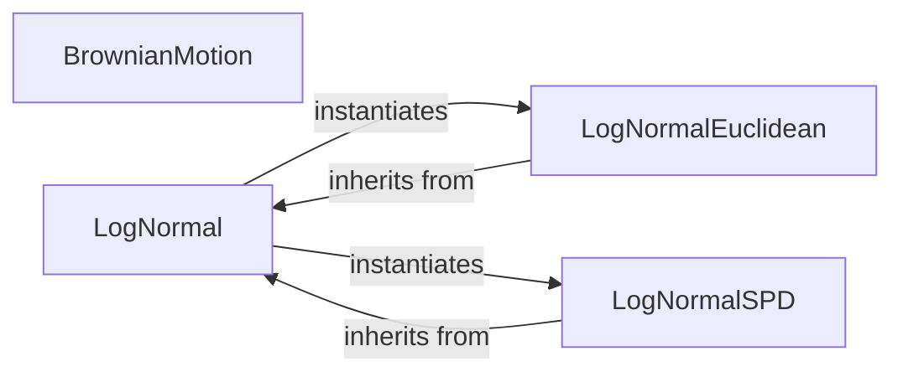

## Details

The `Geometric Distributions` subsystem (`geomstats.distributions`) defines and implements various probability distributions on geometric manifolds.

### BrownianMotion
Manages the simulation and generation of Brownian motion paths on geometric manifolds. It provides the core functionality for stochastic processes within geometric spaces.

**Related Classes/Methods**:

- <a href="https://github.com/geomstats/geomstats/blob/main/geomstats/distributions/brownian_motion.py#L6-L110" target="_blank" rel="noopener noreferrer">`BrownianMotion`:6-110</a>

### LogNormal
Serves as a polymorphic entry point and factory for Log-Normal distributions. Its key role is to abstract specific manifold implementation details, dynamically instantiating the appropriate specialized Log-Normal class based on the underlying manifold type. It also handles general initialization and sampling logic, acting as a base for manifold-specific implementations.

**Related Classes/Methods**:

- <a href="https://github.com/geomstats/geomstats/blob/main/geomstats/distributions/lognormal.py#L92-L167" target="_blank" rel="noopener noreferrer">`LogNormal`:92-167</a>

### LogNormalEuclidean
Implements the Log-Normal distribution specifically for Euclidean manifolds, encapsulating the mathematical logic and sampling procedures relevant to this space. It specializes the general `LogNormal` behavior for Euclidean geometry.

**Related Classes/Methods**:

- <a href="https://github.com/geomstats/geomstats/blob/main/geomstats/distributions/lognormal.py#L68-L89" target="_blank" rel="noopener noreferrer">`LogNormalEuclidean`:68-89</a>

### LogNormalSPD
Implements the Log-Normal distribution specifically for Symmetric Positive Definite (SPD) matrix manifolds, containing the specialized mathematical logic and sampling methods required for SPD matrices. It specializes the general `LogNormal` behavior for SPD geometry.

**Related Classes/Methods**:

- <a href="https://github.com/geomstats/geomstats/blob/main/geomstats/distributions/lognormal.py#L15-L65" target="_blank" rel="noopener noreferrer">`LogNormalSPD`:15-65</a>

### [FAQ](https://github.com/CodeBoarding/GeneratedOnBoardings/tree/main?tab=readme-ov-file#faq)