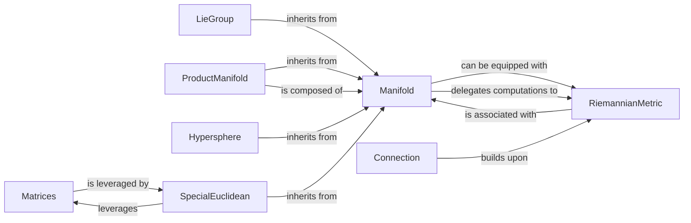

## Details

The `geomstats.geometry` subsystem provides a robust framework for differential geometry, centered around the abstract `Manifold` component. This core component defines the fundamental properties and operations for geometric spaces, which can then be equipped with a `RiemannianMetric` to enable quantitative analysis. The `Connection` component extends this by building upon the `RiemannianMetric` to facilitate advanced computations like geodesics. The system's extensibility is demonstrated through concrete manifold implementations such as `LieGroup`, `ProductManifold`, `Hypersphere`, and `SpecialEuclidean`, all inheriting from `Manifold`. Furthermore, `ProductManifold` supports the composition of manifolds, while `SpecialEuclidean` leverages the `Matrices` component for essential matrix operations, showcasing a clear separation of concerns and a layered architecture.

### Manifold
The abstract base class for all geometric spaces. It defines the common interface and fundamental properties (e.g., `belongs`, `is_tangent`, `random_point`, `equip_with_metric`) that all specific manifolds must adhere to.

**Related Classes/Methods**:

- <a href="https://github.com/geomstats/geomstats/blob/main/geomstats/geometry/manifold.py#L19-L281" target="_blank" rel="noopener noreferrer">`geomstats.geometry.manifold.Manifold`:19-281</a>

### RiemannianMetric
Defines the metric properties of a manifold, including inner products, distances, Christoffel symbols, and curvature tensors. It is crucial for quantitative geometric analysis.

**Related Classes/Methods**:

- <a href="https://github.com/geomstats/geomstats/blob/main/geomstats/geometry/riemannian_metric.py#L18-L629" target="_blank" rel="noopener noreferrer">`geomstats.geometry.riemannian_metric.RiemannianMetric`:18-629</a>

### Connection
Implements affine connections, enabling computations of geodesics, parallel transport, and various curvature derivatives, which are essential for navigating and understanding manifold structures.

**Related Classes/Methods**:

- <a href="https://github.com/geomstats/geomstats/blob/main/geomstats/geometry/connection.py#L34-L779" target="_blank" rel="noopener noreferrer">`geomstats.geometry.connection.Connection`:34-779</a>

### LieGroup
Extends `Manifold` to incorporate Lie group algebraic structures and operations (e.g., `compose`, `inverse`, `exp`, `log`), vital for handling transformations and symmetries in geometric data.

**Related Classes/Methods**:

- <a href="https://github.com/geomstats/geomstats/blob/main/geomstats/geometry/lie_group.py#L255-L629" target="_blank" rel="noopener noreferrer">`geomstats.geometry.lie_group.LieGroup`:255-629</a>

### ProductManifold
Facilitates the construction and manipulation of manifolds as Cartesian products of other manifolds, promoting modularity and reusability by applying operations pointwise across constituent manifolds.

**Related Classes/Methods**:

- <a href="https://github.com/geomstats/geomstats/blob/main/geomstats/geometry/product_manifold.py#L257-L520" target="_blank" rel="noopener noreferrer">`geomstats.geometry.product_manifold.ProductManifold`:257-520</a>

### Matrices
Provides foundational matrix manipulation operations and property checks (e.g., multiplication, transpose, symmetric, SPD). This component acts as a low-level utility, likely abstracting backend-specific matrix operations (NumPy, Autograd, PyTorch), supporting the "Backend Abstraction" pattern.

**Related Classes/Methods**:

- <a href="https://github.com/geomstats/geomstats/blob/main/geomstats/geometry/matrices.py#L160-L827" target="_blank" rel="noopener noreferrer">`geomstats.geometry.matrices.Matrices`:160-827</a>

### Hypersphere
A concrete implementation of an n-dimensional sphere, demonstrating the application of abstract manifold concepts to a specific, commonly used geometric space.

**Related Classes/Methods**:

- <a href="https://github.com/geomstats/geomstats/blob/main/geomstats/geometry/hypersphere.py#L1127-L1150" target="_blank" rel="noopener noreferrer">`geomstats.geometry.hypersphere.Hypersphere`:1127-1150</a>

### SpecialEuclidean
Represents the Special Euclidean group (rigid transformations), handling homogeneous representations and Lie group operations, critical for applications in robotics and 3D geometry.

**Related Classes/Methods**:

- <a href="https://github.com/geomstats/geomstats/blob/main/geomstats/geometry/special_euclidean.py#L1212-L1241" target="_blank" rel="noopener noreferrer">`geomstats.geometry.special_euclidean.SpecialEuclidean`:1212-1241</a>

### [FAQ](https://github.com/CodeBoarding/GeneratedOnBoardings/tree/main?tab=readme-ov-file#faq)