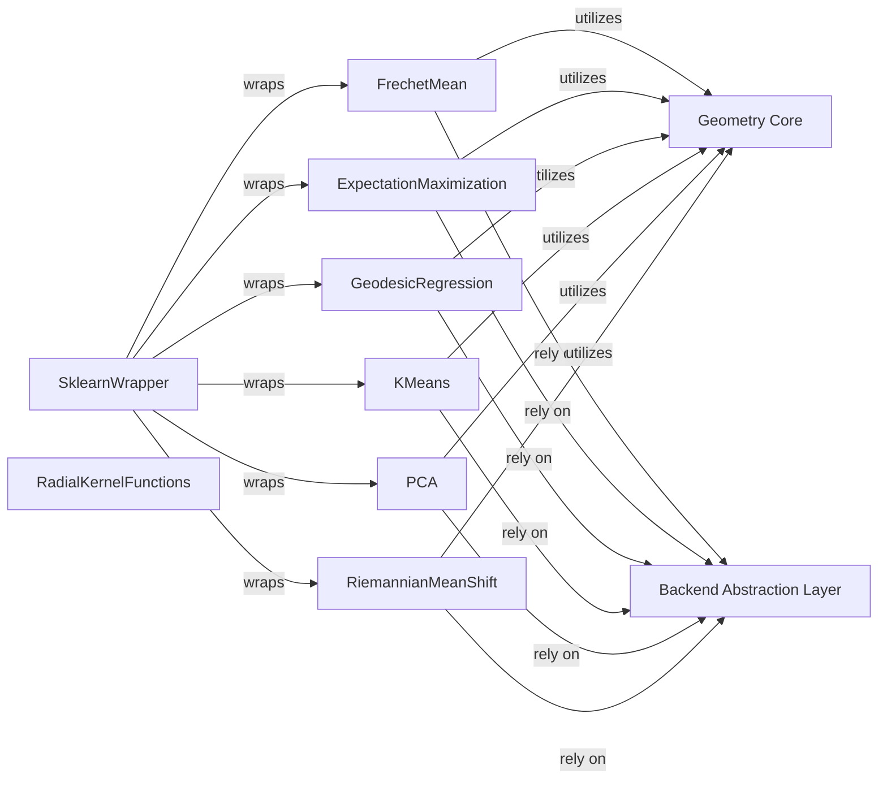

## Details

The `geomstats.learning` subsystem provides a suite of machine learning algorithms specifically designed for data residing on geometric manifolds. These algorithms, such as FrechetMean, ExpectationMaximization, GeodesicRegression, KMeans, PCA, and RiemannianMeanShift, fundamentally utilize the mathematical definitions and operations provided by the Geometry Core (the `geomstats.geometry` package). For all numerical computations, these learning components rely on the Backend Abstraction Layer (the `geomstats._backend` package), which enables seamless execution across different numerical backends like NumPy or PyTorch. Additionally, the SklearnWrapper component acts as an adapter, wrapping various `geomstats` learning estimators to provide a scikit-learn compatible interface, thereby facilitating integration into standard machine learning pipelines. The `RadialKernelFunctions` component offers specialized kernel implementations that can be leveraged by kernel-based learning methods within this subsystem.

### FrechetMean
Implements the computation of the Fréchet mean, a generalization of the arithmetic mean to metric spaces, crucial for statistical analysis on manifolds.

**Related Classes/Methods**:

- <a href="https://github.com/geomstats/geomstats/blob/main/geomstats/learning/frechet_mean.py#L604-L708" target="_blank" rel="noopener noreferrer">`geomstats.learning.frechet_mean.FrechetMean`:604-708</a>

### ExpectationMaximization
Provides an EM algorithm tailored for Gaussian Mixture Models on manifolds, enabling probabilistic clustering and density estimation.

**Related Classes/Methods**:

- <a href="https://github.com/geomstats/geomstats/blob/main/geomstats/learning/expectation_maximization.py#L253-L300" target="_blank" rel="noopener noreferrer">`geomstats.learning.em.RiemannianEM`:253-300</a>

### GeodesicRegression
Focuses on fitting regression models where the response variable lies on a manifold, utilizing geodesic paths.

**Related Classes/Methods**:

- <a href="https://github.com/geomstats/geomstats/blob/main/geomstats/learning/geodesic_regression.py#L141-L523" target="_blank" rel="noopener noreferrer">`geomstats.learning.geodesic_regression.GeodesicRegression`:141-523</a>

### KMeans
Offers a k-means clustering algorithm adapted for geometric spaces, partitioning data points into clusters based on geodesic distances.

**Related Classes/Methods**:

- <a href="https://github.com/geomstats/geomstats/blob/main/geomstats/learning/kmeans.py" target="_blank" rel="noopener noreferrer">`geomstats.learning.kmeans.KMeans`</a>

### PCA
Enables dimensionality reduction for data on manifolds, preserving variance in a geometric context.

**Related Classes/Methods**:

- <a href="https://github.com/geomstats/geomstats/blob/main/geomstats/learning/pca.py" target="_blank" rel="noopener noreferrer">`geomstats.learning.pca.PCA`</a>

### RiemannianMeanShift
Performs non-parametric clustering by iteratively shifting points towards density peaks on Riemannian manifolds.

**Related Classes/Methods**:

- <a href="https://github.com/geomstats/geomstats/blob/main/geomstats/learning/riemannian_mean_shift.py#L13-L204" target="_blank" rel="noopener noreferrer">`geomstats.learning.riemannian_mean_shift.RiemannianMeanShift`:13-204</a>

### SklearnWrapper
Provides a scikit-learn compatible interface for `geomstats` estimators by adapting input/output transformations and ensuring backend compatibility.

**Related Classes/Methods**:

- <a href="https://github.com/geomstats/geomstats/blob/main/geomstats/learning/_sklearn.py#L128-L189" target="_blank" rel="noopener noreferrer">`geomstats.learning._sklearn.ModelAdapter`:128-189</a>

### RadialKernelFunctions
Offers implementations of various radial kernel functions, essential for kernel-based learning methods in geometric spaces.

**Related Classes/Methods**:

- <a href="https://github.com/geomstats/geomstats/blob/main/geomstats/learning/radial_kernel_functions.py" target="_blank" rel="noopener noreferrer">`geomstats.learning.radial_kernel_functions.RadialKernelFunctions`</a>

### Geometry Core [[Expand]](./Geometry_Core.md)
Provides the fundamental mathematical structures for geometric learning, including definitions of manifolds, metrics, and geodesic computations. This forms the mathematical foundation for all geometric algorithms.

**Related Classes/Methods**:

- <a href="https://github.com/geomstats/geomstats/blob/main/geomstats/geometry" target="_blank" rel="noopener noreferrer">`geomstats.geometry`</a>

### Backend Abstraction Layer [[Expand]](./Backend_Abstraction_Layer.md)
Offers an abstraction layer for numerical computation, allowing `geomstats` to run on different backends (e.g., NumPy, Autograd, PyTorch). It ensures that geometric operations are performed efficiently and consistently across various computational environments.

**Related Classes/Methods**:

- <a href="https://github.com/geomstats/geomstats/blob/main/geomstats/_backend" target="_blank" rel="noopener noreferrer">`geomstats._backend`</a>

### [FAQ](https://github.com/CodeBoarding/GeneratedOnBoardings/tree/main?tab=readme-ov-file#faq)