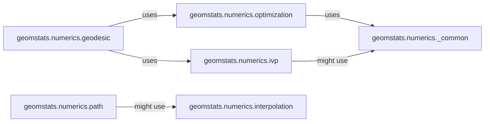

## Details

This subsystem provides the core computational methods for solving various geometric problems within `geomstats`, focusing on numerical techniques for differential geometry and related machine learning tasks. It adheres to the Scientific Computing/Machine Learning Toolkit pattern by offering specialized, modular numerical algorithms.

### geomstats.numerics.geodesic
Orchestrates the computation of geodesics, including exponential maps, logarithmic maps, and solving geodesic boundary value problems. It serves as the primary interface for geodesic-related numerical tasks.

**Related Classes/Methods**:

- <a href="https://github.com/geomstats/geomstats/blob/main/geomstats/numerics/geodesic.py" target="_blank" rel="noopener noreferrer">`geomstats.numerics.geodesic`</a>

### geomstats.numerics.optimization
Offers a suite of optimization algorithms, crucial for minimizing objective functions that arise in various geometric problems, particularly in solving boundary value problems. It abstracts different optimization backends.

**Related Classes/Methods**:

- <a href="https://github.com/geomstats/geomstats/blob/main/geomstats/numerics/optimization" target="_blank" rel="noopener noreferrer">`geomstats.numerics.optimization`</a>

### geomstats.numerics.ivp
Provides fundamental numerical integration capabilities for solving ordinary differential equations (ODEs) as initial value problems. It is a low-level workhorse for time-evolution problems.

**Related Classes/Methods**:

- <a href="https://github.com/geomstats/geomstats/blob/main/geomstats/numerics/ivp.py" target="_blank" rel="noopener noreferrer">`geomstats.numerics.ivp`</a>

### geomstats.numerics.interpolation
Manages the interpolation of data points, essential for generating smooth paths or approximating functions within geometric spaces.

**Related Classes/Methods**:

- <a href="https://github.com/geomstats/geomstats/blob/main/geomstats/numerics/interpolation.py" target="_blank" rel="noopener noreferrer">`geomstats.numerics.interpolation`</a>

### geomstats.numerics.path
Computes the energy of a given path, a fundamental concept in geometric analysis and optimization, often used in variational problems.

**Related Classes/Methods**:

- <a href="https://github.com/geomstats/geomstats/blob/main/geomstats/numerics/path.py" target="_blank" rel="noopener noreferrer">`geomstats.numerics.path`</a>

### geomstats.numerics._common
Provides foundational utilities for ensuring backend compatibility and consistent data type handling across different numerical operations, acting as a crucial support component.

**Related Classes/Methods**:

- <a href="https://github.com/geomstats/geomstats/blob/main/geomstats/numerics/_common.py" target="_blank" rel="noopener noreferrer">`geomstats.numerics._common`</a>

### [FAQ](https://github.com/CodeBoarding/GeneratedOnBoardings/tree/main?tab=readme-ov-file#faq)