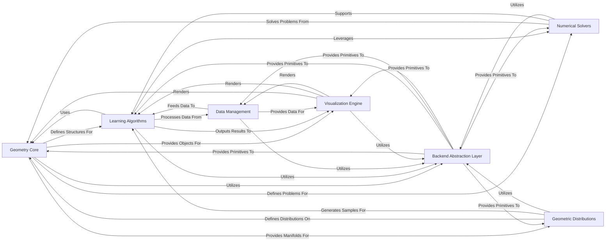

## Details

The `geomstats` architecture is centered around a robust Geometry Core that defines the fundamental mathematical structures of various manifolds. This core provides the necessary context and operations for Learning Algorithms to perform machine learning tasks directly on geometric data, and for Numerical Solvers to tackle complex mathematical problems inherent to these spaces. Data for these processes is handled by Data Management, and probabilistic modeling is supported by Geometric Distributions. A crucial Backend Abstraction Layer underpins the entire system, providing a unified interface for numerical computations across different libraries, ensuring flexibility and performance. Finally, the Visualization Engine offers essential tools for understanding and presenting the geometric objects, data, and results generated throughout the `geomstats` workflow. This modular design, with its clear component boundaries and backend flexibility, makes `geomstats` a powerful and extensible toolkit for geometric statistics and machine learning.

### Geometry Core [[Expand]](./Geometry_Core.md)
Defines mathematical structures of manifolds and their intrinsic properties.

**Related Classes/Methods**:

- <a href="https://github.com/geomstats/geomstats/blob/main/geomstats/geometry/__init__.py" target="_blank" rel="noopener noreferrer">`geomstats.geometry`</a>

### Learning Algorithms [[Expand]](./Learning_Algorithms.md)
Implements machine learning algorithms adapted for geometric spaces.

**Related Classes/Methods**:

- <a href="https://github.com/geomstats/geomstats/blob/main/geomstats/learning/__init__.py" target="_blank" rel="noopener noreferrer">`geomstats.learning`</a>

### Numerical Solvers [[Expand]](./Numerical_Solvers.md)
Provides computational methods for solving geometric problems (e.g., geodesics, optimization).

**Related Classes/Methods**:

- <a href="https://github.com/geomstats/geomstats/blob/main/geomstats/numerics/__init__.py" target="_blank" rel="noopener noreferrer">`geomstats.numerics`</a>

### Backend Abstraction Layer [[Expand]](./Backend_Abstraction_Layer.md)
Offers a unified API for numerical operations across different backends (NumPy, Autograd, PyTorch).

**Related Classes/Methods**:

- <a href="https://github.com/geomstats/geomstats/blob/main/geomstats/_backend/__init__.py" target="_blank" rel="noopener noreferrer">`geomstats._backend`</a>

### Data Management [[Expand]](./Data_Management.md)
Handles loading, preparation, and management of geometric datasets.

**Related Classes/Methods**:

- <a href="https://github.com/geomstats/geomstats/blob/main/geomstats/datasets/__init__.py" target="_blank" rel="noopener noreferrer">`geomstats.datasets`</a>

### Geometric Distributions [[Expand]](./Geometric_Distributions.md)
Defines probability distributions on geometric manifolds.

**Related Classes/Methods**:

- <a href="https://github.com/geomstats/geomstats/blob/main/geomstats/distributions/__init__.py" target="_blank" rel="noopener noreferrer">`geomstats.distributions`</a>

### Visualization Engine
Provides tools for graphically representing geometric objects and computational results.

**Related Classes/Methods**:

- <a href="https://github.com/geomstats/geomstats/blob/main/geomstats/visualization/__init__.py" target="_blank" rel="noopener noreferrer">`geomstats.visualization`</a>

### [FAQ](https://github.com/CodeBoarding/GeneratedOnBoardings/tree/main?tab=readme-ov-file#faq)