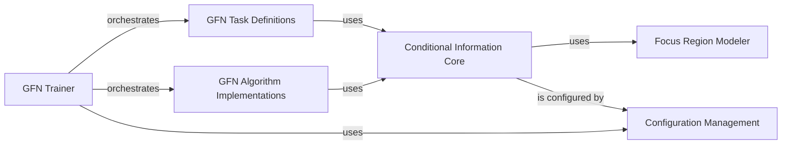

## Details

Overview of the `Conditional Information Handler` subsystem, detailing its structure, flow, purpose, and interactions with other core components of the GFlowNet framework.

### Conditional Information Core
This is the heart of the subsystem, defining the abstract interface for all conditional information and providing concrete implementations for various conditioning strategies. It allows the GFlowNet to be guided by different external signals.

**Related Classes/Methods**:

- <a href="https://github.com/recursionpharma/gflownet/blob/trunk/src/gflownet/utils/conditioning.py#L22-L34" target="_blank" rel="noopener noreferrer">`gflownet.utils.conditioning.Conditional` (22:34)</a>
- <a href="https://github.com/recursionpharma/gflownet/blob/trunk/src/gflownet/utils/conditioning.py#L37-L93" target="_blank" rel="noopener noreferrer">`gflownet.utils.conditioning.TemperatureConditional` (37:93)</a>
- <a href="https://github.com/recursionpharma/gflownet/blob/trunk/src/gflownet/utils/conditioning.py#L96-L133" target="_blank" rel="noopener noreferrer">`gflownet.utils.conditioning.MultiObjectiveWeightedPreferences` (96:133)</a>
- <a href="https://github.com/recursionpharma/gflownet/blob/trunk/src/gflownet/utils/conditioning.py#L136-L249" target="_blank" rel="noopener noreferrer">`gflownet.utils.conditioning.FocusRegionConditional` (136:249)</a>

### Focus Region Modeler
This component is specialized in defining and providing "focus regions," which are specific areas of interest in the state space that the GFlowNet should prioritize during generation. It works in conjunction with `FocusRegionConditional`.

**Related Classes/Methods**:

- <a href="https://github.com/recursionpharma/gflownet/blob/trunk/src/gflownet/utils/focus_model.py#L8-L43" target="_blank" rel="noopener noreferrer">`gflownet.utils.focus_model.FocusModel` (8:43)</a>
- <a href="https://github.com/recursionpharma/gflownet/blob/trunk/src/gflownet/utils/focus_model.py#L46-L116" target="_blank" rel="noopener noreferrer">`gflownet.utils.focus_model.TabularFocusModel` (46:116)</a>

### Configuration Management
This component is responsible for defining and loading the parameters and settings for all types of conditional information, ensuring that the conditioning strategies are properly initialized and configured.

**Related Classes/Methods**:

- <a href="https://github.com/recursionpharma/gflownet/blob/trunk/src/gflownet/config.py#L48-L109" target="_blank" rel="noopener noreferrer">`gflownet.config.Config` (48:109)</a>
- <a href="https://github.com/recursionpharma/gflownet/blob/trunk/src/gflownet/utils/config.py#L75-L80" target="_blank" rel="noopener noreferrer">`gflownet.utils.config.ConditionalsConfig` (75:80)</a>
- <a href="https://github.com/recursionpharma/gflownet/blob/trunk/src/gflownet/utils/config.py#L7-L28" target="_blank" rel="noopener noreferrer">`gflownet.utils.config.TempCondConfig` (7:28)</a>
- <a href="https://github.com/recursionpharma/gflownet/blob/trunk/src/gflownet/utils/config.py#L32-L34" target="_blank" rel="noopener noreferrer">`gflownet.utils.config.MultiObjectiveConfig` (32:34)</a>
- <a href="https://github.com/recursionpharma/gflownet/blob/trunk/src/gflownet/utils/config.py#L55-L71" target="_blank" rel="noopener noreferrer">`gflownet.utils.config.FocusRegionConfig` (55:71)</a>
- <a href="https://github.com/recursionpharma/gflownet/blob/trunk/src/gflownet/utils/config.py#L38-L51" target="_blank" rel="noopener noreferrer">`gflownet.utils.config.WeightedPreferencesConfig` (38:51)</a>

### GFN Task Definitions
This component encapsulates the definition of various generative tasks that GFlowNet can perform (e.g., molecule generation, sequence generation). These tasks explicitly *utilize* conditional information to shape their objectives and guide the generative process towards desired outcomes.

**Related Classes/Methods**:

- `gflownet.tasks.gfn_task.GFNTask` (1:1)
- <a href="https://github.com/recursionpharma/gflownet/blob/trunk/src/gflownet/tasks/qm9.py#L21-L109" target="_blank" rel="noopener noreferrer">`gflownet.tasks.qm9.QM9GapTask` (21:109)</a>
- <a href="https://github.com/recursionpharma/gflownet/blob/trunk/src/gflownet/tasks/seh_frag.py#L22-L69" target="_blank" rel="noopener noreferrer">`gflownet.tasks.seh_frag.SEHTask` (22:69)</a>
- <a href="https://github.com/recursionpharma/gflownet/blob/trunk/src/gflownet/tasks/qm9_moo.py#L28-L189" target="_blank" rel="noopener noreferrer">`gflownet.tasks.qm9_moo.QM9GapMOOTask` (28:189)</a>
- `gflownet.tasks.seh_moo.SEHMOOTask` (1:1)

### GFN Algorithm Implementations [[Expand]](./GFN_Algorithm_Implementations.md)
This component contains the core GFlowNet algorithms (e.g., Trajectory Balance, Flow Matching, Soft Q-Learning). These algorithms *process* the conditional information provided by the `Conditional Information Core` to compute probabilities and guide the generative policy.

**Related Classes/Methods**:

- `gflownet.algo.gfn_algorithm.GFNAlgorithm` (1:1)
- <a href="https://github.com/recursionpharma/gflownet/blob/trunk/src/gflownet/algo/trajectory_balance.py#L70-L776" target="_blank" rel="noopener noreferrer">`gflownet.algo.trajectory_balance.TrajectoryBalance` (70:776)</a>
- <a href="https://github.com/recursionpharma/gflownet/blob/trunk/src/gflownet/algo/flow_matching.py#L35-L190" target="_blank" rel="noopener noreferrer">`gflownet.algo.flow_matching.FlowMatching` (35:190)</a>
- <a href="https://github.com/recursionpharma/gflownet/blob/trunk/src/gflownet/algo/soft_q_learning.py#L12-L190" target="_blank" rel="noopener noreferrer">`gflownet.algo.soft_q_learning.SoftQLearning` (12:190)</a>
- `gflownet.algo.multi_objective_reinforce.MultiObjectiveReinforce` (1:1)

### GFN Trainer
This component orchestrates the entire training process of a GFlowNet. It is responsible for initializing the GFN tasks, algorithms, and crucially, for loading and passing the configured conditional information to the relevant components during the training loop.

**Related Classes/Methods**:

- <a href="https://github.com/recursionpharma/gflownet/blob/trunk/src/gflownet/trainer.py#L36-L371" target="_blank" rel="noopener noreferrer">`gflownet.trainer.GFNTrainer` (36:371)</a>
- <a href="https://github.com/recursionpharma/gflownet/blob/trunk/src/gflownet/online_trainer.py#L27-L133" target="_blank" rel="noopener noreferrer">`gflownet.online_trainer.StandardOnlineTrainer` (27:133)</a>

### [FAQ](https://github.com/CodeBoarding/GeneratedOnBoardings/tree/main?tab=readme-ov-file#faq)