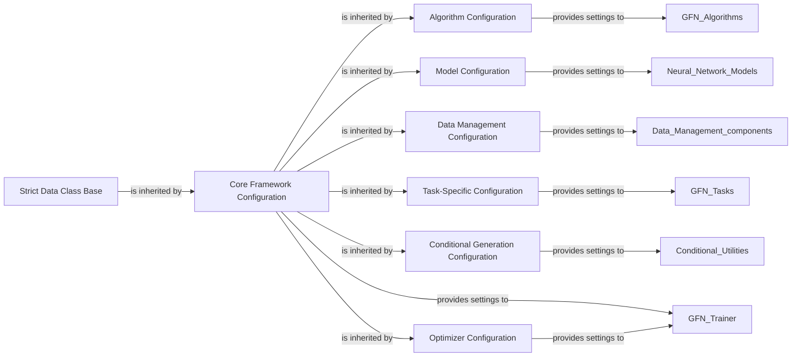

## Details

The Configuration Manager subsystem in GFlowNet is a cornerstone of its architecture, embodying a configuration-driven design that ensures consistency, reproducibility, and flexibility across the entire framework. It centralizes the management of hyperparameters and operational settings, allowing for precise control over algorithms, models, data handling, and tasks. The subsystem is built around a hierarchical structure of configuration classes, all stemming from a strict data class base. This design promotes modularity and clear separation of concerns. These components were chosen because they collectively represent the core of GFlowNet's configuration-driven design, which is explicitly highlighted in the project's architectural patterns. They are fundamental for reproducibility, modularity and extensibility, centralized control, and flexibility. In essence, the Configuration Manager is not just a collection of settings; it's an active architectural pattern that dictates how the GFlowNet framework operates, ensuring robustness, adaptability, and scientific rigor.

### Strict Data Class Base
This is the foundational component for all configuration classes within GFlowNet. It leverages `StrictDataClass` to enforce type-checking and immutability for all configuration parameters. This ensures that configurations are well-defined, consistent, and cannot be accidentally modified during runtime, which is crucial for reproducible machine learning experiments.

**Related Classes/Methods**:

- `StrictDataClass` (1:1)

### Core Framework Configuration
Serving as the top-level configuration, this component aggregates and manages global hyperparameters and settings that apply to the entire GFlowNet framework. It acts as the central entry point for defining the overall system behavior.

**Related Classes/Methods**:

- <a href="https://github.com/recursionpharma/gflownet/blob/trunk/src/gflownet/config.py#L48-L109" target="_blank" rel="noopener noreferrer">`Config` (48:109)</a>

### Algorithm Configuration
This component defines and manages hyperparameters specific to the various GFlowNet algorithms, such as Trajectory Balance (TB), Flow Matching (FM), Advantage Actor-Critic (A2C), Soft Q-Learning (SQL), and Multi-Objective Q-Learning (MOQL). It allows for precise tuning of each algorithm's operational parameters.

**Related Classes/Methods**:

- `AlgoConfig` (1:1)

### Model Configuration
This component specifies the architectural details and training parameters for the neural network models employed within GFlowNet, including Graph Transformers and Sequence Transformers. It ensures that models are instantiated and trained with consistent settings.

**Related Classes/Methods**:

- `ModelConfig` (1:1)

### Data Management Configuration
Manages settings related to data handling within the framework, including parameters for data loading, sampling strategies, and the configuration of replay buffers. These settings are vital for efficient and stable training processes.

**Related Classes/Methods**:

- `ReplayConfig` (1:1)

### Task-Specific Configuration
Encapsulates hyperparameters and settings unique to individual GFlowNet tasks, such as specific reward functions, dataset paths, or evaluation metrics for tasks like QM9 or SEH. This allows for flexible adaptation to diverse generative problems.

**Related Classes/Methods**:

- `TasksConfig` (1:1)

### Conditional Generation Configuration
Defines parameters for utility components that enable conditional generation, such as temperature conditioning for exploration/exploitation balance or focus regions for multi-objective optimization.

**Related Classes/Methods**:

- `ConditionalsConfig` (1:1)

### Optimizer Configuration
Manages the configuration settings for the optimization process, including the choice of optimizer (e.g., Adam, SGD), learning rate schedules, and other related parameters that dictate how models are trained.

**Related Classes/Methods**:

- `OptimizerConfig` (1:1)

### [FAQ](https://github.com/CodeBoarding/GeneratedOnBoardings/tree/main?tab=readme-ov-file#faq)